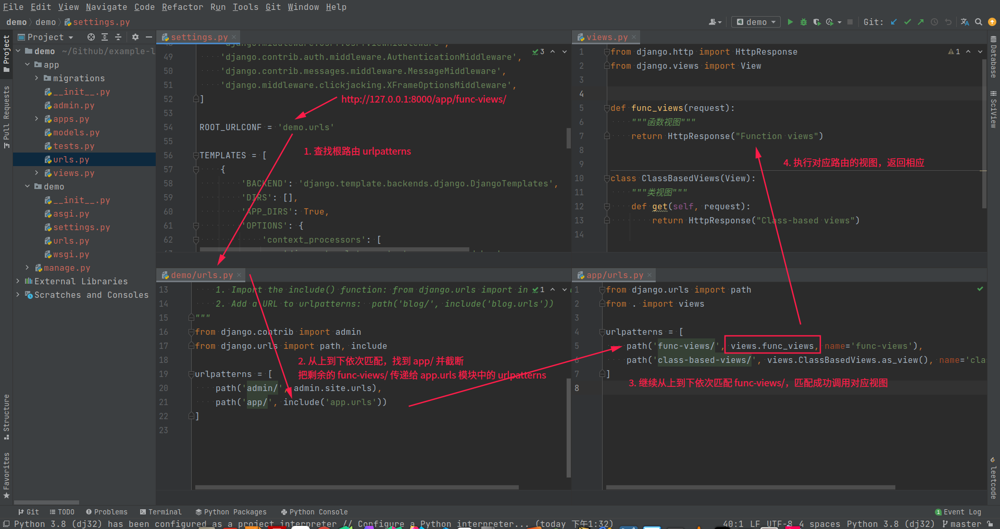
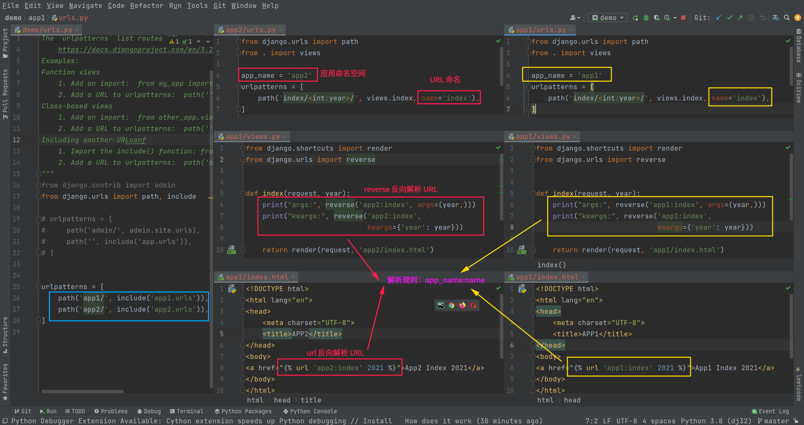
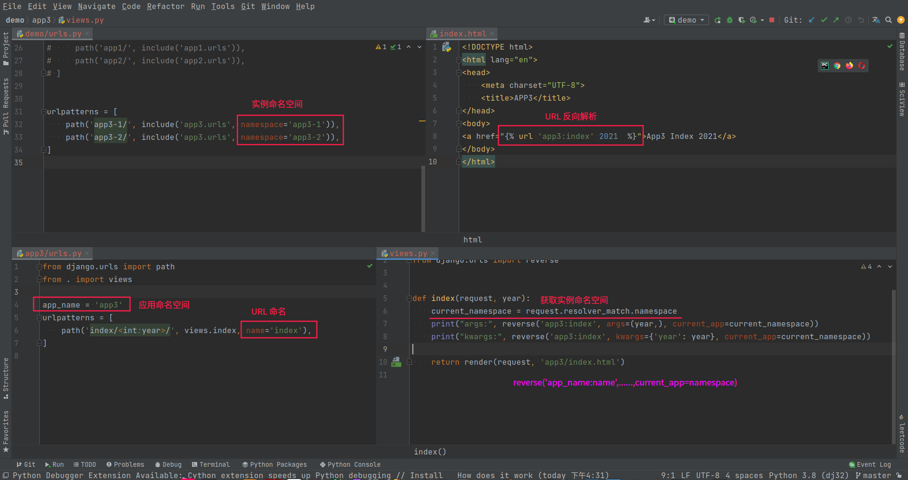

# 1. URLconf 配置

## Function views：函数视图

```python
def func_views(request):
    """函数视图"""
    return HttpResponse("Function views")

urlpatterns = [
    path('func-views/', views.func_views, name='func-views'),
]
```

## Class-based views：类视图

```python
class ClassBasedViews(View):
    """类视图"""
    def get(self, request):
        return HttpResponse("Class-based views")

urlpatterns = [
    path('class-based-views/', views.ClassBasedViews.as_view(), name='class-based-views')
]
```

## Including another URLconf：包含其他 URLconf

`include` 函数有三种用法，可以在 `urlpatterns` 中包含定义了 `urlpatterns` 属性的任意 Python 模块，不一定非要是应用内的 `urls.py` ，且 `urls.py` 也不一定非要是这个名字，比如： `route.py` 都可以。此外还可以直接包含 `pattern_list` 。

```python
from django.urls import path, include

urlpatterns = [
    # 1. include(module, namespace=None)
    path('app/', include('app.urls')),

    # 2. include((pattern_list, app_namespace), namespace=None)
    path('app/', include('app.urls', 'app'), namespace='app')

    # 3. include(pattern_list)
    path('app/', include([
        path('func-views/', views.func_views, name='func-views'),
        path('class-based-views/', views.ClassBasedViews.as_view(), name='class-based-views')
    ]))  
]
```



# 2. 路径尾斜线的说明

Django 中定义路由时，通常以斜线 `/` 结尾，其好处是用户访问不以斜线 `/` 结尾的相同路径时，Django 会把用户重定向到以斜线 `/` 结尾的路径上，而不会返回 404 不存在。如

```python
urlpatterns = [
    path('func-views/', views.func_views, name='func-views'),
]
```

用户访问 `func-views` 或者 `func-views/` 网址，均能访问到 func_views 视图。虽然路由结尾带 `/` 能带来上述好处，但是却违背了 HTTP 中 URL 表示资源位置路径的设计理念（以 `/` 结尾表示目录，不以 `/` 结尾表示文件）。

这种情况本质是受配置文件 `setting.py` 中 `APPEND_SLASH` 项控制的，默认配置项为 True，表示将在 URL 尾部自动添加斜杠。

# 3. URL 参数类型转换器

URL 参数类型转换器可以对 URL 传递过来的值进行类型的限制。Django 支持的所有类型转换器如下：

* `str`：匹配非空的字符串类型，但是不能包含斜杠。如果表达式中不包含转换器，则为默认设置
* `int`：匹配任意大于等于 0 的整数，传递给视图函数的就是一个 int 类型
* `slug`：匹配由 ASCII 字母、数字、连字符`-`和下划线`_`组成的任何字符串。例如：`building-your-1st-django-site`
* `uuid`：匹配 UUID 字符串，字符串中的字母必须是小写，例如：075194d3-6885-417e-a8a8-6c931e272f00。传递给视图函数的就是一个 UUID 实例
* `path`：匹配非空的字符串，可以包含斜杠`/`

```python
urlpatterns = [
    # http://127.0.0.1:8000/app/hello/ ==> views.string_converter(request, string)
    path('<str:string>', views.string_converter, name='string_converter'),

    # http://127.0.0.1:8000/app/100/ ==> views.int_converter(request, number)
    path('<int:number>/', views.int_converter, name='int_converter'),

    # http://127.0.0.1:8000/app/building-your-1st-django-site/ ==> views.slug_converter(request, slug)
    path('<slug:slug>/', views.slug_converter, name='slug_converter'),

    # http://127.0.0.1:8000/app/075194d3-6885-417e-a8a8-6c931e272f00/ ==> views.uuid_converter(request, uuid)
    path('<uuid:uuid>/', views.uuid_converter, name='uuid_converter'),

    # http://127.0.0.1:8000/app/home/ydongy/download/ ==> views.path_converter(request, path)
    path('<path:path>/', views.path_converter, name='path_converter'),
]
```

Django 中内置的 URL 类型转换器源文件定义在 `from django.urls import converters` 模块中。例如下面是 int 转换器的实现。所以我们想要自定义 URL 转换器只需要照猫画虎即可。 

```python
class IntConverter:
    regex = '[0-9]+'

    def to_python(self, value):
        """处理匹配的字符串转换为传递到函数的参数"""
        return int(value)

    def to_url(self, value):
        """处理 Python 类型数据转换为字符串用于 URL 中"""" 
        return str(value)

DEFAULT_CONVERTERS = {
    'int': IntConverter(),
    'path': PathConverter(),
    'slug': SlugConverter(),
    'str': StringConverter(),
    'uuid': UUIDConverter(),
}
```

**自定义转换器**

假设现在要实现一个获取文章列表的 demo，用户可以根据 `/articles/文章分类/` 的方式来获取文章。其中文章分类采用的是 `分类1+分类2+分类3...` 的方式拼接的，并且如果只有一个分类，那就不需要加号。示例如下：

```http
/articles/python/               ：获取 python 分类下的文章
/articles/python+django/        ：获取 python 和 django 分类下的文章
/articles/python+django+flask/  ：获取 python 和 django 和 flask 分类下的文章
```

解决思路：当文章分类参数传到视图函数之前要把这些分类分开来存储到列表中。比如参数是 `python+django` ，那么传到视图函数的时候就要变成 `['python', 'django']` 。然后使用 `reverse` 反转的时候，限制传递文章分类的参数应该是一个列表，并且要将这个列表变成 `python+django` 的形式。

```python
from django.urls import register_converter

class CategoryConverter(object):
    regex = r'\w+|(\w+\+\w+)+'
    # \w：0-9,a-z,A-Z

    def to_python(self,value):
        # python+django+flask ==> ['python','django','flask']
        result = value.split("+")
        return result

    def to_url(self,value):
        # ['python','django','flask'] ==> python+django+flask
        if isinstance(value,list):
            result = "+".join(value)
            return result
        else:
            raise RuntimeError("转换 url 的时候，分类参数必须为列表！")

register_converter(CategoryConverter,'cate') # 注册自定义转换器，名称为 cate

urlpatterns = [
    # http://127.0.0.1:8000/app/django+python/ ==> views.cate_converter(request, categories) ==> categories: ['django', 'python']
    path('<cate:categories>/', views.cate_converter, name='cate_converter')

    # reverse('app:cate_converter', kwargs={"categories": ["django", "python"]}) ==> url: /app/django+python/
]
```

# 4. URL 的反向解析和 URL 命名

Django 中通过 URLconf 定义视图和 URL 的映射关系，然后可以双向使用它们：

* `url-->views`：用户请求 URL，调用正确的 Django 视图，从 URL 中提取它的参数需要的值
* `views-->url`：通过 URL 命名以及传递给它的参数来获取相关联的 URL，也称为反向解析

Django 提供了反向解析 URL 的工具，不同工具需要在不同场景下使用。一般为了防止硬编码，可以在 `path` 函数中传递一个 `name` 参数可以给每个 URL 取一个名字，这样以后在需要使用 URL 的地方就可以通过名字进行反转获取。例如针对下面的 URLconf 定义：

```python
path('articles/<int:year>/', views.year_archive, name='news-year-archive'),
```

* 使用 `url` 标签在模板中动态生成 URL

```django
{# 使用固定参数 #}
<a href="">2021 Archive</a>

{# 使用动态变量 #}
<ul>
    
        <li><a href="">位置参数：{{ var }} Archive</a></li>
        <li><a href="">关键字参数：{{ var }} Archive</a></li>
    
</ul>
```

* 使用 `reverse()` 方法在 Python 代码中生成 URL

```python
# 1. 命名字符串
reverse('news-year-archive') )

# 2. 函数对象
reverse(views.year_archive)

# 3. URL 接收的可选参数
reverse('news-year-archive', args=(2021,))          # 带位置参数
reverse('news-year-archive', kwargs={'year':2021})  # 带关键字参数
```

# 5. URL 命名空间

## 应用命名空间：app_name

在多个 app 之间，有可能产生同名的 URL，这时候为了避免反转 URL 的时候产生混淆，可以使用应用命名空间来做区分。定义应用命名空间只需要在应用的 `urls.py` 中定义一个叫做 `app_name` 的变量即可



## 实例命名空间：namespace

一个 app 可以创建多个实例，也就是说使用多个 URL 映射同一个 app。但是这就会产生一个问题，在通过反向解析的时候无法确定到底是用哪一个 URL。

因此为了避免这个问题，可以在 `include` 函数中传递一个 `namespace` 变量指定实例命名空间，前提必须要先指定应用命名空间（ `app_name` ）。如果没有传递 `namespace` ，默认实例命名（ `namespace` ）和应用命名（ `app_name` ）相同，用于表示一个应用的默认实例。注意：实例命名空间在整个项目中是唯一的



# 6. 路由向视图传递参数
1. 通过 URL 传递关键字参数

```python
urlpatterns = [
    # http://127.0.0.1:8000/app/kwargs/1/ ==> views.kwargs_parameters(request, pk) ==> pk=1
    path('kwargs/<pk>/', views.kwargs_parameters, name='kwargs_parameters'),
]
```

2. 使用 `path()` 方法的第三个参数向视图传递额外参数，例如：

```python
urlpatterns = [

    # http://127.0.0.1:8000/app/extra/1/ ==> views.extra_parameters(request, pk, name) ==> pk=1 , name=jack
    path('extra/<pk>/', views.extra_parameters, {'name': 'jack'}, name='extra_parameters'),
]
```

3. 传递额外参数给 `include()`，例如：

```python
urlpatterns = [
    path('app/', include('app.urls'), {'key': 'value'}),
]

# 上面的额外参数 {'key': 'value'} 将会被传递给 app 中的每一个 URL，等价于
urlpatterns = [
    # http://127.0.0.1:8000/app/kwargs/1/ ==> views.kwargs_parameters(request, pk, key) ==> pk=1 , key=value
    path('kwargs/<pk>/', views.kwargs_parameters, {'key':'value'} name='kwargs_parameters'),

    # http://127.0.0.1:8000/app/extra/1/ ==> views.extra_parameters(request, pk, name, key) ==> pk=1 , name=jack , key=value
    path('extra/<pk>/', views.extra_parameters, {'name': 'jack','key':'value'}, name='extra_parameters'),
]
```

# 7. re_path 正则表达式

除了 `path` 函数，Django 还提供了 `re_path` 函数通过正则表达式规则来定义 URL 模式，用法与 `path` 函数一样，唯一的区别就是 `re_path` 的 `router` 参数可以兼容正则表达式，同时为防止字符串转义，在编写正则表达式时推荐使用原生字符串，也就是以 `r` 开头的字符串。

另外，如果要在正则表达式中捕获变量，需要使用**圆括号**括起来。如果参数需要指定关键字，则需要使用 `?P<参数的名字>` ，然后在后面添加正则表达式的规则。示例代码如下：

```python
from django.urls import path, re_path

urlpatterns = [
    path('articles/2003/', views.special_case_2003),

    # /articles/<year>/ ==> views.year_archive(request, year)
    re_path(r'^articles/(?P<year>[0-9]{4})/$', views.year_archive),
]
```
