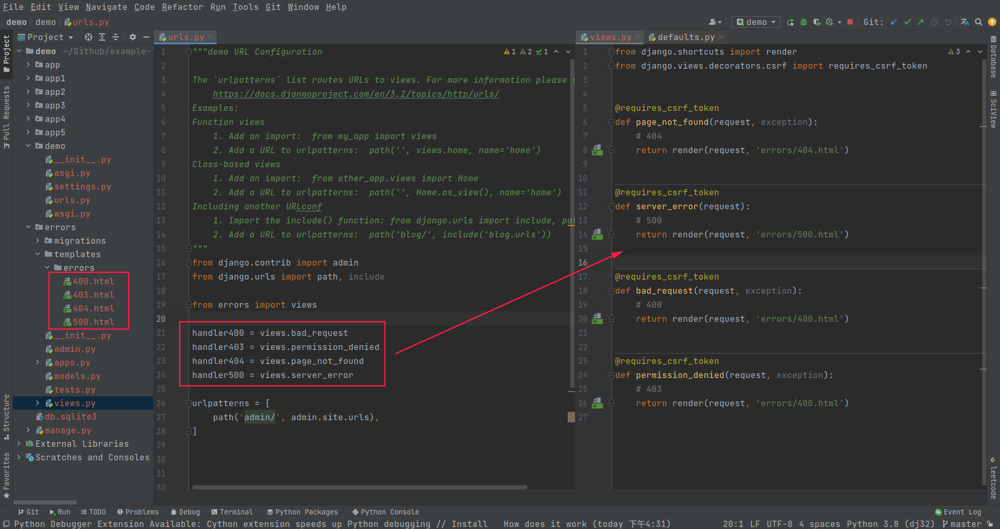
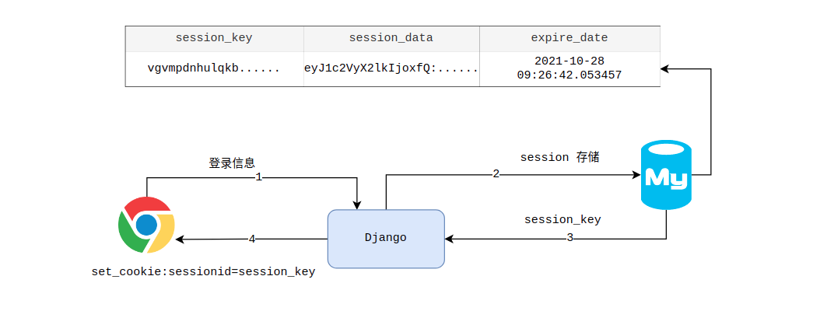

# 1. 函数视图和类视图

视图一般都定义在 app 的 `views.py` 中，且需要满足以下条件：

1. 第一个参数是一个 `HttpRequest` 的对象，通常为 `request`，存储了请求过来的所有信息
2. 返回结果必须是 `HttpResponse` 对象或者其子类的对象

## 函数视图

```python
def register(request):
    """处理注册"""

    # 获取请求方法，判断是 GET/POST 请求
    if request.method == 'GET':
        # 处理 GET 请求，返回注册页面
        return render(request, 'register.html')
    else:
        # 处理 POST 请求，实现注册逻辑
        return HttpResponse('这里实现注册逻辑')
```

## 类视图

`django.views.generic.base. View` 是顶层基类视图，所有的类视图都继承自它。类视图和函数视图的区别是可以根据请求的 method 来实现不同的方法，例如下面这个类视图：

```python
class RegisterView(View):
    """处理注册"""

    def get(self, request):
        # 处理 GET 请求，返回注册页面
        return render(request, 'register.html')

    def post(self, request):
        # 处理 POST 请求，实现注册逻辑
        return HttpResponse('这里实现注册逻辑')
```

类视图写完后，还应该在 `urls.py` 中进行映射，映射的时候就需要调用 View 的类方法 `as_view()` 来进行转换。示例代码如下：

```python
urlpatterns = [
    path("register/", views.RegisterView.as_view(), name='register')
]
```

默认情况下，View 支持以下方法 `['get', 'post', 'put', 'patch', 'delete', 'head', 'options', 'trace']` 。

此外，如果用户访问了 View 中没有定义的方法。比如你的类视图只支持 get 方法，而出现了 post 方法，那么就会把这个请求转发给 `http_method_not_allowed(request, *args, **kwargs)` 。示例代码如下：

```python
class RegisterView(View):
    ...

    def http_method_not_allowed(self, request, *args, **kwargs):
        return HttpResponse(f"当前采用的 method 是：{request.method}！")
```

# 2. 通用类视图

## TemplateView

`django.views.generic.base. TemplateView` ，这个类视图是专门用来返回模版的。在这个类中，有两个属性是经常需要用到的

1. `template_name` 属性是用来存储模板的路径，TemplateView 会自动渲染该属性指向的模板
2. `get_context_data` 方法是用来返回上下文数据的，也就是给模板传的参数的。

示例代码如下：

```python
from django.views.generic import TemplateView

class HomePageView(TemplateView):
    template_name = "home.html"

    def get_context_data(self, **kwargs):
        context = super().get_context_data(**kwargs)
        context['username'] = "Jack"
        return context
```

在 `urls.py` 中的映射代码如下：

```python
from django.urls import path

urlpatterns = [
    path('', HomePageView.as_view(), name='home'),
]
```

如果在模板中不需要传递任何参数，那么可以直接只在路由定义中使用 TemplateView 来渲染模版。示例代码如下：

```python
from django.urls import path
from django.views.generic import TemplateView

urlpatterns = [
    path('about/', TemplateView.as_view(template_name="about.html")),
]
```

## ListView

在网站开发中，经常会出现需要列出某个表中的一些数据作为列表展示出来。比如文章列表，图书列表等等。在 Django 中可以使用 ListView 来帮我们快速实现这种需求。示例代码如下：

```python
class BookListView(ListView):
    model = Book                                    # 重写 model 类属性，指定从哪个模型的获取数据
    template_name = 'books_list.html'               # 指定渲染的模板，默认查找 <app>/<model>_list.html
    paginate_by = 10                                # 指定列表一页中展示多少条数据
    context_object_name = 'books'                   # 指定上下文参数对象在模板中的参数名称，默认 object_list
    ordering = 'pub_time'                           # 数据排序，按照 pub_time 字段
    page_kwarg = 'page'                             # 获取第几页的数据的参数名称。默认是 page。
    queryset = Book.objects.filter(price__lt=50)    # 指定对象列表

    def get_context_data(self, **kwargs):
        """添加额外的上下文"""
        context = super(ArticleListView, self).get_context_data(**kwargs)
        context['name'] = 'jack'
        return context

    def get_queryset(self):
        """动态过滤"""
        # self.args 位置参数
        # self.kwargs 关键字参数
        author = self.request.GET['author']
        return Book.objects.filter(author=author)
```

## DetailView

同样，如果需要列出某个表中的某一条数据，在 Django 中可以使用 DetailView 来帮助实现，而不需要自己获取 URL 参数然后查询数据库。

```python
class BookDetailView(DetailView):
    model = Book
    template_name = 'books_detail.html' # 指定渲染的模板，默认查找 <app>/<model>_detail.html
    queryset = Book.objects.all()
    context_object_name = 'book'        # 指定上下文参数对象在模板中的参数名称，默认 object
    pk_url_kwarg = 'book_id'            # 指定 url 查询字段，默认 pk
```

# 3. 视图装饰器

> https://docs.djangoproject.com/zh-hans/3.2/topics/http/decorators/

## HTTP 方法装饰器

HTTP 方法装饰器用于约束访问视图的请求类型，该装饰器位于 `django.views.decorators.http` 模块。当访问视图的请求类型不正确时，HTTP 方法装饰器将会返回 `django.http.HttpResponseNotAllowed` 异常错误




这个装饰器需要传递一个允许访问的方法的列表。比如只能通过 GET 的方式访问。那么示例代码如下：

```python
from django.views.decorators.http import require_http_methods

@require_http_methods(["GET"])
def my_view(request):
    pass
```




这个装饰器相当于是 `require_http_methods(['GET'])` 的简写形式，只允许使用 GET 的 method 来访问视图

```python
from django.views.decorators.http import require_GET

@require_GET
def my_view(request):
    pass
```




这个装饰器相当于是 `require_http_methods(['POST'])` 的简写形式，只允许使用 POST 的 method 来访问视图

```python
from django.views.decorators.http import require_POST

@require_POST
def my_view(request):
    pass
```




这个装饰器相当于是 `require_http_methods(['GET', 'HEAD'])` 的简写形式，只允许使用相对安全的方式来访问视图。因为 GET 和 HEAD 不会对服务器产生增删改的行为。因此是一种相对安全的请求方式

```python
from django.views.decorators.http import require_safe

@require_safe
def my_view(request):
    pass
```




## Cache 缓存装饰器

缓存装饰器位于 `django.views.decorators.cache` 模块，用于设置服务器端和客户端缓存




设置浏览器响应的 Cache-Control 头，参数如下：

| cache-directive | 说明                                                         |
| --------------- | ------------------------------------------------------------ |
| `publice` | 表示任意响应内容都可能被缓存到任何位置                       |
| `pricate` | 表示全部或部分响应内容都会被当做单独用户所使用，并且只缓存到私有缓存中（仅客户端可以缓存，代理服务器不可缓存） |
| `no-cache` | 如果没有为 `no-cache` 提供字段，那么后续请求将不会使用现有缓存，后续请求必须重新进行服务器验证<br>如果为 `no-cache` 提供了一个或多个字段，那么后续请求将会使用现有的缓存，但是缓存不包含前面提供的字段 |
| `no-store` | 该指令可以防止由于疏忽而发布或保存敏感信息，对 HTTP 请求或响应信息有效。请求和响应都禁止被缓存 |
| `max-age=xxx` | 指示客户端只能接受有效期小于指定时间的响应，单位为秒，该选项只在 HTTP 1.1 中可用 |

```python
from django.views.decorators.cache import cache_control

@cache_control(private=True, max_age=3600)
def cache(request):
    pass
```




该装饰器添加 `Cache-Control:max-age=0,no-cache,no-store,must-revalidate` 头到一个响应来标志禁止缓存该页面

```python
from django.views.decorators.cache import never_cache

@never_cache
def no_cache(request):
    pass
```




## 给类视图添加装饰器

> https://docs.djangoproject.com/zh-hans/3.2/topics/class-based-views/intro/#decorating-class-based-views




```python
from django.contrib.auth.decorators import login_required, permission_required
from django.views.generic import TemplateView

from .views import VoteView

urlpatterns = [
    path('about/', login_required(TemplateView.as_view(template_name="secret.html"))),
    path('vote/', permission_required('polls.can_vote')(VoteView.as_view())),
]
```




不能直接给类视图的方法添加装饰器，需要使用 `method_decorator` 将其转换为适用于类视图方法的装饰器。

```python
from django.utils.decorators import method_decorator
from django.contrib.auth.decorators import login_required

class IndexView(View):
    def get(self, request, *args, **kwargs):
        return HttpResponse("index")

    @method_decorator(login_required)
    def dispatch(self, request, *args, **kwargs):
        super(IndexView, self).dispatch(request, *args, **kwargs)

# 等价于
@method_decorator(login_required, name='dispatch') # 为特定的请求方法添加
class IndexView(View):
    def get(self, request, *args, **kwargs):
        return HttpResponse("index")
```




# 4. 内置视图

> https://docs.djangoproject.com/zh-hans/3.2/ref/views/

## serve

serve 视图可以用来查看任意路径下的文件。例如，当用户上传文件后，使用 serve 视图查看文件是否保存成功

```python
from django.conf import settings
from django.urls import re_path
from django.views.static import serve

# ... the rest of your URLconf goes here ...

if settings.DEBUG:
    urlpatterns += [
        re_path(r'^media/(?P<path>.*)$', serve, {
            'document_root': settings.MEDIA_ROOT,
        }),
    ]
```

上面代码表示所有保存在 `document_root` 路径下的文件都可以直接使用 `/media/文件名` 的方式进行访问

## 错误视图

Django 内置处理 HTTP 错误的视图（在 `django.views.defaults` 模块下），主要错误视图包括：

* 404 服务器没有指定的 URL：`page_not_found`
* 400 Bad Request，请求的参数错误：`bad_request`
* 500 服务器内部错误：`server_error`
* 403 没有权限访问相关的数据：`permission_denied`

如果想要在碰到类似 404，500 错误的时候返回自己定义的模板。那么可以直接在 templates 文件夹下创建相应错误代码的 html 模板文件。那么以后在发生相应错误后，会将指定的模板返回回去。

```bash
templates
  ├── 404.html
  └── 400.html
```


 

当程序抛出 HTTP 404 异常时，Django 会调用一个视图取处理它，默认视图是 `django.views.defaults.page_not_found()` 。该视图会在网页输出 “Not Found” 或者加载 404.html。

注意：

1. 当 Django 无法找到匹配的 URL 会抛出 404 错误
2. HTTP 404 视图可以接受模板上下文中的变量
3. 当 DEBUG=True 时 HTTP 404 视图将被禁用




当出现运行时异常，Django 会调用 `django.views.defaults.server_error` 视图，该视图会在网页输出 “Server Error” 或者加载 500.html

注意：

1. 默认 HTTP 500 视图不会向 500.html 传递任何变量
2. 当 DEBUG=True 时 HTTP 500 视图将被禁用




Django 会调用 `django.views.defaults.permission_denied` 视图，该视图会在网页输出 “403 Forbidden” 或者加载 403.html




当出现 SuspiciousOperation 异常并且代码中没有进行处理，Django 会调用 `django.views.defaults.bad_request` 视图，该视图会在网页输出 “bad request” 或者加载 400.html。bad_request 视图要求 DEBUG=False




## 自定义错误视图

> [https://docs.djangoproject.com/zh-hans/3.2/topics/http/views/#customizing-error-views](https://docs.djangoproject.com/zh-hans/3.2/topics/http/views/#customizing-error-views)
> [https://docs.djangoproject.com/zh-hans/3.2/ref/urls/#handler400](https://docs.djangoproject.com/zh-hans/3.2/ref/urls/#handler400)
> [https://docs.djangoproject.com/zh-hans/3.2/ref/views/#error-views](https://docs.djangoproject.com/zh-hans/3.2/ref/views/#error-views)

对于自定义的错误，我们可以专门定义一个 app，用来处理这些错误，同时也可以覆盖默认的错误处理函数



# 5. 重定向

重定向分为永久性重定向和暂时性重定向：

* 永久性重定向：HTTP 的状态码是 301，多用于旧网址被废弃了要转到一个新的网址确保用户的访问，最经典的就是京东网站，你输入`www.jingdong.com`的时候，会被重定向到`www.jd.com`，因为`jingdong.com`这个网址已经被废弃了，被改成`jd.com`，所以这种情况下应该用永久重定向。
* 暂时性重定向：HTTP 的状态码是 302，表示页面的暂时性跳转。比如访问一个需要权限的网址，如果当前用户没有登录，应该重定向到登录页面，这种情况下，应该用暂时性重定向。

在 Django 中，重定向是使用 `redirect(to, *args, permanent=False, **kwargs)` 快捷函数，返回 `HttpResponseRedirect` 对象，用于 URL 跳转。

* `to`
  + 一个模型：模型的 `get_absolute_url()` 函数将被调用。
  + 视图名：可能带有的参数，后台使用 `reverse()` 方法反向解析 URL
  + 绝对或相对 URL：将按原样用于重定向
* `permanent`：默认为临时重定向，设置为 True 将进行永久重定向

1. 传递模型对象，模型对象的 `get_absolute_url()` 方法将被调用

```python
from django.shortcuts import redirect

def my_view(request):
    ...
    obj = MyModel.objects.get(...)
    return redirect(obj)
```

2. 传递视图名和一些可选的位置或关键字参数；URL 将使用 `reverse()` 方法来反向解析

```python
def my_view(request):
    ...
    return redirect('app_name:name', foo='bar')
```

3. 传递硬编码 URL 来重定向

```python
def my_view(request):
    ...
    return redirect('/some/url/')
    # return redirect('https://example.com/')
```

# 6. 请求和响应对象

> https://docs.djangoproject.com/zh-hans/3.2/ref/request-response/#module-django.http

## WSGIRequest 和 HttpRequest

当一个页面被请求时，Django 会创建一个 WSGIRequest 对象，这个对象包含了请求的元数据。然后 Django 加载相应的视图，将 WSGIRequest 作为视图函数的第一个参数，也就是我们经常看到的 request 参数。（本质上 WSGIRequest 继承自 HTTPRequest，所以 WSGIRequest 对象大部分属性和方法都继承自 HttpRequest）



| 属性      | 描述                                                         |
| --------- | ------------------------------------------------------------ |
| `path` | 请求的页面的完整路径，不包含域名和参数部分                   |
| `method` | 代表当前请求的 `http` 方法，比如是 `GET` 还是 `POST` |
| `GET` | 一个 `django.http.request.QueryDict` 对象。操作起来类似于字典。这个属性中包含了所有以 `?xxx=xxx` 的方式上传上来的参数 |
| `POST` | 一个 `django.http.request.QueryDict` 对象。这个属性中包含了所有以 `POST` 方式上传上来的参数。 |
| `FILES` | 一个 `django.http.request.QueryDict` 对象。这个属性中包含了所有上传的文件 |
| `COOKIES` | 一个标准的Python字典，包含所有的 `cookie` ，键值对都是字符串类型 |
| `session` | `SessionMiddleware` 提供用于存储当前 `session` 信息的属性，属性值是个类似字典的对象，属性值可以修改 |
| `META` | `python` 字典类型，封装了请求头 `headers` 中的数据           |
| `user` | `AuthenticationMiddleware` 提供用于存储当前用户的属性。属性值是 `AUTH_USER_MODEL` 的实例对象。如果当前用户没有登录，属性值是 `AnonymousUser` 对象 |





| 方法                 | 说明                                                         |
| -------------------- | ------------------------------------------------------------ |
| `get_host()` | 根据 `HTTP_X_FORWARDED_HOST` 和 `HTTP_HOST` 头的值获取原始请求的主机名。如果两个 `Header` 都没有值，该方法返回 `SERVER_NAME:SERVER_PORT` ，比如 `www.baidu.com:9000` |
| `get_port()` | 根据 `HTTP_X_FORWARDED_PORT` 头和名为 `SERVER_PORT` 的 `META` 属性返回请求的原始端口号 |
| `get_full_path()` | 返回完整的 `path` ，如果有查询字符串，还会加上查询字符串。比如 `/login/?next=/` |
| `get_raw_uri()` | 获取请求的完整 `url` 。比如 `http://127.0.0.1:8000/login/?next=/` |
| `is_secure()` | 请求是通过 `HTTPS` 发出的，返回 `True` （3.1 版后已移除） |
| `is_ajax()` | 判断请求头中是否存在 `X-Requested-With: XMLHttpRequest` ，从而判断是否采用 `ajax` 发送的请求 |
| `accepts(mime_type)` | 如果请求的 `Accept` 头符合 `mime_type` 参数，则返回 True。例如： `request.accepts('text/html')` |



```python
def index(request):
    # xxx/?name=jack&age=21&name=tom

    # 1. 获取查询参数
    print(request.GET)  # <QueryDict: {'name': ['jack', 'tom'], 'age': ['21']}>

    # 2. 获取表单数据
    print(request.POST)  # <QueryDict: {'name': ['jerry']}>

    # 3. 获取请求体非表单数据，用 body 属性，得到 bytes 类型的数据
    json_bytes = request.body
    json_str = json_bytes.decode()
    dict_obj = json.loads(json_str)

    # 4. 获取请求头 headers 中的数据
    print(request.META['CONTENT_TYPE'])

    # 5. 获取当前请求对象
    # 如果没有登录，则获取匿名用户 AnonymousUser 实例
    # 如果登录，则获取到当前登录的用户对象
    # 可以用 is_authenticated 来区分它们
    print(request.user)
    if request.user.is_authenticated:
        ... # Do something for logged-in users.
    else:
        ... # Do something for anonymous users.

```

## HttpResponse

Django 服务器接收到客户端发送过来的请求，然后视图函数在处理完相关的逻辑后，需要返回一个响应给浏览器。而这个响应，我们必须返回 `HttpResponseBase` 或者其子类的对象。而 `HttpResponse` 则是 `HttpResponseBase` 用得最多的子类

```python
# 1. 使用 django.http.HttpResponse 来构造响应对象
def index(request):
    # ...
    # HttpResponse(content=b'', content_type=None, status=None, reason=None, charset=None, headers=None)
    return HttpResponse('<h1>hello<h1>', content_type='text/html', status=200, charset='utf-8',
                            headers={"Name": "Jack"}) 

# 2. 通过 HttpResponse 对象属性来设置响应体、状态码

def index(request):
    response = HttpResponse()
    response.content = '<h1>hello<h1>'
    response.status_code = 200
    # 响应头设置
    response['Content-Type'] = 'text/html; charset=utf-8'
    response['Name'] = 'Jack' # response.headers['Name'] = Jack
    return response
```

## JsonResponse

用来把对象序列化成 `json` 字符串，然后返回将 `json` 字符串封装成 `Response` 对象返回给浏览器。并且它的 `Content-Type` 是 `application/json` 。示例代码如下：

```python
from django.http import JsonResponse

def index(request):
    return JsonResponse({"username": "张三", "age": 18})
```

默认情况下 JsonResponse 只能对字典进行序列化，如果想要对非字典的数据进行序列化，那么需要给 JsonResponse 传递一个 `safe=False` 参数。示例代码如下：

```python
from django.http import JsonResponse

def index(request):
    persons = ['张三', '李四', '王五']
    return JsonResponse(persons, safe=False)
```

此外，当包含的内容中包含中文时，会返回该中文对应的编码，例如：

```python
def index(request):
    # {"username": "\u5f20\u4e09", "age": 18}
    # return JsonResponse({"username": "张三", "age": 18})
    return JsonResponse({"username": "张三", "age": 18}, json_dumps_params={'ensure_ascii':False})
```

## 自定义响应类

如果自己需要一个 Django 没有提供的响应类，你可以借助 `http.HTTPStatus` 来创建它。例如：

```python
from http import HTTPStatus
from django.http import HttpResponse

class HttpResponseNoContent(HttpResponse):
    status_code = HTTPStatus.NO_CONTENT
```

## QueryDict 对象

我们平时用的 `request.GET` 和 `request.POST` 都是 `QueryDict` 对象，这个对象继承自 `dict` ，因此用法跟 dict 相差无几。其中用得比较多的是 `get` 方法和 `getlist` 方法。

```python
# get()：用来获取指定 key 的值，如果没有这个 key，那么会返回 None。
get('键', 默认值)

# getlist()：如果浏览器上传上来的 key 对应的值有多个，根据键获取值，值以列表返回，如果键不存在则返回空列表[]
getlist('键', 默认值)
```

# 7. cookie 和 session

> https://docs.djangoproject.com/zh-hans/3.2/topics/http/sessions/

```python
def set_cookie(request):
    """设置 cookie """
    response = HttpResponse("set_cookie")

    # set_cookie(self, key, value='', max_age=None, expires=None, path='/',
    #                    domain=None, secure=False, httponly=False, samesite=None)

    expires = datetime(year=2022, month=1, day=1, hour=0, minute=0, second=0)
    response.set_cookie(key='name', value='jack', max_age=180, expires=expires, path='/cookie/',
                        domain=None, secure=False, httponly=False, samesite=None)

    return response

def get_cookie(request):
    """获取 cookie """
    cookies = request.COOKIES
    for cookie_key, cookie_value in cookies.items():
        print(cookie_key, cookie_value)
    return HttpResponse("get_cookie")

def delete_cookie(request):
    """删除 cookie"""
    response = HttpResponse("delete_cookie")
    response.delete_cookie('name', path='/cookie/')
    return response
```

* `max_age`：有效期，单位是秒。默认 None 表示浏览器关闭时过期
* `expires`：过期时间，跟 `max_age` 是类似的，只不过这个参数需要传递一个具体的日期。比如 `datetime` 或者是符合日期格式的字符串，如果同时设置了 `expires` 和 `max_age`，那么将会使用 `expires` 的值作为过期时间
* `path`：对域名下哪个请求路径有效。默认是对域名下所有路径都有效，上面设置的 `path` 仅在 `http://127.0.0.1/cookie/xxx` 路径下访问。
* `domain`：针对哪个域名有效。默认是针对主域名下都有效，如果只要针对某个子域名才有效，那么可以设置这个属性
* `secure`：是否是安全的，如果设置为 True，那么只能在 `https` 协议下才可用
* `httponly`：默认是 False。如果为 True，那么在客户端不能通过 `JavaScript` 进行操作



```python
def set_session(request):
    """设置 session"""
    request.session['user_id'] = 1
    request.session.set_expiry(value=0) # 设置过期时间

    # 0：代表只要浏览器关闭，session 就会过期
    # None：会使用全局的 session 配置 SESSION_COOKIE_AGE，默认 2 周

    return HttpResponse("set_session")

def get_session(request):
    """获取 session"""
    request.session.get('user_id')
    request.session.keys()
    return HttpResponse("get_session")

def delete_session(request):
    """删除 session"""
    request.session.clear() # 清除当前这个用户的 session 数据
    request.session.flush() # 删除 session 并且删除 sessionid 对应的数据库存储记录
    request.session.clear_expired() # 清除过期的 session
    
    # Django 并不会清除过期的 session，需要定期手动的清理
    # 或者是在终端，使用命令行 python manage.py clearsessions 来清除过期的 session
    
    return HttpResponse("delete_session") 
```

默认情况下， `session` 数据是存储到数据库中的。当然也可以将 `session` 数据存储到其他地方。可以通过设置 `SESSION_ENGINE` 来更改 `session` 的存储位置，这个可以配置为以下几种方案：

```python
django.contrib.sessions.backends.db     # 默认使用数据库
django.contrib.sessions.backends.file   # 使用文件来存储 session
django.contrib.sessions.backends.cache  # 使用缓存来存储 session ，前提是必须配置好 CACHES
"""
CACHES = {
    'session': {
        'BACKEND': 'django.core.cache.backends.memcached.PyMemcacheCache',
        'LOCATION': '127.0.0.1:11211',
    }
}
SESSION_ENGINE = '....'
SESSION_CACHE_ALIAS = 'session'
"""
# 在存储数据的时候，会将数据先存到缓存中，再存到数据库中，这样就可以保证万一缓存系统出现问题，session 数据也不会丢失。
# 在获取数据的时候，会先从缓存中获取，如果缓存中没有，那么就会从数据库中获取
django.contrib.sessions.backends.cached_db

django.contrib.sessions.backends.signed_cookies # 将 session 信息加密后存储到浏览器的 cookie 中
# 这种方式要注意安全，建议设置 SESSION_COOKIE_HTTPONLY=True，那么在浏览器中不能通过 js 来操作 session 数据
# 并且还需要对 SECRET_KEY 进行保密，因为一旦别人知道这个 SECRET_KEY，那么就可以进行解密
# 另外就是在 cookie 中，存储的数据不能超过 4k
```

# 8. 生成 CSV 文件

> https://docs.djangoproject.com/zh-hans/3.2/howto/outputting-csv/

```python
import csv
from django.http import HttpResponse

def csv_view(request):
    # 指定了 Content-Type 为 text/csv，告诉浏览器是一个 csv 格式的文件
    response = HttpResponse(content_type='text/csv')

    # Content-Disposition头 告诉浏览器该如何处理这个文件
    #   - attachment; 表示浏览器将不会对这个文件进行显示，而是作为附件的形式下载
    #   - filename  用来指定下载 csv 文件的名字
    response['Content-Disposition'] = 'attachment; filename="somefilename.csv"'

    writer = csv.writer(response)
    writer.writerow(['username', 'age', 'height', 'weight'])
    writer.writerow(['jack', '18', '180', '110'])

    return response
```

## 将 CSV 文件定义成模板

除了上面以固定格式向 `response` 写入 `csv` 数据，还可以将 `csv` 格式的文件定义成模板，然后使用 Django 内置的模板系统，并给这个模板传入一个 `Context` 对象，这样模板系统就会根据传入的 `Context` 对象，生成具体的 `csv` 文件。示例代码如下：

* 模板文件：

```django
"{{ row.0|addslashes }}", "{{ row.1|addslashes }}", "{{ row.2|addslashes }}", "{{ row.3|addslashes }}", "{{ row.4|addslashes }}"

```

* 视图函数：

```python
from django.http import HttpResponse
from django.template import loader, Context

def some_view(request):
    response = HttpResponse(content_type='text/csv')
    response['Content-Disposition'] = 'attachment; filename="somefilename.csv"'

    csv_data = (
        ('First row', 'Foo', 'Bar', 'Baz'),
        ('Second row', 'A', 'B', 'C', '"Testing"', "Here's a quote"),
    )

    t = loader.get_template('my_template_name.txt')
    response.write(t.render({"data": csv_data}))
    return response
```

## 生成大的 CSV 文件

服务器要生成一个大型 csv 文件，需要的时间可能会超过浏览器默认的超时时间。这时候我们可以借助另外一个类，叫做 `StreamingHttpResponse` 对象，这个对象是将响应的数据作为一个流返回给客户端，而不是作为一个整体返回。示例代码如下：

```python
class Echo:
    """
    定义一个可以执行写操作的类，以后调用 csv.writer 的时候，就会执行这个方法
    """
    def write(self, value):
        return value

def large_csv(request):

    # 构建了一个非常大的数据集 rows
    rows = (["Row {}".format(idx), str(idx)] for idx in range(655360))
    
    # Echo 的 write 方法，在执行 csv.writer(pseudo_buffer) 的时候会调用
    pseudo_buffer = Echo()

    writer = csv.writer(pseudo_buffer)
    response = StreamingHttpResponse((writer.writerow(row) for row in rows),content_type="text/csv")
    response['Content-Disposition'] = 'attachment; filename="somefilename.csv"'
    return response
```

注意： `StreamingHttpResponse` 会启动一个进程来和客户端保持长连接，所以会很消耗资源。所以如果不是特殊要求，尽量少用这种方法。

# 9. 生成 PDF
* 安装依赖包

```bash
$ pip install reportlab
```

* 视图函数

```python
import io
from django.http import FileResponse
from reportlab.pdfgen import canvas

def pdf_view(request):
    buffer = io.BytesIO()
    p = canvas.Canvas(buffer)
    p.drawString(100, 100, "Hello world.")
    p.showPage()
    p.save()
    buffer.seek(0)
    return FileResponse(buffer, as_attachment=True, filename='hello.pdf')
```

# 10. Django 便捷函数

> https://docs.djangoproject.com/zh-hans/3.2/topics/http/shortcuts/

## render_to_string()

```python
from django.http import HttpResponse
from django.template.loader import render_to_string

def index(request):
    context = {"data": "首页"}
    rendered = render_to_string("books/index.html", context=context)
    return HttpResponse(rendered)
```

## render()

将特定模板和上下文字典组合在一起并返回一个 HttpResponse 对象

```python
render(request, template_name, context=None, content_type=None, status=None, using=None)
```

* 必填参数
  + `request`：HttpRequest 对象
  + `template_name`：一个或多个模板文件名，如果是多个模板文件名，该方法将选择第一个可以使用的模板进行渲染
* 可选参数
  + `context`：一个字典对象，字典中的元素值可以被填充到模板中，默认为空字典。如果字典值是一个可调用对象，视图方法将会在渲染模板之前调用它
  + `content_type`：最终文档的 MIME 类型，默认值为 `text/html`
  + `status`：HTTP 状态码，默认为 200
  + `using`：用于加载模板的模板引擎名

```python
from django.shortcuts import render

def index(request):
    return render(request, 'books/index.html', {"data": "首页"},
                  content_type='text/html')

# 等价于

from django.http import HttpResponse
from django.template import loader

def index(request):
    template = loader.get_template('books/index.html')
    context = {"data": "首页"}

    return HttpResponse(template.render(context, request), content_type='text/html')
```

## redirect()

返回 HttpResponseRedirect 对象，用于 URL 跳转

```python
redirect(to, *args, permanent=False, **kwargs):
```

* `to`
  + 一个模型：模型的 `get_absolute_url()` 函数将被调用。
  + 视图名：可能带有的参数，后台使用 `reverse()` 方法反向解析 URL
  + 绝对或相对 URL：将按原样用于重定向
* `permanent`：默认为临时重定向，设置为 True 将进行永久重定向

1. 传递对象，对象的 `get_absolute_url()` 方法将被调用

```python
from django.shortcuts import redirect

def my_view(request):
    ...
    obj = MyModel.objects.get(...)
    return redirect(obj)
```

2. 传递视图名和一些可选的位置或关键字参数，URL 将使用 `reverse()` 方法来反向解析

```python
def my_view(request):
    ...
    return redirect('app_name:some-view-name', foo='bar')
```

3. 传递硬编码 URL 来重定向

```python
def my_view(request):
    ...
    return redirect('/some/url/')
    # return redirect('https://example.com/')
```

## get_object_or_404()

从模型中提取数据，如果数据不存在则调用 Http404 异常视图

```python
get_object_or_404(klass, *args, **kwargs):
```

* `klass`：一个模型类、Manager 或者 QuerySet 对象实例
* `**kwargs`：查询参数，用于 `get()` 或者 `filter()` 方法

```python
from django.shortcuts import get_object_or_404, render
from django.http import HttpResponse

def book_detail(request, book_id):
    obj = get_object_or_404(BookInfo, pk=book_id)

    context = {
        "book":obj
    }

    return render(request, 'books/detail.html', context=context)

# 等价于
def book_detail(request, book_id):
    try:
        obj = BookInfo.objects.get(pk=book_id)
    except BookInfo.DoesNotExist:
        raise Http404("No BookInfo matches the given query.")

    context = {
        "book":obj
    }

    return render(request, 'books/detail.html', context=context)
```

## get_list_or_404()

使用 `filter()` 方法从模型中提取一组数据，如果数据不存在则抛出 Http404 异常

```python
get_list_or_404(klass, *args, **kwargs):
```

参数作用与 `get_object_or_404()` 方法相同

```python
from django.shortcuts import get_list_or_404, render
from django.http import HttpResponse

def book_list(request):
    objs = get_list_or_404(BookInfo, is_delete=False)

    context = {
        "books":objs
    }

    return render(request, 'books/list.html', context=context)

# 等价于
def book_list(request):
    objs = list(BookInfo.objects.filter(is_delete=False))
    if not objs:
        raise Http404("No BookInfo matches the given query.")
        
    context = {
        "books":objs
    }

    return render(request, 'books/list.html', context=context)
```
