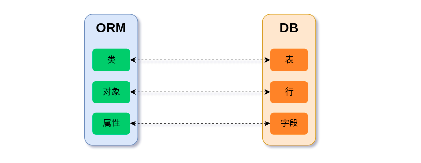

# 1. ORM

传统的数据库操作都是通过编写 SQL 语句，且针对不同的数据库还存在一定的差异。而 ORM 则是通过使用类和对象对数据库进行操作，避免了直接使用 SQL 语句，从而简化对数据库的操作。这种程序技术的底层主要是通过映射机制实现的。如图是 ORM 与数据库的映射关系图。



* 模型：相当于 Python 的类，映射一张数据库表。继承自 `django.db.models. Model`
* 属性：相当于一个数据库的字段，映射为数据库的列。每个属性都是一个 Field 类的实例
* 对象：相当于数据库中的一行记录
# 2. 常用字段类型与选项

> https://docs.djangoproject.com/zh-hans/3.2/ref/models/fields/#field-types



```sql
+----------------------+-------------------+------+-----+---------+----------------+
| Field                | Type              | Null | Key | Default | Extra          |
+----------------------+-------------------+------+-----+---------+----------------+
| Auto                 | int               | NO   | PRI | <null>  | auto_increment |
| BigAuto              | bigint            | NO   | PRI | NULL    | auto_increment |
| SmallAuto            | smallint          | NO   | PRI | <null>  | auto_increment |
| Boolean              | tinyint(1)        | NO   |     | <null>  |                |
| NullBoolean          | tinyint(1)        | YES  |     | <null>  |                |
| SmallInteger         | smallint          | NO   |     | <null>  |                |
| Integer              | int               | NO   |     | <null>  |                |
| BigInteger           | bigint            | NO   |     | <null>  |                |
| PositiveSmallInteger | smallint unsigned | NO   |     | <null>  |                |
| PositiveInteger      | int unsigned      | NO   |     | <null>  |                |
| PositiveBigInteger   | bigint unsigned   | NO   |     | <null>  |                |
| Float                | double            | NO   |     | NULL    |                |
| Decimal              | decimal(5,2)      | NO   |     | NULL    |                |
| Char                 | varchar(200)      | NO   |     | <null>  |                |
| Text                 | longtext          | NO   |     | <null>  |                |
| Time                 | time(6)           | NO   |     | <null>  |                |
| DateTime             | datetime(6)       | NO   |     | <null>  |                |
| Duration             | bigint            | NO   |     | <null>  |                |
| Date                 | date              | NO   |     | <null>  |                |
| File                 | varchar(100)      | NO   |     | <null>  |                |
| FilePath             | varchar(100)      | NO   |     | <null>  |                |
| Image                | varchar(100)      | NO   |     | <null>  |                |
| Email                | varchar(254)      | NO   |     | <null>  |                |
| JSON                 | json              | NO   |     | <null>  |                |
| Slug                 | varchar(50)       | NO   | MUL | <null>  |                |
| URL                  | varchar(200)      | NO   |     | <null>  |                |
| UUID                 | char(32)          | NO   |     | <null>  |                |
| GenericIPAddress     | char(39)          | NO   |     | <null>  |                |
| Binary               | longblob          | NO   |     | <null>  |                |
+----------------------+-------------------+------+-----+---------+----------------+
```



## 文件类型字段

* **FileField**：一个文件上传字段，该字段不允许使用 `primary_key` 属性，有可选参数：

```python
def user_directory_path(instance, filename):
    # file will be uploaded to MEDIA_ROOT/user_<id>/<filename>
    return 'user_{0}/{1}'.format(instance.user.id, filename)

fs = FileSystemStorage(location='/media/photos')

class MyModel(models.Model):
    # 文件上传到 MEDIA_ROOT/uploads
    upload = models.FileField(upload_to ='uploads/')

    # 文件上传到 MEDIA ROOT/uploads/2017/12/30
    upload = models.FileField(upload_to ='uploads/%Y/%m/%d/')

    # upload_to 也可以是可调用的函数，且必须接受两个参数，并返回一个 Unix 风格的路径（带斜线）
    upload = models.FileField(upload_to = user_directory_path)

    # 使用存储对象，忽略 MEDIA_ROOT 的设置将存储上传文件到 /media/photos
    upload = models.FileField(storage=fs)
```

* **FilePathField**：显示指定路径目录下的文件下拉列表，其中包括参数：
  + `path`：指定目录绝对路径，该目录下的文件将会显示在下拉列表中，其次 `path` 也可以是一个可调用对象，可以是在运行时动态设置路径的函数
  + `match`：一段正则表达式，用于显示过滤 `path` 目录中的文件，注意该正则表达式只能过滤文件名，不能过滤路径
  + `recursive`：是否递归的显示 `path` 目录下的文件，默认值为 False
  + `allow_files`：参数值为 True 或 False。规定是否包含文件，默认为 True
  + `allow_folders`：参数值为 True 或 False。规定是否包含文件夹，默认为 True。`allow_files` 和 `allow_folders` 之间必须有一个 True

```python
import os
from django.conf import settings
from django.db import models

def images_path():
    return os.path.join(settings.LOCAL_FILE_DIR, 'images')

class MyModel(models.Model):
    # FilePathField(path ="/home/images", match ="foo.*", recursive = True)
    file = models.FilePathField(path=images_path, match ="*.png", recursive = True)
```

* **ImageField**：FileField 类的子类，其仅限于上传图像格式，其次 `ImageField` 需要 `Pillow` 库才能够正常运行。额外属性：
  + `height_field`：每次保存模型实例时将自动填充图像的高度
  + `width_field`：每次保存模型实例时将自动填充图像的宽度

## 时间日期类型字段

* **TimeField**：存储时间的时间字段，在 Python 中用 `datetime.time` 实例表示
* **DateField**：存储日期的字段，在 Python 中创建的 `datetime.date` 对象
* **DateTimeField**：存储日期的日期和时间字段，在 Python 中由 `datetime.datetime` 实例表示
* **DurationField**：在 MySQL 数据库上存储采用 bigint 类型，存储时间戳，在 Python 中用 `timedelta` 表示

其中 `TimeField` 、 `DateField` 和 `DateTimeField` 具有以下额外的可选参数：

* `auto_now`：每次保存对象时自动将字段设置为现在。一般用来保存最后修改时间
* `auto_now_add`：首次创建对象时，将字段自动设置为现在时间，一般用来保存当前时间

注意：

1. 将日期类型字段的 `auto_now` 或者 `auto_now_add` 属性设置为 True ，那么字段的 `editable` 属性会被自动设置为 False，同时 `blank` 属性会被自动设置为 True
2. `auto_now` 和 `auto_now_add` 属性总是使用 `TIME_ZONE` 中设置的时区保存时间
3. `auto_now_add`、`auto_now` 和 `default` 三者只能单独存在

```python
import datetime
from django.utils import timezone

class DateFieldModel(models.Model):
    time = models.TimeField(default=datetime.time)
    date = models.DateField(default=datetime.date.today)
    datetime = models.DateTimeField(default=timezone.now)
```

## choices 选项

`choices` ：属性值为一个可迭代对象，如列表或者元组，迭代对象的每个成员包括两个字符串。其中第一个值将作为字段值保存到数据库中，第二个值用于提高字段的可读性。可以通过 `get_FOO_display()` 方法可以获取第二个值，其中 `FOO` 是字段的名称

```python
class Student(models.Model):
    GENDER = (
        ('0', 'male'),
        ('1', 'female')
    )
    gender = models.CharField(default='0', choices=GENDER, verbose_name="性别")
```

# 3. Meta 选项

> https://docs.djangoproject.com/zh-hans/3.2/ref/models/options/

## abstract

在 Meta 类中填入 `abstract=True` 。该模型将不会创建任何数据表。当其用作其它模型类的基类时，它的字段会自动添加至子类。

```python
from django.db import models

class CommonInfo(models.Model):
    name = models.CharField(max_length=100)
    age = models.PositiveIntegerField()

    class Meta:
        abstract = True

class Student(CommonInfo):
    home_group = models.CharField(max_length=5)
```

## app_label

如果模型所在位置不属于任何已注册的应用程序，即模型不在 INSTALLED_APPS 范围内，那么必须使用 `app_label` 选项来指定所属的应用程序名字。
​

例如我在 `first_app` 下新建了一个 `models2.py` 的文件。

```bash
.
├── db.sqlite3
├── django_tutorial
│   ├── asgi.py
│   ├── __init__.py
│   ├── settings.py
│   ├── urls.py
│   └── wsgi.py
├── first_app
│   ├── admin.py
│   ├── apps.py
│   ├── models2.py
│   ├── models.py
│   ├── tests.py
│   └── views.py
└── manage.py
```

在该文件中编写模型类，而没有把模型类写在默认的 `models.py` 文件中，所以要想使用该模型类就需要在模型类的 `meta` 选项中定义 `app_label` 指明该模型类属于那个 `app`

```python
from django.db import models

class Person(models.Model):
    name = models.CharField(max_length=64)

    class Meta:
        app_label = 'first_app'
```

## db_table

默认情况下一个模型的数据库表名为 `小写应用名_小写模型名` 。通过 `db_table` 可以指定用于模型的数据库表的名称，强烈建议使用小写的表名。

```python
class Student(modes.Model):
    # ...
    class Meta:
        db_table = 'student_info'
```

注意： `db_table` 元选项对抽象基类是无效的，也就是不应该在抽象基类中定义，因为抽象基类需要被多个子类继承

## get_latest_by

该属性的值是字段名或字段名列表，通常是 DateField，DateTimeField 或 IntegerField。使用该参数可以修改默认 `last()` 和 `earliest()` 方法的过滤规则。例如：

```python
# Latest by ascending order_date.
get_latest_by = "order_date"

# Latest by priority descending, order_date ascending.
get_latest_by = ['-priority', 'order_date']
```

## managed

默认为 True，代表 Django 会管理数据表的生命周期，即利用 Django 提供的工具可以完成创建和删除数据表。如果设置为 False，Django 则不会管理这些 Model 所对应数据表。
​

注意：

* 如果 Model 中没有声明主键，那么即使`managed=False`，Django 仍然会自动添加一个`id`的主键
* 如果 Model 中包含 ManyToManyField 类型的字段，且指向的 Model 也是自管理的（`managed=False`），那么相关两个模型表会创建，但是多对多的中间表不会创建

## order_with_respect_to

使该对象可以根据给定字段（通常是 ForeignKey ）进行排序。例如，如果一个 Answer 与一个 Question 对象相关联，且一个问题有多个答案，并且答案的顺序很重要，你可以这样做：

```python
from django.db import models

class Question(models.Model):
    text = models.TextField()
    # ...

class Answer(models.Model):
    question = models.ForeignKey(Question, on_delete=models.CASCADE)
    # ...

    class Meta:
        order_with_respect_to = 'question'
```

当设置了 `order_with_respect_to` 后，Answer 关联对象 Question 获得两个额外新方法： `get_RELATED_order()` 和 `set_RELATED_order()` ，其中 `RELATED` 是小写的模型名称 `answer` 。
​

例如，假设一个 Question 对象有多个相关的 Answer 对象，返回的列表包含相关 Answer 对象的主键：

```python
>>> question = Question.objects.get(id=1)
>>> question.get_answer_order()
[1, 2, 3]
```

而与 Question 对象的相关联的 Answer 对象顺序可以通过传递 Answer 主键列表来设置：

```python
>>> question.set_answer_order([3, 1, 2])
```

除此之外 Answer 对象还得到两个方法， `get_next_in_order()` 和 `get_previous_in_order()` ，这两个方法可以用来按照正确的顺序访问这些对象。假设 Answer 对象按 id 排序：

```python
>>> answer = Answer.objects.get(id=2)
>>> answer.get_next_in_order()
<Answer: 3>
>>> answer.get_previous_in_order()
<Answer: 1>
```

**注意：在内部， `order_with_respect_to` 增加了一个名为 `_order` 的额外字段也就是新增了数据库列，并将模型的 `ordering` 选项设置为这个字段。因此， `order_with_respect_to` 和 `ordering` 不能同时使用**

## ordering

用于获取对象列表时，对象的默认排序：

```python
from django.db import models

class ModelName(models.Model):
    ...
    
    class Meta:
        ordering = ['-order_date'] # 降序
        ordering = ['order_date'] # 升序
        ordering = '?' # 随机排序
        ordering = ['-pub_date', 'author'] # 按 pub_date 降序，然后按 author 升序
```

## permissions

创建此对象时，要在权限表中输入额外的权限。将为每个模型自动创建添加，更改，删除和查看权限。下面的例子将增加两个额外的权限 `export` 和 `notify`

```python
from django.db import models

class ModelName(models.Model):
    ...
    
    class Meta:
        permissions = [
            ("export", "Can export candidate list"),
            ("notify", "notify interviewer for candidate review"),
        ]
```

## indexes

它是一个列表类型的元选项，用来定义 Model 的索引，列表中的每一个元素都是 `django.db.models.indexes.Index` 类型的实例，Index 的类定义如下：

```python
class Index(fields=[], name=None, db_tablespace=None)
```

* `fields`用于指定索引的字段，至少包含一个字段，必选
* `name`用于标识索引的名称，可选
* `db_tablespace`表空间，可选

```python
class Customer(models.Model):
    first_name = models.CharField(max_length=100)
    last_name = models.CharField(max_length=100)

    class Meta:
        indexes = [
            models.Index(fields=['last_name', 'first_name']),
            models.Index(fields=['first_name'], name='first_name_idx')
        ]
```

## unique_together

为数据库表设置联合主键，形式如下：

```python
unique_together = [['driver', 'restaurant']]
```

这是一个列表，这些列表在一起考虑时必须是唯一的。如果只有一个联合主键，可以简化 `unique_together` ​

```python
unique_together = ['driver', 'restaurant']
```

注意：ManyToManyField 类型的字段不能包含在 unique_together 中

## index_together

创建联合唯一索引

```python
index_together = ["pub_date", "deadline"]
```

## constraints

创建约束，例如下面的 `age` 字段，确保年龄永远不小于 18

```python
from django.db import models

class Customer(models.Model):
    age = models.IntegerField()

    class Meta:
        constraints = [
            models.CheckConstraint(check=models.Q(age__gte=18), name='age_gte_18'),
        ]
```

## verbose_name

对象的可读名称，单数。如果没有给定，Django 将使用一个 munged 版本的类名：CamelCase 变成 camel case。

```python
verbose_name = "pizza"
```

## verbose_name_plural

对象的复数名称，如果没有给定，Django 将使用 `verbose_name + "s"` 。

```python
verbose_name_plural = "stories"
```

## default_manager_name

按照在模型中定义的顺序，Django 将类定义中的第一个 `Manager` 视作 “默认” `Manager` 。但是也可以通过 `Meta.default_manager_name` 指定一个自定义的默认管理器。

```python
class Person(models.Model):
    ......
    people = models.Manager()
    authors = AuthorManager()
    editors = EditorManager()
    
    class Meta:
        default_manager_name = 'people'
```

# 4. 模型实例方法

> https://docs.djangoproject.com/zh-hans/3.2/ref/models/instances/

## `__str__`

每当你对一个对象调用 `str()` 时，就会调用 `__str__()` 方法，重写该方法返回一个易读的模型表示。

```python
from django.db import models

class Person(models.Model):
    first_name = models.CharField(max_length=50)
    last_name = models.CharField(max_length=50)

    def __str__(self):
        return '%s %s' % (self.first_name, self.last_name)
```

## `__eq__`

判断两个模型对象是否相等，当主键相同，则为相等，否则不相等

```bash
>>> MyModel(id=1) == MyModel(id=1)
True
>>> MyModel(id=1) == MyModel(id=2)
False
>>> MyModel(id=None) == MyModel(id=None)
False

# 主键值为 None 的实例除自身外对任何事物都不相等
>>> instance = MyModel(id=None)
>>> instance == instance
True
```

## get_absolute_url

对于调用者而言，该方法应该返回一个对象的 HTTP URL 字符串

```python
def get_absolute_url(self):
    return "/people/%i/" % self.id
```

但是通常使用 `reverse()` 函数是最好的方法。

```python
def get_absolute_url(self):
    from django.urls import reverse
    return reverse('people.views.details', args=[str(self.id)])
```

然而如果是在模板中使用则不需要硬编码

```python
# 硬编码方式不好
<a href="/people/{{ object.id }}/">{{ object.name }}</a>

<a href="{{ object.get_absolute_url }}">{{ object.name }}</a>
```

从 `get_absolute_url()` 返回的字符串必须只包含 ASCII 字符。如果使用的字符串包含 ASCII 码范围以外的字符，可以使用 `django.utils.encoding.iri_to_uri()` 函数来解决

## get_FOO_display

当设置了 `choice` 的字段，该对象将有一个 `get_FOO_display()` 方法，其中 FOO 是字段的名称。该方法返回 `choice` 二元组的第二个值。

```python
from django.db import models

class Person(models.Model):
    SHIRT_SIZES = (
        ('S', 'Small'),
        ('M', 'Medium'),
        ('L', 'Large'),
    )
    name = models.CharField(max_length=60)
    shirt_size = models.CharField(max_length=2, choices=SHIRT_SIZES)
    
>>> p = Person(name="Fred Flintstone", shirt_size="L")
>>> p.save()
>>> p.shirt_size
'L'
>>> p.get_shirt_size_display()
'Large'
```

# 5. 数据的增删改查

> https://docs.djangoproject.com/zh-hans/3.2/ref/models/querysets/




```python
# 1. 先创建在保存
book = Book(name='三国演义', author='罗贯中', price=99.98)
book.save()

# 2. 创建并保存
book = Book.objects.create(name='西游记', author='吴承恩', price=89.99)

# 3. 批量创建
book1 = Book(name='水浒传', author='施耐庵', price=119.99)
book2 = Book(name='红楼梦', author='曹雪芹', price=79.98)
books = Book.objects.bulk_create([book1, book2])

# 4. 查找不存在则创建， obj 是检索或创建的对象， created 是指定是否创建新对象的布尔值
obj, created = Book.objects.get_or_create(name='射雕英雄传', author='金庸', price=109.99)

# 5. 更新不存在则创建， obj 是更新或创建的对象， created 是指定是否创建新对象的布尔值
obj, created = User.objects.update_or_create(username='john', age=27, defaults={'age': '28'})
```




```python
# 1. 直接修改
rows = Book.objects.update(price=69.99) # 更改所有记录的 price 列，返回修改的行数

# 2. 查找对象修改
books = Book.objects.filter(name='水浒传').update(price=119.99)

# 3. 查找对象，赋值保存修改
book = Book.objects.filter(name='水浒传')[0]
book.pric e= 119.99
book.save()
```

`update` 是在 SQL 级别上进行更新，因此，它不会在模型上调用任何 `save` 方法，也不会发出 `pre_save` 或 `post_save` 信号




```python
# 1. 查询对象删除
book = Book.objects.filter(name='水浒传')[0]
book.delete()

# 2. 直接执行 QuerySet 删除
deleted, rows = Book.objects.filter(name='水浒传').delete()
# deleted 删除的记录数量
# rows 每个对象类型的删除数量的字典
# eg: 1 {'app.User': 1}
```

默认情况下，Django 的 `ForeignKey` 模拟了 SQL 约束 `ON DELETE CASCADE` 。 `delete()` 方法进行批量删除，会为所有被删除的对象（包括级联删除）发出 `pre_delete` 和 `post_delete` 信号。

Django 需要将对象获取到内存中来发送信号和处理级联。但是，如果没有级联和信号，那么 Django 可能会采取**快速路径**删除对象，而不需要将其获取到内存中。对于大面积的删除，这可以使内存使用量大大降低。也可以减少执行查询的数量。但是如果设置 `on_delete=DO_NOTHING` 的外键不会阻止在删除时采取快速路径。




## QuerySet API

> https://docs.djangoproject.com/zh-hans/3.2/ref/models/querysets/#queryset-api

* **annotate**

给 QuerySet 中的每个对象都添加一个使用查询表达式（聚合函数、F 表达式、Q 表达式、Func 表达式等）的新字段

```python
books = Book.objects.annotate(Count('author'))
print(books[0].author__count) # 2
print(books[1].author__count) # 1

books = Book.objects.annotate(new_price=F('price') + 1000)
print(books[0].new_price) # 1099.98
```

* **in_bulk**

接受一个字段值列表 `field_list` ，返回字段值与其对应对象的映射字典。其中 `field_name` 必须是一个唯一的字段，它默认为主键

* 如果没有提供 `field_list`，则返回查询集中的所有对象。
* 如果提供一个空列表，你将得到一个空字典。

```python
# in_bulk(id_list=None, field_name='pk')

Book.objects.in_bulk([1, 2])
# {1: <Book: 三国演义>, 2: <Book: 西游记>}

Book.objects.in_bulk(['三国演义'], field_name='name')
# {'三国演义': <Book: 三国演义>}

Book.objects.in_bulk(['三国演义', '西游记'], field_name='name')
# {'三国演义': <Book: 三国演义>, '西游记': <Book: 西游记>}
```

* **values**

用来指定在提取哪些字段。默认情况下会把表中所有的字段全部都提取出来，且提取出的 QuerySet 中的数据类型不是模型，而是在 `values` 方法中指定的字段和值形成的字典

```python
books = Book.objects.values()
# <QuerySet [{'id': 1, 'name': '三国演义', 'author': '罗贯中', 'price': Decimal('99.98')}, {'id': 2, 'name': '西游记', 'author': '吴承恩', 'price': Decimal('89.99')}, {'id': 3, 'name': '水浒传', 'author': '施耐庵', 'price': Decimal('119.99')}, {'id': 4, 'name': '红楼梦', 'author': '曹雪芹', 'price': Decimal('79.98')}]>

books = Book.objects.values('name', 'author') # 仅获取 name 和 author 属性
# <QuerySet [{'name': '三国演义', 'author': '罗贯中'}, {'name': '西游记', 'author': '吴承恩'}, {'name': '水浒传', 'author': '施耐庵'}, {'name': '红楼梦', 'author': '曹雪芹'}]>
```

* **values_list**

类似于 values。只不过返回的 QuerySet 中，存储的不是字典，而是元组

```python
books = Book.objects.values_list('name', 'author')
# <QuerySet [('三国演义', '罗贯中'), ('西游记', '吴承恩'), ('水浒传', '施耐庵'), ('红楼梦', '曹雪芹')]>

books = Book.objects.values_list('name')
# <QuerySet [('三国演义',), ('水浒传',), ('红楼梦',), ('西游记',)]>

books = Book.objects.values_list('name', flat=True) # 只有一个字段，传递 flat=True 将结果扁平化
# <QuerySet ['三国演义', '水浒传', '红楼梦', '西游记']>
```

* **select_related**

```python
class Category(models.Model):
    ......

class Article(models.Model):
    ......
    category = models.ForeignKey(to=Category, on_delete=models.CASCADE) 
```

在提取某个模型的数据的同时，也提前将相关联的数据提取出来。比如提取文章数据，可以使用 `select_related` 将 `category` 信息提取出来，以后再次使用 `article.category` 的时候就不需要再次去访问数据库了，可以减少数据库查询的次数。

* 普通查询

```python
# 1. 访问数据库
article = Article.objects.get(pk=1)
# 2. 访问数据库，获取相关的 Category 对象
category = article.category
```

* select_related 查询

```python
# 1. 访问数据库
article = Article.objects.select_related("category").get(pk=1)

# 2. 不需要访问数据库，因为 article.category 已经被预先填充在上一个查询中
category = article.category
```

> 注意： `selected_related` 只能用在一对多或者一对一中，不能用在多对多或者多对一中。比如可以提前获取文章的作者，但是不能通过作者获取这个作者的文章。

* **prefetch_related**

```python
class Article(models.Model):
    ......

class Tag(models.Model):
    ......
    articles = models.ManyToManyField(Article)
    # articles = models.ManyToManyField(Article, related_name='tags')
```

这个方法和 `select_related` 非常的类似，就是在访问多个表中的数据的时候，减少查询的次数。这个方法是为了解决多对一和多对多的关系的查询问题。比如要获取 Article 内容中带有 `Python` 字符串的文章以及它的所有标签，示例代码如下：

```python
from django.db import connection

# 此处的 tag_set 可通过 related_name='tags' 替换
articles = Article.objects.prefetch_related("tag_set").filter(content__contains='Python')

print(articles.query)
# SELECT `app_article`.`id`, `app_article`.`title`, `app_article`.`content`, `app_article`.`category_id` FROM `app_article` WHERE `app_article`.`content` LIKE BINARY %Python%

for article in articles:
    print("title:",article.title)
    print(article.tag_set.all())

# 通过以下代码可以看出以上代码执行的sql语句
for sql in connection.queries:
    print(sql)
```

但是如果在使用 `article.tag_set` 的时候又创建了一个新的 QuerySet 那么会把之前的 SQL 优化给破坏掉。比如以下代码：

```python
tags = Tag.obejcts.prefetch_related("articles")
for tag in tags:
    # 因为 filter 方法会重新生成一个 QuerySet，因此会破坏掉之前的 sql 优化
    articles = tag.articles.filter(content__contains='Python')

# 通过以下代码，我们可以看到在使用了 filter 的，他的 sql 查询会更多，而没有使用 filter 的，只有两次 sql 查询
for sql in connection.queries:
    print(sql)
```

那如果确实是想要在查询的时候指定过滤条件该如何做呢，这时候我们可以使用 `django.db.models.Prefetch` 来实现， `Prefetch` 这个可以提前定义好 queryset。示例代码如下：

```python
tags = Tag.objects.prefetch_related(Prefetch("articles",queryset=Article.objects.filter(content__contains='Python'))).all()

for tag in tags:
    articles = tag.articles.all()
    for article in articles:
        print(article)

for sql in connection.queries:
    print('='*30)
    print(sql)
```

因为使用了 `Prefetch` ，即使在查询文章的时候使用了 `filter` ，也只会发生两次查询操作。

* **iterator**

QuerySet 通常会在内部缓存其结果，因此重复执行不会导致额外的查询。相反， `iterator()` 将直接读取结果，而不在 QuerySet 级别做任何缓存。对于一个只需要访问一次就能返回大量对象的 QuerySet 来说，这可以带来更好的性能，并显著减少内存。
​

其次使用 `iterator()` 会导致之前的 `refetch_related()` 调用被忽略

```python
Entry.objects.iterator(chunk_size=2000)
```

`chunk_size` 参数控制 Django 从数据库驱动中获取的批次大小。批量越大，就会减少与数据库驱动通信的开销，但代价是略微增加内存消耗。默认值 2000。

* **explain**

> https://docs.djangoproject.com/zh-hans/3.2/ref/models/querysets/#explain

返回 QuerySet 的执行计划的字符串。用于分析查询性能

```python
explain = Book.objects.filter(name='三国演义').explain()
print(explain) # -> Rows fetched before execution  (cost=0.00 rows=1)

explain = Book.objects.filter(name='三国演义').explain(format='JSON')
```

## Field 查找

> https://docs.djangoproject.com/zh-hans/3.2/ref/models/querysets/#field-lookups

```python
# 模型类.objects.filter(<field>__<ruleger>)
users = User.objects.filter(age__gte=20)
```

## QuerySet 转换为 SQL 去执行的条件

> [https://docs.djangoproject.com/zh-hans/3.2/ref/models/querysets/#when-querysets-are-evaluated](https://docs.djangoproject.com/zh-hans/3.2/ref/models/querysets/#when-querysets-are-evaluated)

生成一个 QuerySet 对象并不会马上转换为 SQL 语句去执行。比如我们获取 `Book` 表下所有的图书：

```python
books = Book.objects.all()
print(connection.queries)
```

`connection.quries` 打印的是一个空的列表，说明上面的 QuerySet 并没有真正的执行。
​

在以下情况下 QuerySet 会被转换为 SQL 语句执行：

1. 迭代：在遍历 QuerySet 对象的时候，会首先先执行这个 SQL 语句，然后再把这个结果返回进行迭代。比如以下代码就会转换为 SQL 语句

```python
for book in Book.objects.all():
    print(book)
```

2. 使用步长做切片操作：QuerySet 可以类似于列表一样做切片操作。做切片操作本身不会执行 SQL 语句，但是如果如果在做切片操作的时候提供了步长，那么就会立马执行 SQL 语句。需要注意的是，做切片后不能再执行 filter 方法，否则会报错。
3. 调用`len`函数：调用`len`函数用来获取 QuerySet 中总共有多少条数据也会执行 SQL 语句
4. 调用`list`函数：调用`list`函数用来将一个 QuerySet 对象转换为`list`对象也会立马执行SQL语句
5. 判断：如果对某个 QuerySet 进行判断，也会立马执行 SQL 语句

## 关联关系

### 一对多：ForeignKey

> https://docs.djangoproject.com/zh-hans/3.2/ref/models/fields/#foreignkey

比如一个文章分类表 `Category` 和一个文章表 `Article` ，一个分类可以有多个文章，所以文章分类表 `Category` 和一个文章表 `Article` 是一对多的关系

```python
class Category(models.Model):
    name = models.CharField(max_length=100)

class Article(models.Model):
    title = models.CharField(max_length=100)
    content = models.TextField()
    category = models.ForeignKey(to=Category, on_delete=models.CASCADE,
                                 related_name='articles', related_query_name='article_query',
                                 limit_choices_to=None, parent_link=False, to_field=None, db_constraint=True)
```

默认情况下，数据库表名为 `小写应用名_小写类名` ，关联字段命名为 `fieldname_id` ，且会自动创建一个数据库索引。当然也可以通过设置 `db_index=False` 来禁用它。

参数：

* `to`：指示引用的是哪个模型，可取值：`modelname`（模型对象）、`"modelname"`（模型名字符串）、`"appname.modelname"`（应用名. 模型名字符串）

```python
category = models.ForeignKey(to=Category)
category = models.ForeignKey(to='Category')
category = models.ForeignKey(to='app.Category')
```

* `on_delete`：外键约束，决定删除外键对应的数据时，关联的数据如何处理

```python
# CASCADE 级联操作。category 对应的外键被删除，则关联的 Article 数据也被删除
category = models.ForeignKey(to=Category, on_delete=models.CASCADE)

# PROTECT 受保护。category 对应的外键被删除，则关联的 Article 数据不能删除
category = models.ForeignKey(to=Category, on_delete=models.PROTECT)

# SET_NULL 设置为空。category 对应的外键被删除，则关联的 Article 的 cagegory 字段值设置为空，前提是该字段允许为空
category = models.ForeignKey(to=Category, null=True, on_delete=models.SET_NULL)

# SET_DEFAULT 设置默认值。category 对应的外键被删除，则关联的 Article 的 cagegory 字段值设置为默认值，前提是该字段需要设置默认值
category = models.ForeignKey(to=Category, default=1, on_delete=models.SET_DEFAULT)

# DO_NOTHING category 对应的外键被删除，则关联的 Article 不采取任何行为，一切全看数据库级别的约束
category = models.ForeignKey(to=Category, on_delete=models.DO_NOTHING)

# SET(val) 设置值。category 对应的外键被删除，则关联的 Article 的 cagegory 字段值设置为 SET 函数中的值。
# SET 函数可以接收一个可以调用的对象（比如函数或者方法），如果是可调用的对象，那么会将这个对象调用后的结果作为值返回回去
category = models.ForeignKey(to=Category, on_delete=models.SET())
```

* `related_name`：设置反向查询字段名称

```python
"""需求：通过 Catrgory 查询其关联的 Article"""

category = Category.objects.first()

# 1. 使用默认的 <模型名字小写_set>
articles = category.article_set.all()

# 2. 使用 related_name='articles' 替换 article_set
articles = category.articles.all()

# 3. 将 related_name 设置为 '+' 或者以 '+' 结束，则通过 Catrgory 查询其关联的 Article
```

* `related_query_name`：反向过滤器的名称

```python
# 1. 默认 <关联模型类名小写>__<关联模型字段>
categories = Category.objects.filter(article__title='Django')

# 2. 使用 <related_name>__<关联模型字段>，前提是设置了 related_name，而没有设置 related_query_name，此时 related_query_name 默认等于 related_name 
categories = Category.objects.filter(articles__title='Django')

# 3. 使用 <related_query_name>__<关联模型字段>
categories = Category.objects.filter(article_query__title='Django')
```

* `to_field`：指定关联对象的字段。默认情况下，Django 使用相关对象的主键。如果引用了其他字段，这个字段必须是 `unique=True`

### 一对一：OneToOneField

> https://docs.djangoproject.com/zh-hans/3.2/ref/models/fields/#onetoonefield

比如一个用户表 `User` 和一个用户信息表 `UserExtension` 。用户信息表用于对用户表的信息补充，所以用户表 `User` 和用户信息表 `UserExtension` 就是典型的一对一了。

```python
class User(models.Model):
    username = models.CharField(max_length=20)
    password = models.CharField(max_length=100)

class UserExtension(models.Model):  
    birthday = models.DateTimeField(null=True)  
    school = models.CharField(blank=True,max_length=50)  
    user = models.OneToOneField(User, on_delete=models.CASCADE)
```

### 多对多：ManyToManyField

比如一个文章表 `Article` 和一个标签表 `Tag` 。一篇文章可以有多个标签，一个标签可以被多个文章所引用。因此标签和文章的关系是典型的多对多的关系。

```python
class Article(models.Model):
    title = models.CharField(max_length=100)
    content = models.TextField()
    # tags = models.ManyToManyField("Tag",related_name="articles")

class Tag(models.Model):
    name = models.CharField(max_length=50)
    articles = models.ManyToManyField(Article, related_name="tags")
```

在多对多关系中，Django 会创建了一个中间连接表来表示多对多的关系。默认情况下，这个表名为 `小写应用名_小写模型名_关联字段名` ，上面的例子就是 `app_tag_articles` 。

其次 `ManyToManyField` 所涉及的一些参数用法与 ForeignKey 相同。除了个别特有的参数：

* `through`：默认情况下，Django 会自动生成一个中间表来管理多对多关系，该参数可以自定义中间表

```python
# 1. 当源模型和目标模型不同
class Article(models.Model):
    ...

class Tag(models.Model):
    ...
    articles = models.ManyToManyField(Article, related_name="tags")

+------------+--------+------+-----+---------+----------------+
| Field      | Type   | Null | Key | Default | Extra          |
+------------+--------+------+-----+---------+----------------+
| id         | bigint | NO   | PRI | NULL    | auto_increment |
| tag_id     | bigint | NO   | MUL | NULL    |                |
| article_id | bigint | NO   | MUL | NULL    |                |
+------------+--------+------+-----+---------+----------------+

# 2. 当源模型和目标模型相同，也就是自关联多对多
class Person(models.Model):
    friends = models.ManyToManyField("self")

+----------------+--------+------+-----+---------+----------------+
| Field          | Type   | Null | Key | Default | Extra          |
+----------------+--------+------+-----+---------+----------------+
| id             | bigint | NO   | PRI | NULL    | auto_increment |
| from_person_id | bigint | NO   | MUL | NULL    |                |
| to_person_id   | bigint | NO   | MUL | NULL    |                |
+----------------+--------+------+-----+---------+----------------+

# 3. 使用 through 参数自定义中间表而不采用默认建立的
class Article(models.Model):
    ...
    
class Tag(models.Model):
    ...
    articles = models.ManyToManyField(Article, through='ArticleTag')

class ArticleTag(models.Model):
    article = models.ForeignKey(Article, on_delete=models.CASCADE)
    tag = models.ForeignKey(Tag, on_delete=models.CASCADE)
    pub_date = models.DateTimeField(default=timezone.now) # 添加额外字段

    class Meta:
        db_table = "article_tag_relationship" # 自定义中间表名
```

* `through_fields`：只有当指定了一个自定义的中间模型时才会使用，Django 通常会决定使用模型的哪些字段来自动建立多对多的关系

```python
class Article(models.Model):
    ...
    
class Tag(models.Model):
    ...
    articles = models.ManyToManyField(Article, through='ArticleTag', through_fields=('tag', 'article'))

class ArticleTag(models.Model):
    article = models.ForeignKey(Article, on_delete=models.CASCADE)
    tag = models.ForeignKey(Tag, on_delete=models.CASCADE)
    pub_date = models.DateTimeField(default=timezone.now) # 添加额外字段

    class Meta:
        db_table = "article_tag_relationship" # 自定义中间表名
```

`through_fields` 接受一个二元元组 `('field1', 'field2')` ，其中 `field1` 是定义在 `ManyToManyField` 上的模型（本例中为 `tag` ）的外键名称， `field2` 是目标模型（本例中为 `article` ）的外键名称。

# 6. 聚合函数

| **函数名** | **描述** |
| --- | --- |
| `Avg` | 返回表达式的平均值。 |
| `Count` | 计算返回的对象数 |
| `Max` | 返回表达式的最大值。 |
| `Min` | 返回表达式的最小值。 |
| `StdDev` | 返回给定表达式中数据的标准差。 |
| `Sum` | 返回表达式中所有值的总和。 |
| `Variance` | 返回给定表达式中数据的方差。 |

聚合函数是通过 `aggregate` 函数来实现的，该函数返回值为一个字典，默认字典的键是根据字段名和聚合函数名自动生成的（ `字段名__小写聚合函数名` ）也可以指定的名称。

```python
from django.db.models import Sum, Count, Max, Min, Avg

# Avg
>>> Book.objects.all().aggregate(Avg('price'))  
{'price__avg': 34.35}

# distinct，默认是等于 False，如果是等于 True，那么将去掉那些重复的值
>>> Book.objects.all().aggregate(Count('price',distinct=True))
{'price__count': 110.15}

# 生成更多的聚合内容
>>> Book.objects.aggregate(Avg('price'), Max('price'), Min('price'))
{'price__avg': 34.35, 'price__max': Decimal('81.20'), 'price__min': Decimal('12.99')}

# 指定的名称
>>> Book.objects.aggregate(average_price=Avg('price'))
{'average_price': 34.35}
```

# 7. 表达式

## F() 表达式

`F()表达式` 是用来优化 ORM 操作数据库的。比如我们要将所有书籍的价格都增加 10 元，如果按照正常的流程，应该是先从数据库中提取所有的 `book.price` 到内存中，然后在原基础之上增加 10 元，最后再保存到数据库中。这里面涉及的流程就是，首先从数据库中提取数据到内存中，然后在内存中做完运算之后再保存到数据库中。示例代码如下：

```python
books = Book.objects.all()
for book in books:
    book.price += 10
    book.save()
```

而 `F()表达式` 就可以优化这个流程，它不需要先把数据从数据库中提取出来，计算完成后再保存回去，而是直接执行 SQL 语句，就将书籍的价格增加 10 元。示例代码如下：

```python
from django.db.models import F
Book.objects.update(price=F("price") + 10)
```

这样做的好处是可以**避免多线程竞争**，假设两个 Python 线程执行上面的第一种方案的代码，一个线程可以在另一个线程从数据库中获取一个 `price` 字段的值后，检索、递增并保存它。第二个线程保存的值将基于原始值，从而导致第一个线程的工作并不是基于第二个线程之后的结果。

如果数据库负责更新字段，那么这个过程就比较稳健：它只会在执行 `save()` 或 `update()` 时，根据数据库中字段的值来更新字段，而不是根据检索实例时的值来更新。

* **F() 表达式赋值在 `Model.save()` 之后持续存在**

例如下面的代码， `price` 将被更新两次。如果最初是 1，最终值将是 3。这种持久性可以通过在保存模型对象后重新加载来避免，例如，使用 `refresh_from_db()` 。

```python
book.price = F('price') + 1
book.save()

# reporter.refresh_from_db() 重新加载对象

book.name = '射雕英雄传'
book.save()
```

* **在过滤器中使用 F() 表达式**

Django 中 F 表达式的实例充当查询中的模型字段的引用。这些引用可在查询过滤器中用于在同一模型实例中比较两个不同的字段。

```python
from django.db.models import F

# 查询图书阅读量大于评论量图书信息
Book.objects.filter(read__gt=F('comment')) 

# 查询图书阅读量大于2倍评论量图书信息
Book.objects.filter(read__gt=F('comment')*2) 

# 查询图书阅读量大于评论量+点赞量图书信息
Book.objects.filter(read__gt=F('comment')+F('like')) 

# 查询修改超过 3 天的图书信息
Book.objects.filter(modifidy_at__gt=F('created_at') + timedelta(days=3)) 
```

F() 表达式通过 `.bitand()` ， `.bitor()` ， `.bitxor()` ， `.bitrightshift()` 和 `.bitleftshift()` 支持位操作

```python
F('somefield').bitand(16)
```

## Q() 对象

像 F() 表达式一样， `Q()对象` 将 SQL 表达式封装在 Python 对象内部。 `Q()对象` 最常用于通过使用 `AND(&)` 、 `OR(|)` 和 `NOT(~)` 运算符将多个表达式链接在一起来构造复杂的数据库查询：

```python
from django.db.models import Q

# 查询id大于3且阅读量大于 30 的图书的信息。
Book.objects.filter(id__gt=3, bread__gt=30)
Book.objects.filter(Q(id__gt=3)&Q(bread__gt=30))

# 查询 id 大于 3 或者阅读量大于 30 的图书的信息。
Book.objects.filter(Q(id__gt=3)|Q(bread__gt=30))

# 查询 id 不等于 3 图书的信息。
Book.objects.filter(~Q(id=3))
```

# 8. 原生 SQL

> https://docs.djangoproject.com/zh-hans/3.2/topics/db/sql/#performing-raw-sql-queries

```python
# 查询所有
Book.objects.raw('select * from app_book') # <RawQuerySet: select * from app_book>

# 指定模型字段名，查询返回的 Book 对象即延迟模型实例
books = Book.objects.raw('select id,price from app_book')
for book in books:
    print(book.id, book.price)      # 原始查询，由 raw() 查询出的
    print(book.name, book.author)   # 按需加载，打印时按需查询

# 使用 SQL 的 AS 子句将查询语句中的字段映射至模型中的字段，查询语句中的字段排序并不重要，只要名字对上了，模型实例就会被正确创建
Book.objects.raw('select bid as id ,bname as name, bauthor as author, bprice as price from app_book')

# 用 translations 参数将查询语句中的字段映射至模型中的字段
field_map = {'bname': 'name', 'bid': 'id', 'bauthor': 'author', 'bprice': 'price'}
Book.objects.raw('SELECT * FROM some_other_table', translations=name_map)

# 切片
Book.objects.raw('select * from app_book')[0]

# 索引和切片不是在数据库层面上实现的。若数据库中有非常多的 Book 对象，更高效的方式是在 SQL 层面使用 limit 子句:
Book.objects.raw('select * from app_book limit 1')[0]

# 传递参数
name = '三国演义'
books = Book.objects.raw('select * from app_book where name = %s', [name])
```

注意：

1. Django 允许在 `raw()` 方法中执行任意 SQL 语句，但是 Django 希望 SQL 语句能够返回一行或多行数据，如果执行结束没有返回任何数据， `raw()` 方法将会抛出异常
2. Django 不会对传给 `raw()` 的 SQL 语句做任何检查
3. 在 MySQL 上执行查询，可能会因为强制类型导致不可预料的后果。例如用一个整数值查询一个字符串列，MySQL 会执行比较前将表中所有数据强制转为整数
4. 不要对原生查询或 SQL 字符串中的引号占位符使用字符串格式化！使用 `params` 参数和不用引号包裹占位符使你免受 SQL 注入攻击，下面的代码就存在 SQL 注入的漏洞，即当 `name="xxx' or '1"` 就永远为真

```python
name = "三国演义 'or '1"
query = "select * from app_book where name = '%s'" % name
books = Book.objects.raw(query)
```

## 自定义 SQL

* `django.db.connection`：对象提供了数据库连接操作
* `connection.cursor()`：得到一个游标对象
* `cursor.execute(sql, [params])`：执行指定 SQL 语句
* `cursor.fetchone()`：得到一个结果
* `cursor.fetchall()`：得到所有的结果

```python
from collections import namedtuple
from django.db import connection

with connection.cursor() as cursor:
    price = 59.99
    cursor.execute('select * from app_book where price > %s', [price])
    rows = cursor.fetchall()  # 元组套元组
    columns = [col[0] for col in cursor.description]
    nt_result = namedtuple('Result', [col[0] for col in cursor.description])

# ((6, '三国演义', '罗贯中', Decimal('99.98')), (7, '西游记', '吴承恩', Decimal('89.99'),...)
print(rows)

# [{'id': 6, 'name': '三国演义', 'author': '罗贯中', 'price': Decimal('99.98')},{...},...]
print([dict(zip(columns, row)) for row in rows])

# [Result(id=6, name='三国演义', author='罗贯中', price=Decimal('99.98')),Result(...),...]
print([nt_result(*row) for row in rows])
```

要避免 SQL 注入，绝对不能在 SQL 字符串中用引号包裹 `%s` 占位符。此外若要在查询中包含文本的百分号，你需要在传入参数使用两个百分号:

```python
cursor.execute("select * from app_book where name = '30%'")
cursor.execute("select * from app_book where name = '30%%' AND id = %s", [self.id])
```

如果当前工程包含多个数据库，可以使用 `django.db.connections` 获取指定数据库的连接。例如：连接数据库 `polls` ：

```python
from django.db import connections
with connections['polls'].cursor() as cursor:
    pass
```

## 执行存储过程

例如，在一个 Oracle 数据库中指定存储过程：

```python
CREATE PROCEDURE "TEST_PROCEDURE"(v_i INTEGER, v_text NVARCHAR2(10)) AS
    p_i INTEGER;
    p_text NVARCHAR2(10);
BEGIN
    p_i := v_i;
    p_text := v_text;
    ...
END;
```

调用该存储过程：

```python
with connection.cursor() as cursor:
    cursor.callproc('test_procedure', [1, 'test'])
```

# 9. 数据库事务

Django 默认的事务行为是自动提交。除非事务正在执行，每个查询将会马上自动提交到数据库。注意，只有视图被限制在事务中执行，中间件在事务之外运行，同理，渲染模板响应也是在事务之外运行的。

* **ATOMIC_REQUESTS**

开启事务，只需要配置 `ATOMIC_REQUESTS=True` ，则在调用试图方法前，Django 会生成一个事务。如果响应能正常生成，Django 会提交该事务。而如果视图出现异常，Django 则会回滚该事务。

但是即便启用了 `ATOMIC_REQUESTS` ，仍能避免视图在事务中运行。 利用 `non_atomic_requests(using=None)` 装饰器为指定视图取消 `ATOMIC_REQUESTS` 的影响。

```python
from django.db import transaction

@transaction.non_atomic_requests
def my_view(request):
    do_stuff()

@transaction.non_atomic_requests(using='other')
def my_other_view(request):
    do_stuff_on_the_other_database()
```

* **atomic**

`atomic` 允许创建代码块来保证数据库的原子性。如果代码块成功创建，这个变动会提交到数据库。如果有异常，变动会回滚。

```python
from django.db import transaction

@transaction.atomic
def viewfunc(request):
    # 此代码在事务内执行
    do_stuff()

def viewfunc(request):
    # 这段代码在自动提交模式下工作
    do_stuff()

    with transaction.atomic():
        # 这段代码在事务中处理
        do_more_stuff()   
```

# 10. 模型继承

## 抽象基类

抽象基类不会生成数据表，也没有管理器，也不能被实例化和保存。一般用于多个模型存在共同的字段时，为了避免大量重复的代码，可以建立一个父类抽象模型，再建立子类模型去继承父类

```python
class BaseModel(models.Model):
    create_time = models.DateTimeField(auto_now_add=True)
    update_time = models.DateTimeField(auto_now=True)
    is_delete = models.BooleanField(default=False)

    class Meta:
        abstract = True

class Article(BaseModel):
    title = models.CharField(max_length=100)
    content = models.TextField()
```

由此，上述建立的模型中 `Article` 模型除了 `title` 和 `content` 字段，还继承自 `BaseModel` 中的 3 个字段。对于从抽象基类继承过来的字段，如果不想要，可以自定义覆盖，或者设置为 None

```python
class Article(BaseModel):
    title = models.CharField(max_length=100)
    content = models.TextField()
    is_delete = None
```

关于 Model 的 Meta 数据继承关系，遵循以下几个规则：

* 抽象基类中定义的元数据，子类中没有定义，子类会继承基类中的 Meta 数据
* 抽象基类中定义的元数据，子类也定义了，子类优先级更高会覆盖父类的 Meta
* 子类可以定义自己额外的 Meta 数据

```python
class BaseModel(models.Model):
    ......

    class Meta:
        abstract = True
        ordering = ['create_time']

class Article(BaseModel):
    ...
    class Meta：
        db_table = 'tb_article'
```

但是对于 `abstract` 子类并会继承，因为 Django 在安装 `Meta` 属性前，对抽象基类的 `Meta` 做了一个调整，设置 `abstract=False` ，所以子类继承抽象基类，并不会称为抽象类。要想继承一个抽象基类，且自身为抽象基类，需要显式的设置 `abstract=True` 。

此外由于 Python 继承的工作方式，如果子类从多个抽象基类继承，则默认情况下仅继承第一个列出的类的 Meta 选项。为了从多个抽象类中继承 Meta 选项，必须显式地声明 Meta 继承。例如：

```python
class BaseModel(models.Model):
    ...
    class Meta:
        abstract = True

class UnmanagedBaseModel(models.Model):
    ...
    class Meta:
        abstract = True
        managed = False

class Article(BaseModel, UnmanagedBaseModel):
    """ 继承多个抽象基类 """
    ......
    class Meta(BaseModel.Meta, UnmanagedBaseModel.Meta):
    	""" 显式继承多个抽象基类的 Meta """
        pass
```

如果抽象基类定义了外键或多对多字段，且使用了 `related_name 和 related_query_name` 字段选项，则必须为该字段提供一个独一无二的反向名字和查询名字。因为基类中的字段都被子类继承，且保持了同样的值。

通常的做法是：

```python
# common/models.py

class Base(models.Model):
    m2m = models.ManyToManyField(
        OtherModel,
        related_name="%(app_label)s_%(class)s_related",
        related_query_name="%(app_label)s_%(class)ss",
    )

    class Meta:
        abstract = True

class ChildA(Base):
    pass
    # >>> common_childa_related
    # >>> common_childas

class ChildB(Base):
    pass
    # >>> common_childb_related
    # >>> common_childbs

# rare/models.py
from common.models import Base

class ChildB(Base):
    pass
    # >>> rare_childb_related
    # >>> rare_childbs
```

* `'%(class)s'` 用使用了该字段的子类的小写类名替换
* `'%(app_label)s'` 用小写的包含子类的应用名替换

## 多表继承

多表继承与抽象模型继承最大的区别在于 Django 也会为父类模型建立自己的数据表，其中共有字段部分会存储在父类模型对应的数据表里，每个子类模型专属的字段会存在每个子类对应的数据表里。同时隐式地在父类和子类之间建立一个一对一关系。

```python
from django.db import models

class Place(models.Model):
	""" 父类 """
    name = models.CharField(max_length=50)
    address = models.CharField(max_length=80)

class Restaurant(Place):
	""" 子类 继承自 Place"""	
    serves_hot_dogs = models.BooleanField(default=False)
    serves_pizza = models.BooleanField(default=False)
```

通过下面的输出我们可以发现两个问题：

1. 多表继承中，子类创建对象，同时父类也会被创建
2. 父类可以通过小写的模型名将 Place 对象转为 Restaurant 对象

```python
>>> Restaurant.objects.create(name='zhangsan',address='China')
<Restaurant: zhangsan>
>>> Place.objects.all()
<QuerySet [<Place: zhangsan>]>
>>> p = Place.objects.get(id=4)
>>> p
<Place: zhangsan>     
>>> p.restaurant        # 父类对象转换成子类对象
<Restaurant: zhangsan>
>>> r = p.restaurant
>>> r
<Restaurant: zhangsan>
>>> r.place_ptr         # 子类对象，通过 `子类小写类名_ptr` 引用父类对象
<Place: zhangsan>
```

`Restaurant` 与 `Place` 隐式的创建 `OneToOneField` 数据表关系，并且该字段定义在子表，如果你想修改该属性名，可以自己创建 `OneToOneField` ，并设置 `parent_link=True` ，表明该属性用于连接回父类。

```python
place_ptr = models.OneToOneField(
   Place, on_delete=models.CASCADE,
   parent_link=True,
   primary_key=True,
)
```

其次，在多表继承情况下，**子类不会继承父类的 Meta**。所有的 Meta 类选项已被应用至父类，在子类中再次应用会导致行为冲突。故，子类模型无法访问父类的 Meta 类。不过，有几种情况下子类会从父类继承这些。

1. 若子类未指定 `ordering` 属性
2. `get_latest_by` 属性

当然，如果从父类继承的 `ordering` 不想要，可以显示的禁止它:

```python
class ChildModel(ParentModel):
    # ...
    class Meta:
        # Remove parent's ordering effect
        ordering = []
```

## 代理模型

如果我们只想修改默认管理器或添加一个方法，而不是添加额外的字段或创建额外的数据表，我们就可以使用代理模型。设置一个代理模型，需要在子类模型 Meta 选项中设置 `proxy=True` ， Django 不会为代理模型生成新的数据表，它将使用父类 Model 的数据表，即对代理模型的 CURD 操作将会作用到原始的 Model 中。

```python
class Person(models.Model):
    first_name = models.CharField(max_length=30)
    last_name = models.CharField(max_length=30)

class MyPerson(Person):
    class Meta:
        proxy = True

    def do_something(self):
        # ...
        pass
```

注意：

* 一个代理模型必须继承自一个非抽象模型类
* 一个代理模型可以继承任意数量的抽象模型类
* 一个代理模型也可以继承任意数量的代理模型

在代理模型中，若未在代理模型中指定模型管理器，它会从父类模型中继承。如果你在代理模型中指定了管理器，它会成为默认管理器，但父类中定义的管理器仍是可用的

```python
class NewManager(models.Manager):
    # ...
    pass

class MyPerson(Person):
    objects = NewManager() # 代理模型中指定了管理器，成为默认管理器

    class Meta:
        proxy = True
```

如果想要在不替换已存在的默认管理器的情况下，为代理添加新管理器。可以创建一个包含新管理器的基类，在继承列表中主类后面追加这个基类:

```python
# Create an abstract class for the new manager.
class ExtraManagers(models.Model):
    secondary = NewManager()

    class Meta:
        abstract = True

class MyPerson(Person, ExtraManagers):
    class Meta:
        proxy = True
```

## 多重继承

多重继承中，如果存在多个父类包含 Meta，只有第一个会被使用，其它的都会被忽略。且继承自多个包含 id 主键的字段会抛出错误

```python
class Article(models.Model):
    article_id = models.AutoField(primary_key=True)
    # ...
    
class Book(models.Model):
    book_id = models.AutoField(primary_key=True)
    # ...

class BookReview(Book, Article):
    pass
```

一般来说，不要同时继承多个父类。常见的应用场景是使用 Mixin 类：为每个继承此类的模型添加额外的字段或方法

# 11. 管理器

默认情况下，Django 为每个模型类添加了一个名为 `objects` 的 Manager。如果想要进行重命名，就在模型中定义一个类型为 `models.Manager` 的属性：

```python
class Person(models.Model):
    #...
    people = models.Manager()
```

之后使用这个实例模型时， `Person.objects` 会产生一个 `AttributeError` 异常，而 `Person.people.all()` 会返回包含所有 Person 对象的列表。

## 自定义 Manager 添加额外的方法

添加额外的 Manager 方法一般是为模型添加 “表级” 功能。对于 “行级” 功能就是通过模型方法只操作单个模型对象。自定义 Manager 方法能返回任何东西，没有强制它必须返回一个 QuerySet，下面是自定义管理器添加了一个 `get_default_address()` 方法

```python
class AddressManager(models.Manager):
    '''地址模型管理器类'''

    # 1. 改变原有查询的结果集：all()
    # 2. 封装方法：用于操作模型类对应的数据表（增删改查）

    def get_default_address(self, user):
        '''获取用户默认收货地址'''
        # self.model:获取 self 对象所在的模型类
        try:
            address = self.get(user=user, is_default=True)
        except self.model.DoesNotExist:
            address = None
        return address

class Address(BaseModel):
    '''地址模型类'''
		......
    # 自定义一个模型管理器对象
    objects = AddressManager()

Address.objects.get_default_address(request.user) # 获取用户默认收货地址
```

## 修改管理器的初始 QuerySet

```python
class Book(models.Model):
    title = models.CharField(max_length=100)
    author = models.CharField(max_length=50)
```

当执行 `Book.objects.all()` 时会返回数据库中所有的书。你可以通过重写 `Manager.get_queryset()` 方法来覆盖 Manager 的基础 QuerySet。例如，以下模型有两个 Manager，一个返回所有对象，另一个仅返回 `Roald Dahl` 写的书

```python
# First, define the Manager subclass.
class DahlBookManager(models.Manager):
    def get_queryset(self):
        return super().get_queryset().filter(author='Roald Dahl')

# Then hook it into the Book model explicitly.
class Book(models.Model):
    title = models.CharField(max_length=100)
    author = models.CharField(max_length=50)

    objects = models.Manager() # The default manager.
    dahl_objects = DahlBookManager() # The Dahl-specific manager.
```

* `Book.objects.all()` 会返回数据库中所有的书
* `Book.dahl_objects.all()` 仅返回`Roald Dahl`写的书。

因为 `get_queryset()` 返回一个 `QuerySet` 对象，所以可以继续链式调用 `filter()` ， `exclude()` 和其它的 QuerySet 方法。

```python
Book.dahl_objects.all()
Book.dahl_objects.filter(title='Matilda')
Book.dahl_objects.count()
```

## 管理器调用自定义 QuerySet 方法

```python
class PersonQuerySet(models.QuerySet):
	""" 自定义 QuerySet 中定义了额外方法 """
    def authors(self):
        return self.filter(role='A')

    def editors(self):
        return self.filter(role='E')

class PersonManager(models.Manager):
	""" 在 Manager 中实现 authors() 和 editors() """
    def get_queryset(self):
        return PersonQuerySet(self.model, using=self._db)

    def authors(self):
        return self.get_queryset().authors()

    def editors(self):
        return self.get_queryset().editors()

class Person(models.Model):
    first_name = models.CharField(max_length=50)
    last_name = models.CharField(max_length=50)
    role = models.CharField(max_length=1, choices=[('A', _('Author')), ('E', _('Editor'))])
    people = PersonManager()

# 使用的方式
Person.person.authors()
Person.person.editors()
```

## 创建带有 QuerySet 方法的管理器

使用 `QuerySet.as_manager()` 创建一个 Manager 实例，拷贝了自定义 QuerySet 的方法:

```python
class PersonQuerySet(models.QuerySet):
	""" 自定义 QuerySet 中定义了额外方法 """
    def authors(self):
        return self.filter(role='A')

    def editors(self):
        return self.filter(role='E')

class Person(models.Model):
    ...
    people = PersonQuerySet.as_manager()
```

由 `QuerySet.as_manager()` 创建的 Manager 实例实质上等价于前面例子中的 `PersonManager`

方法拷贝规则如下：

* 公开方法默认会被拷贝。
* 私有方法（以下划线打头）默认不会被复制。
* `queryset_only` 属性值为 `False` 的方法总是会被复制。
* `queryset_only` 属性值为 `True` 的方法永远不会被复制。

```python
class CustomQuerySet(models.QuerySet):
    # Available on both Manager and QuerySet.
    def public_method(self):
        return

    # Available only on QuerySet.
    def _private_method(self):
        return

    # Available only on QuerySet.
    def opted_out_public_method(self):
        return
    opted_out_public_method.queryset_only = True

    # Available on both Manager and QuerySet.
    def _opted_in_private_method(self):
        return
    _opted_in_private_method.queryset_only = False
```

## from_queryset()

当同时要一个自定义 Manager 和一个自定义 QuerySet。你可以通过调用 `Manager.from_queryset()` 达成目的，这将会返回一个自定义基础 Manager 的子类，带有一份自定义 QuerySet 方法的拷贝:

```python
class CustomManager(models.Manager):
    def manager_only_method(self):
        return

class CustomQuerySet(models.QuerySet):
    def manager_and_queryset_method(self):
        return

class MyModel(models.Model):
    objects = CustomManager.from_queryset(CustomQuerySet)()
```

还可以将生成的类存储到变量中：

```python
MyManager = CustomManager.from_queryset(CustomQuerySet)

class MyModel(models.Model):
    objects = MyManager()
```

## 自定义管理器和模型继承

1. 基类的管理器总是被子类以 Python 的普通名称解析顺序继承
2. 如果没有在模型或其父类声明管理器，Django 会自动创建 `objects` 管理器。
3. 一个类的默认管理器要么由`Meta.default_manager_name`指定，要么是模型中声明的第一个管理器，或者是使用父模型的默认管理器。

```python
class AbstractBase(models.Model):
    # ...
    objects = CustomManager()

    class Meta:
        abstract = True
        
class ExtraManager(models.Model):
    extra_manager = OtherManager()

    class Meta:
        abstract = True

class ChildA(AbstractBase):
    """子类没有声明，默认使用父类的 objects"""
    pass

class ChildB(AbstractBase):
    """子类提供不同的默认管理器，但是子类的为默认，而父类的还能继续用"""
    default_manager = OtherManager()

class ChildC(AbstractBase, ExtraManager):
    """子类中添加额外的管理器，但是仍然使用来自 AbstractBase 的默认管理器"""
    pass
```

请注意，虽然可以在抽象模型上定义自定义管理器，但不能使用抽象模型调用任何方法。即:

```python
ClassA.objects.do_something()
```

是合法的，但：

```python
AbstractBase.objects.do_something()
```

会引发一个异常
