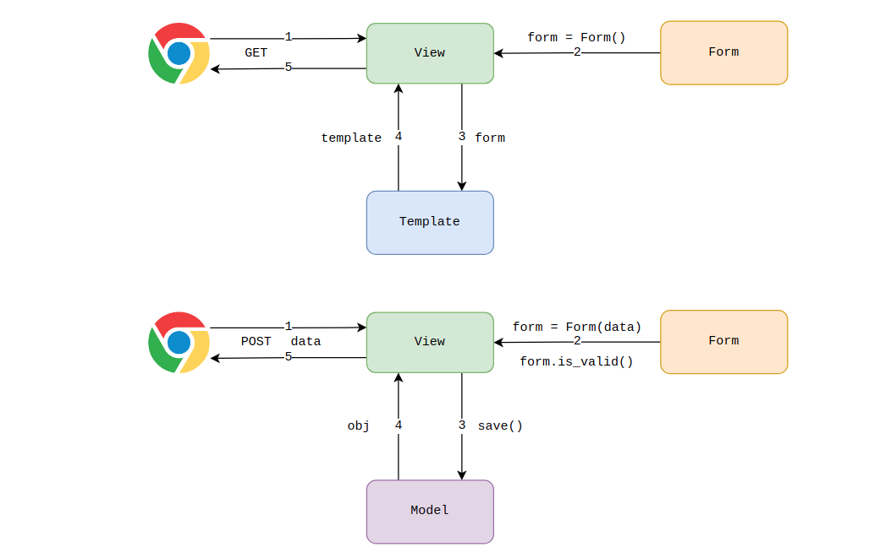

# 1. Django 中使用 Form 表单

> https://docs.djangoproject.com/zh-hans/3.2/topics/forms/#looping-over-the-form-s-fields

在传统的表单处理流程中，一般 GET 请求用于获取 HTML 表单页面，POST 请求则是把通过表单提交的数据进行校验处理保存到数据库，最终返回一个响应结果。

而使用 Django 中的 Form 类构建表单，不仅可以可以简化 GET 请求的 HTML 表单页面的编写，还能在 POST 请求时对表单提交的数据进行有效验证以及错误信息的提示。



这里以个人网站上实现“联系我”的功能为例，在 `app/forms.py` 中定义一个表单类，继承自 `django.forms.Form` 。示例代码如下：

```python
from django import forms

class ContactForm(forms.Form):
    subject = forms.CharField(max_length=100)
    message = forms.CharField(widget=forms.Textarea)
    sender = forms.EmailField()
    cc_myself = forms.BooleanField(required=False)
```

然后在视图中，根据是 GET 还是 POST 请求来做相应的操作。如果是 GET 请求，那么返回一个空的表单，如果是 POST 请求，那么将提交上来的数据进行校验。示例代码如下：

```python
def contact(request):
    if request.method == 'POST':
        form = ContactForm(request.POST) # 把表单数据传递给 Form 类
        if form.is_valid():
            subject = form.cleaned_data['subject']
            message = form.cleaned_data['message']
            sender = form.cleaned_data['sender']
            cc_myself = form.cleaned_data['cc_myself']

            recipients = ['info@example.com']
            if cc_myself:
                recipients.append(sender)

            # send_mail(subject, message, sender, recipients)
            return HttpResponse(f'{subject} - {message} - {sender} - {recipients}')
    else:
        form = ContactForm()
    return render(request, 'contact.html', {"form": form})
```

1. GET 请求的时候，得到一个空表单并把 `form` 对象传递给模板，自动生成一个表单的 `html` 代码
2. POST 请求的时候，根据前端上传上来的数据，构建一个新的表单，这个表单是用来验证数据是否合法的，如果数据都验证通过了，那么我们可以通过`cleaned_data` 属性来获取相应的数据

在模板中渲染表单的 HTML 代码如下：

```html
<form action="" method="post">
    {{ form.as_p }}
    <input type="submit" value="submit">
</form>
```

# 2. 表单字段类型和字段参数

> https://docs.djangoproject.com/zh-hans/3.2/ref/forms/fields/

表单字段类型和字段参数与模型字段类型和字段参数一样，只不过表单字段类型和字段参数用于对表单提交的数据进行有效验证，同时可以根据字段类型和参数生成对应的 `html` 标签

```python
In [1]: from django import forms

In [2]: class MessageBoardForm(forms.Form):
   ...:     title = forms.CharField(max_length=3, label='标题', min_length=2, error_messages={"min_length": '标题字符段不符合要求！'})
   ...:     content = forms.CharField(widget=forms.Textarea, label='内容')
   ...:     email = forms.EmailField(label='邮箱')
   ...:     reply = forms.BooleanField(required=False, label='回复')
   ...: 

In [3]: f = MessageBoardForm()

In [4]: print(f)
<tr><th><label for="id_title">标题:</label></th><td><input type="text" name="title" maxlength="3" minlength="2" required id="id_title"></td></tr>
<tr><th><label for="id_content">内容:</label></th><td><textarea name="content" cols="40" rows="10" required id="id_content"></textarea></td></tr>
<tr><th><label for="id_email">邮箱:</label></th><td><input type="email" name="email" required id="id_email"></td></tr>
<tr><th><label for="id_reply">回复:</label></th><td><input type="checkbox" name="reply" id="id_reply"></td></tr>
```

# 3. 验证器

> https://docs.djangoproject.com/zh-hans/3.2/ref/validators/

除了基本的表单字段类型的限制，对于复杂的验证逻辑，可以在表单字段中传递一个 `validators` 参数用来指定验证器，进一步对数据进行过滤

比如现在要验证手机号码是否合格，可以通过正则表达式的验证器（ `RegexValidator` ）实现，代码如下：

```python
from django import forms
from django.core import validators

class MyForm(forms.Form):
    telephone = forms.CharField(
        validators=[validators.RegexValidator("1[345678]\d{9}", message='请输入正确格式的手机号码！')])
```

由于验证器是一个可调用对象，它接收一个值，如果它不符合某些标准，就会引发一个 `ValidationError` ，所以我们可以自己编写验证器

```python
from django.core.exceptions import ValidationError

def validate_even(value):
    if value % 2 != 0:
        raise ValidationError(f'{value} 不是偶数')

class MyForm(forms.Form):
    even_field = forms.IntegerField(validators=[validate_even])
```

# 3. 自定义表单验证

对某个字段进行自定义的验证方式是，定义一个方法，这个方法的名字定义规则是： `clean_fieldname` ，如果验证失败，那么就抛出一个验证错误。

比如要验证用户表中手机号码之前是否在数据库中存在，那么可以通过以下代码实现：

```python
from django import forms
from django.core import validators

class MyForm(forms.Form):
    telephone = forms.CharField(
        validators=[validators.RegexValidator("1[345678]\d{9}", message='请输入正确格式的手机号码！')])

    def clean_telephone(self):
        telephone = self.cleaned_data.get('telephone')
        exists = User.objects.filter(telephone=telephone).exists()
        if exists:
            raise forms.ValidationError("手机号码已经存在！")
        return telephone
```

以上是对某个字段进行验证，如果验证数据的时候，需要针对多个字段进行验证，那么可以重写 `clean` 方法。比如要在注册的时候，要判断提交的两个密码是否相等。那么可以使用以下代码来完成：

```python
from django import forms
from django.core import validators

class MyForm(forms.Form):
    telephone = forms.CharField(
        validators=[validators.RegexValidator("1[345678]\d{9}", message='请输入正确格式的手机号码！')])
    pwd1 = forms.CharField(max_length=12)
    pwd2 = forms.CharField(max_length=12)

    def clean(self):
        cleaned_data = super().clean()
        pwd1 = cleaned_data.get('pwd1')
        pwd2 = cleaned_data.get('pwd2')
        if pwd1 != pwd2:
            raise forms.ValidationError('两个密码不一致！')
```

# 4. 提取错误信息

如果验证失败了，那么有一些错误信息是我们需要传给前端的。这时候我们可以通过以下属性来获取：

* `form.errors`：这个属性获取的错误信息是一个包含了 HTML 标签的错误信息
* `form.errors.get_json_data()`：这个方法获取到的是一个字典类型的错误信息。将某个字段的名字作为 `key`，错误信息作为值的一个字典
* `form.as_json()`：这个方法是将 `form.get_json_data()` 返回的字典 dump 成 json 格式的字符串，方便进行传输

```python
{
    'username': [
        {
            'message': 'Enter a valid URL.',
            'code': 'invalid'
        },
        {
            'message': 'Ensure this value has at most 4 characters (it has 22).',
            'code': 'max_length'
        }
    ]
}
```

如果我只想把错误信息放在一个列表中，而不要再放在一个字典中。这时候我们可以定义一个方法，把这个数据重新整理一份。实例代码如下：

```python
from django import forms

class MyForm(forms.Form):
    username = forms.URLField(max_length=4)

    def get_errors(self):
        errors = self.errors.get_json_data()
        new_errors = {}
        for key, message_dicts in errors.items():
            messages = []
            for message in message_dicts:
                messages.append(message['message'])
            new_errors[key] = messages
        return new_errors
```

# 5. ModelForm

> https://docs.djangoproject.com/zh-hans/3.2/topics/forms/modelforms/

表单中的 Field 和模型中的 Field 基本上是一模一样的，而且表单中需要验证的数据，也就是我们模型中需要保存的。那么这时候我们就可以将模型中的字段和表单中的字段进行绑定。
​

比如现在有个 Article 的模型。示例代码如下：

```python
from django.db import models
from django.core import validators

class Article(models.Model):
    title = models.CharField(max_length=10,
                             validators=[validators.MinLengthValidator(limit_value=3)])
    content = models.TextField()
    author = models.CharField(max_length=100)
    category = models.CharField(max_length=100)
    create_time = models.DateTimeField(auto_now_add=True)
```

那么在写表单的时候，就不需要把 Article 模型中所有的字段都重复写一遍了。示例代码如下：

```python
from django import forms
from django.utils.translation import gettext_lazy as _

class MyForm(forms.ModelForm):  # 继承自 forms.ModelForm
    class Meta:
        model = Article                 # 对应的模型
        fields = "__all__"              # 表单验证所有字段
        # fields = ['title', 'content'] # 针对其中几个字段进行验证
        # exclude = ['category']        # 排除某些字段
        widgets = {                     # 覆盖默认字段，由 <textarea> 代替默认的 <input type="text"> 来表示
            'title': Textarea(attrs={'cols': 80, 'rows': 20}),
        }   
        error_messages = {              # 因为字段都不是在表单中定义的，因此一些错误消息无法在字段中定义，可以通过 Meta 定义字段错误消息
            'title': {
                'max_length': '最多不能超过10个字符！',
                'min_length': '最少不能少于3个字符！'
            },
            'content': {
                'required': '必须输入content！',
            }
        }
        help_texts = {                  # 帮助信息
            'title': _('最大长度为 10'),
        }
        labels = {                      # 标签名称
            'title': _('文章标题'),
        }
    

```

# 6. 表单与模板

在模板中渲染表单只需要在模板中添加 `{{ form }}` 。另外，可以使用以下方式对 form 格式进行设置：

1. `{{ form.as_table }}`：使用 `<tr>` 标签显示表单字段，需要注意的是，表单不会自动生成 `<table>` 标签，必须手工在模板中添加
2. `{{ form.as_p }}`：使用 `<p>` 标签显示表单字段
3. `{{ form.as_ul }}`：使用 `<li>` 标签显示表单字段，注意表单不会生成 `<ul>` 标签，需要手工添加

除此之外，还可以手工创建表单内容：

```django

    {{ hidden_field }}



    <div class="fieldWrapper">
        {{ visible_field.errors }}
        {{ visible_field.label_tag }} {{ visible_field }}
    </div>

```

其中 `hidden_fields` 是表单隐藏字段， `visible_fields` 是表单可显示字段

# 7. 表单集

> https://docs.djangoproject.com/zh-hans/3.2/topics/forms/formsets/

formset 它可以在同一页面上处理多个表单的，例如允许用户一次创建多篇文章：

* 表单类

```python
class ArticleForm(forms.Form):
    title = forms.CharField()
    pub_date = forms.DateField()
```

* 视图函数

```python
def form_set(request):
    # extra 显示的表单数量
    # max_num 限制表单的最大数量
    # absolute_max 限制在提供 POST 数据时可以实例化的表单数量，防止使用伪造的 POST 请求进行内存耗尽攻击
    # absolute_max 默认为 max_num + 1000，如果 max_num=None，则默认为 2000
    ArticleFormSet = formset_factory(ArticleForm, extra=5, max_num=3, absolute_max=1500)
    if request.method == 'POST':
        data = request.POST
        formset = ArticleFormSet(data)
        if formset.is_valid():
            print(formset.cleaned_data)  # [{},{}...]
        return HttpResponse("ok")
    else:
        formset = ArticleFormSet()
        print(form_set)
        return render(request, 'demo_forms/formset.html', context={"formset": formset})
"""
<input type="hidden" name="form-TOTAL_FORMS" value="3" id="id_form-TOTAL_FORMS"><input type="hidden" name="form-INITIAL_FORMS" value="0" id="id_form-INITIAL_FORMS"><input type="hidden" name="form-MIN_NUM_FORMS" value="0" id="id_form-MIN_NUM_FORMS"><input type="hidden" name="form-MAX_NUM_FORMS" value="3" id="id_form-MAX_NUM_FORMS">
<tr><th><label for="id_form-0-title">Title:</label></th><td><input type="text" name="form-0-title" id="id_form-0-title"></td></tr>
<tr><th><label for="id_form-0-pub_date">Pub date:</label></th><td><input type="text" name="form-0-pub_date" id="id_form-0-pub_date"></td></tr> <tr><th><label for="id_form-1-title">Title:</label></th><td><input type="text" name="form-1-title" id="id_form-1-title"></td></tr>
<tr><th><label for="id_form-1-pub_date">Pub date:</label></th><td><input type="text" name="form-1-pub_date" id="id_form-1-pub_date"></td></tr> <tr><th><label for="id_form-2-title">Title:</label></th><td><input type="text" name="form-2-title" id="id_form-2-title"></td></tr>
<tr><th><label for="id_form-2-pub_date">Pub date:</label></th><td><input type="text" name="form-2-pub_date" id="id_form-2-pub_date"></td></tr>
"""
```

* 模板

```django
<form action="" method="post">
    {{ formset.management_form }}
    
        {{ form.as_table }}
    
    <input type="submit" value="submit">
</form>
```
