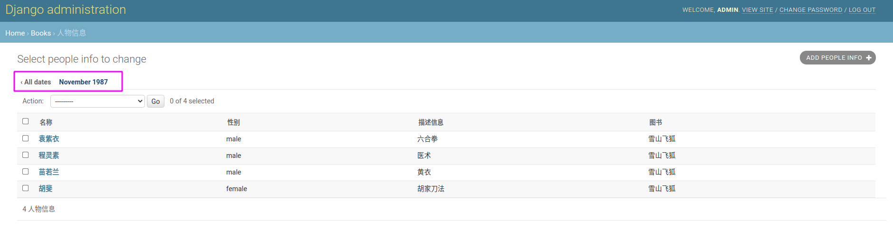

# 1. 后台管理配置

通过 `django-admin startproject project_name` 创建的项目默认启动用了管理，如果没有使用默认的项目模板，可以按照如下要求：

1. 将`'django.contrib.admin'`以及所属的依赖添加到`INSTALLED_APPS`配置中

```python
INSTALLED_APPS = [
    'django.contrib.admin',
    'django.contrib.auth',
    'django.contrib.contenttypes',
    'django.contrib.sessions',
    'django.contrib.messages',
    ......
]
```

2. 在`TEMPLATES`配置中设置一个在`OPTIONS`的`'context_processors'`选项且包含如下内容

```python
TEMPLATES = [
    {
       	......
        'OPTIONS': {
            'context_processors': [
                ......
                'django.template.context_processors.request',
                'django.contrib.auth.context_processors.auth',
                'django.contrib.messages.context_processors.messages',
            ],
        },
    },
]
```

3. 如果自定义了`MIDDLEWARE`设置，则必须包含下面两个选项

```python
MIDDLEWARE = [
    ......
    'django.contrib.auth.middleware.AuthenticationMiddleware',
    'django.contrib.messages.middleware.MessageMiddleware',
    ......
]
```

4. 把管理的网址添加在`URLconf`里，一般为`admin/`

```python
from django.contrib import admin
from django.urls import path

urlpatterns = [
    path('admin/', admin.site.urls),
]
```

5. 通过`python manage.py createsuperuser`创建一个用户用来登录，默认情况下，登录管理的用户属性`is_staff=True`
6. 完成上述步骤运行服务器，即可通过`http://127.0.0.1:8000/admin/`来访问管理站点


下文示例均按照以下模型进行配置：

```python
class BookInfo(models.Model):
    name = models.CharField(max_length=20, verbose_name='名称')
    pub_date = models.DateField(verbose_name='发布日期', null=True, blank=True)
    read_count = models.IntegerField(default=0, verbose_name='阅读量')
    comment_count = models.IntegerField(default=0, verbose_name='评论量')
    is_delete = models.BooleanField(default=False, verbose_name='逻辑删除')

    class Meta:
        db_table = 'bookinfo'
        verbose_name_plural = '图书'

    def __str__(self):
        return self.name

class PeopleInfo(models.Model):
    # 准备人物列表信息的模型类
    GENDER_CHOICES = (
        (0, 'male'),
        (1, 'female')
    )
    name = models.CharField(max_length=20, verbose_name='名称')
    gender = models.SmallIntegerField(choices=GENDER_CHOICES, default=0, verbose_name='性别')
    description = models.CharField(max_length=200, null=True, verbose_name='描述信息')
    book = models.ForeignKey(BookInfo, on_delete=models.CASCADE, verbose_name='图书')
    is_delete = models.BooleanField(default=False, verbose_name='逻辑删除')

    class Meta:
        db_table = 'peopleinfo'
        verbose_name_plural = '人物信息'

    def __str__(self):
        return self.name
```

# 2. ModelAdmin 对象

```python
from django.contrib import admin
from books.models import BookInfo
from books.admin_site import custom_admin_site

# 1. 直接注册模型类
admin.site.register(BookInfo)

# 2. 创建模型管理类
class BookInfoAdmin(admin.ModelAdmin):
    pass

admin.site.register(BookInfo, BookInfoAdmin) # 注册模型类

# 3. 通过装饰器注册模型类
@admin.register(BookInfo)
class BookInfoAdmin(admin.ModelAdmin):
    pass

# 4. 接受一个或多个模型类，以及使用自定义的 `AdminSite`
@admin.register(BookInfo, PeopleInfo, site=custom_admin_site)
class InfoAdmin(admin.ModelAdmin):
    pass
```

# 3. ModelAdmin 选项

## list_display

设置 `list_display` 来控制哪些字段显示在管理页面




```python
@admin.display(description='金庸小说')
def callable_obj(obj):
    return f"金庸-{obj.name}"

@admin.register(BookInfo)
class BookInfoAdmin(admin.ModelAdmin):
    list_display = (
        'name', 'pub_date', 'read_count', 'comment_count', 'is_delete',
        callable_obj, 'model_admin_method', 'model_method',
        'display_boolean', 'display_ordering_read_count', 'display_empty_value')

    @admin.display(description="武侠小说")
    def model_admin_method(self, obj):
        return f"武侠-{obj.name}"
```




```python
class BookInfo(models.Model):
    ......

    @admin.display(description="经典小说")
    def model_method(self):
        # return f"经典-{self.name}"
        # 进行 HTML 转义
        return format_html(f'<span style="color: red;">{self.name}</span>')

    @admin.display(boolean=True, description="布尔显示")
    def display_boolean(self):
        """布尔值显示"""
        return self.is_delete

    @admin.display(ordering='read_count', description="字段排序显示")
    def display_ordering_read_count(self):
        """字段可排序"""
        return self.read_count

    @admin.display(empty_value='pub_date', description="空显示")
    def display_empty_value(self):
        """空显示"""
        return "空"
```





## list_display_links

使用 `list_display_links` 来控制 `list_display` 中的哪些字段应该被链接到对象的 “更改” 页面。默认情况下，更改列表页将把第一列链接到 `list_display` 中指定的第一个字段

* 将其设置为 None，则完全没有链接
* 将它设置为一个列表或元组字段（格式与`list_display`相同），你希望将其列转换为链接

```python
@admin.register(BookInfo)
class BookInfoAdmin(admin.ModelAdmin):
    ......
    list_display_links = ['pub_date', 'read_count', 'comment_count', 'is_delete',
                          'pub_date', callable_obj, 'model_admin_method', 'model_method', ]

```


## list_editable

设置 `list_editable` 可以在模型列表页直接编辑字段，不过需要注意以下两个问题：

1. `list_editable`中的任何字段都必须在`list_display`中
2. 同一字段不能同时列在`list_editable`和`list_display_links`中

```python
@admin.register(BookInfo)
class BookInfoAdmin(admin.ModelAdmin):
    list_display = (
        'name', 'pub_date', 'read_count', 'comment_count', 'is_delete',
        callable_obj, 'model_admin_method', 'model_method',
        'display_boolean', 'display_ordering_read_count', 'display_empty_value')

    list_editable = ('read_count', 'comment_count')
    ......
```


## list_filter

设置 `list_filter` 来激活管理更改列表页面右侧侧栏的过滤器

```python
@admin.register(BookInfo)
class BookInfoAdmin(admin.ModelAdmin):
    ......
    list_filter = ('name', 'pub_date')
```


## list_per_page

设置 `list_per_page` 来控制每个模型的列表页所能显示的最大项目数。默认每页最多显示 100 条

```python
@admin.register(BookInfo)
class BookInfoAdmin(admin.ModelAdmin):
    ......
    list_per_page = 2
```


## list_max_show_all

设置 `list_max_show_all` 来控制显示全部记录的阀值。当模型现有的记录总数小于或等于 `list_max_show_all` 时，列表页会显示一个 `Show all` 链接，单击链接显示全部记录。 `list_max_show_all` 的默认值是 200

```python
@admin.register(BookInfo)
class BookInfoAdmin(admin.ModelAdmin):
    ......
    # 总共条目有 5 个，这里设置 4 ，所以不会显示 show all 的链接
    list_max_show_all = 4
```


## list_select_related

设置 `list_select_related` 告诉 Django 在提取模型列表时是否使用 `select_related()` 方法。



`select_related()` 方法使得 Django 能够创建一个复杂的查询语句，该查询可以同时查找模型关联的外键对象，减少访问数据库的次数



`list_select_related` 该值应是布尔值、列表或元组。默认值是 False。当值为 True 时， `select_related()` 总是会被调用。当值设置为 False 时，Django 将查看 `list_display` ，如果有 `ForeignKey` ，则调用 `select_related()` 。空元组将阻止 Django 调用 `select_related`

## ordering

设置 `ordering` 来指定对象列表在 Django 管理视图中的排序方式。值是一个列表或元组，格式与模型的 `ordering` 参数相同。
如果没有提供，Django 管理员将使用模型的默认排序

```python
@admin.register(BookInfo)
class BookInfoAdmin(admin.ModelAdmin):
    ......
    ordering = ('read_count',)
```


## prepopulated_fields

设置该属性可以使得用户在管理后台输入某些字段时自动填充另一个字段。

```python
@admin.register(PeopleInfo)
class PeopleInfoAdmin(admin.ModelAdmin):
    ......
    prepopulated_fields = {"description": ("name",)}
```


## preserve_filters

当新增、编辑、删除结束回到列表页是保留原来的搜索的结果页面，设置为 False 可以取消保存搜索

```python
@admin.register(PeopleInfo)
class PeopleInfoAdmin(admin.ModelAdmin):
    ......
    preserve_filters = False
    search_fields = ('name',)
```

## radio_fields

通过设置可以在新增或编辑页面使用单选按钮显示外键或者 choices 集合（默认情况为下拉列表）

```python
@admin.register(PeopleInfo)
class PeopleInfoAdmin(admin.ModelAdmin):
    ......
    radio_fields = {'gender': admin.VERTICAL, 'book': admin.HORIZONTAL}
```


## autocomplete_fields

该属性用于外键或多对多字段，能够自动检索需要的数据。但是使用该字段时，必须在对应外键的 `ModelAdmin` 类中定义 `search_fields`

```python
@admin.register(BookInfo)
class BookInfoAdmin(admin.ModelAdmin):
    ......
    search_fields = ('name',)

@admin.register(PeopleInfo)
class PeopleInfoAdmin(admin.ModelAdmin):
    ......
    autocomplete_fields = ('book',)
```


## raw_id_fields

当用户对外建比较了解时，很多用户希望输入外键值而不是下拉列表选择

* 一对多

```python
@admin.register(PeopleInfo)
class PeopleInfoAdmin(admin.ModelAdmin):
    ......
    raw_id_fields = ('book',)
```


* 多对多

```python
@admin.register(TagInfo)
class TagInfoAdmin(admin.ModelAdmin):
    ......
    raw_id_fields = ('book_name',)
```


## readonly_fields

默认情况下，管理会将所有字段显示为可编辑。设置该选项中的任何字段将按原样显示其数据，不可编辑

```python
@admin.register(BookInfo)
class BookInfoAdmin(admin.ModelAdmin):
    ......
    readonly_fields = ('name', 'pub_date')
```


## fields

使用 `fields` 选项在 “添加” 和 “更改” 页面的表单中进行简单的布局修改，比如只显示可用字段的子集，修改它们的顺序，或者将它们分成几行。
下面的例子中，只有 `name` 、 `pub_date` 字段会依次显示

```python
@admin.register(BookInfo)
class BookInfoAdmin(admin.ModelAdmin):
    ......
    fields = ('name', 'pub_date')
```


`fields` 选项接受与 `list_display` 相同类型的值，**只是不接受作为可调用对象的值**。模型和模型管理方法的名称只有在 `readonly_fields` 中列出时才会被使用。
​

要在同一行显示多个字段，将这些字段包在自己的元组中。在这个例子中， `name` 和 `pub_date` 字段将显示在同一行， `read_count` 字段将显示在它们下面的一行：

```python
@admin.register(BookInfo)
class BookInfoAdmin(admin.ModelAdmin):
    ......
    fields = (('name', 'pub_date'), 'read_count')
```


## fieldsets

设置 `fieldsets` 来控制管理员 “添加” 和 “更改” 页面的布局。 `fieldsets` 是一个元组，这个元组的每一项都是一个拥有两个元素的元组。每一个二级元组都对应管理页面上的一个片段。格式是 `(name, field_options)` ，其中 `name` 是每一个片段显示的名称， `field_options` 是一组需要显示的字段，包括字段的显示行为。

```python
@admin.register(BookInfo)
class BookInfoAdmin(admin.ModelAdmin):
    ......
    fieldsets = (
        ('Basic options', {
            'fields': ('name', 'pub_date')
        }),
        ('Other options', {
            'fields': ('read_count', 'comment_count'),
            'classes': ('collapse',),
            'description': '当前片段描述信息'
        }),
        (None, {
            'fields': ('is_delete',)
        })
    )
```


## filter_horizontal

用于优化多对多关系在管理后台的显示方式。

```python
@admin.register(TagInfo)
class TagInfoAdmin(admin.ModelAdmin):
    filter_horizontal = ('book_name',)
```


## filter_vertical

功能与 filter_horizontal 完全一样，只是显示选择框时使用竖向排版


## form

Django 会为每一个模型动态创建一个 ModelForm，这个表单被用于模型的添加和编辑页面。




```python
from django import forms
from .models import BookInfo

class BookInfoForm(forms.ModelForm):
    class Meta:
        model = BookInfo
        exclude = ['is_delete']
```




```python
@admin.register(BookInfo)
class BookInfoAdmin(admin.ModelAdmin):
    ......
    form = BookInfoForm
    # exclude = ('is_delete',) 由于 form 已经排除了该字段，所以这里不需要再次设置
    # 如果此处再次定义，则 BookInfoAdmin 优先级更高
```





## formfield_overrides

formfield_overrides 可作为应急方案为管理后台重写 field 属性。其值是一个字典，键是模型的字段类，值仍是一个字典

```python
@admin.register(BookInfo)
class BookInfoAdmin(admin.ModelAdmin):
    ......
    exclude = ('is_delete',)

    formfield_overrides = {
        models.CharField: {
            'help_text': '<span style="color:red;">请输入</span>'
        },
        models.IntegerField: {
            'help_text': '<span style="color:blue;">请输入</span>'
        }
    }
```


## exclude

从表单中排除的字段名列表

```python
@admin.register(BookInfo)
class BookInfoAdmin(admin.ModelAdmin):
    ......
    exclude = ('is_delete',)
```

## search_fields

设置 `search_fields` ，在管理更改列表页面上启用搜索框。Django 在执行搜索的过程中会将用户输入的搜索条件分成一组单词，如果每一个单词都在搜索字段中，那么搜索结果为真。搜索过程不区分大小写。如果想要精确搜索可以在字段后添加 `exact`

search_fields 支持下表所示的查询类型，列表中前缀与后缀功能一样：

| 前缀       | 后缀       |
| ---------- | ---------- |
| ^          | startswith |
| =          | iexact     |
| @          | search     |
| 空（None） | icontains  |

```python
@admin.register(PeopleInfo)
class PeopleInfoAdmin(admin.ModelAdmin):
    list_display = ('name', 'gender', 'description', 'book')
    search_fields = ('name', 'book__name'，'description__exact')
```


## date_hierarchy

将模型中 `DateField` 或 `DateTimeField` 的字段赋值给 `date_hierarchy` ，此时列表就可以按照时间过滤数据了

```python
@admin.register(BookInfo)
class BookInfoAdmin(admin.ModelAdmin):
    date_hierarchy = 'pub_date'

@admin.register(PeopleInfo)
class PeopleInfoAdmin(admin.ModelAdmin):
    # 使用 __ 查找来指定相关模型上的字段
    date_hierarchy = 'book__pub_date'
```



## actions_on_top/actions_on_bottom

控制动作条的显示位置，默认在页面顶部显示动作条

```python
@admin.register(BookInfo)
class BookInfoAdmin(admin.ModelAdmin):
    actions_on_top = False
    actions_on_bottom = True
```


## actions_selection_counter

控制动作条是否显示计数功能默认显示

```python
@admin.register(BookInfo)
class BookInfoAdmin(admin.ModelAdmin):
    actions_on_top = False
    actions_on_bottom = True
    actions_selection_counter = False
```


## empty_value_display

空数据的显示方式。例如某一条记录的字段值为 None 或者空字符串，将使用该属性值替代字段值。默认值为： `-`

```python
@admin.register(PeopleInfo)
class PeopleInfoAdmin(admin.ModelAdmin):
    # 覆盖所有字段为空的默认显示值
    empty_value_display = '-empty-'
```


## save 管理动作

### save_as

通常情况下，对象有三个保存选项。“保存”、“保存并继续编辑” 和 “保存并添加另一个”。如果 `save_as` 为 True，则 “保存并添加另一个” 将被 “另存为新” 按钮所取代，该按钮将创建一个新的对象（具有新的 ID），而不是更新现有的对象
​

默认情况下， `save_as` 被设置为 False

```python
@admin.register(BookInfo)
class BookInfoAdmin(admin.ModelAdmin):
    save_as = True
```


### save_as_continue

当 `save_as=True` 时，保存新对象后默认重定向到该对象的变更视图。如果设置 `save_as_continue=False` ，则重定向到变更列表视图。默认情况下， `save_as_continue` 被设置为 True

### save_on_top

通常情况下，保存按钮只出现在表格的底部。如果设置 `save_on_top` ，按钮将同时出现在顶部和底部。默认情况下， `save_on_top` 被设置为 False

```python
@admin.register(BookInfo)
class BookInfoAdmin(admin.ModelAdmin):
    save_on_top = True
```


## show_full_result_count

表示是否显示搜索结果的总数

```python
@admin.register(BookInfo)
class BookInfoAdmin(admin.ModelAdmin):
    show_full_result_count = True
```


## sortable_by

默认情况下， `list_display` 中的所有字段在列表页都可以排序，当指定 `sortable_by` 时，只有在 `sortable_by` 中的字段可以排序，当 `sortable_by` 为空集合时，全部字段禁用排序功能

```python
@admin.register(BookInfo)
class BookInfoAdmin(admin.ModelAdmin):
    sortable_by = ('read_count', 'comment_count')
```


## view_on_site

控制是否在编辑页面显示“在站点查看”按钮，单击该按钮可以跳转到对象页面。 `view_on_site` 可以接收一个布尔值或可执行对象。当 view_on_site = True 时，模型的 `get_absolute_url()` 方法可以生成当前数据的 URL




```python
class BookInfo(models.Model):
    ...
    def get_absolute_url(self):
        return ""
```




```python
@admin.register(BookInfo)
class BookInfoAdmin(admin.ModelAdmin):
    view_on_site = True
```





## 自定义模板

Django 允许开发人员使用自己的模板替代默认的管理后台模板，不同页面对应的模板模板也不一样，具体如下：

```python
ModelAdmin.add_form_template
ModelAdmin.change_form_template
ModelAdmin.change_list_template
ModelAdmin.delete_confirmation_template
ModelAdmin.delete_selected_confirmation_template
ModelAdmin.object_history_template
ModelAdmin.popup_response_template
```

Example：

* 添加自定义模板：`books/templates/books/book_list.html`

```django
<!DOCTYPE html>
<html lang="en">
<head>
    <meta charset="UTF-8">
    <title>Title</title>
</head>
<body>
<table>
    <thead>
    <tr>
        <th>名称</th>
        <th>发布日期</th>
        <th>阅读量</th>
        <th>评论量</th>
    </tr>
    </thead>

    <tbody>
    
        <tr>
            <td>{{ book.name }}</td>
            <td>{{ book.pub_date }}</td>
            <td>{{ book.read_count }}</td>
            <td>{{ book.comment_count }}</td>
        </tr>
    

    </tbody>
</table>
</body>
</html>
```

* 修改 BookInfoAdmin

```python
@admin.register(BookInfo)
class BookInfoAdmin(admin.ModelAdmin):
    path = os.path.normpath(
        os.path.join(os.path.dirname(__file__), r"templates/books/book_list.html"))

    change_list_template = path

    def changelist_view(self, request, extra_context=None):
        other_objects = BookInfo.objects.all()
        extra_context = dict()
        extra_context['other_objects'] = other_objects
        return super().changelist_view(request, extra_context)
```


# 4. ModelAdmin 方法

> https://docs.djangoproject.com/zh-hans/3.2/ref/contrib/admin/#modeladmin-methods

## save_model

重写该方法可以使得用户在创建或修改对象时增加额外操作，其中参数 request 是 HttpRequest 实例，obj 是模型实例，form 是 ModelForm 实例，change 是一个布尔值用于标记新增还是修改

```python
@admin.register(PeopleInfo)
class PeopleInfoAdmin(admin.ModelAdmin):
    def save_model(self, request, obj, form, change):
        if not obj.description:
            obj.description = "默认描述"
        super().save_model(request, obj, form, change)
```

## delete_model

重写该方法使得用户在删除对象时增加额外操作

```python
@admin.register(PeopleInfo)
class PeopleInfoAdmin(admin.ModelAdmin):
    def delete_model(self, request, obj):
        obj.is_delete = True
        obj.save()
        # 逻辑删除，不调用 super().delete_model()
        # super().delete_model(request, obj)
```

## delete_queryset

重写该方法可以自定义 “删除选定对象” 的删除过程

```python
@admin.register(PeopleInfo)
class PeopleInfoAdmin(admin.ModelAdmin):
    def delete_queryset(self, request, queryset):
        queryset.update(is_delete=True)
        # super().delete_queryset(request,queryset)
```

## get_ordering

get_ordering 方法以 request 为参数，并期望返回一个类似于 ordering 属性的 list 或 tuple 的排序

```python
@admin.register(PeopleInfo)
class PeopleInfoAdmin(admin.ModelAdmin):
    def get_ordering(self, request):
        if request.user.is_superuser:
            return ['name', 'admin']
        else:
            return ['name']
```

## get_search_results

默认的实现搜索是 `ModelAdmin.search_fields` 中的字段。该方法可以定制搜索结果，其中 queryset 是通过当前搜索条件搜索出来的结果， search_term 是用户提交的搜索条件。方法返回一个包含两个元素则元组，第一个元素是新的搜索结果，第二个元素用于标志当前结果是否包含重复值

```python
from django.contrib import admin
from books.models import PeopleInfo

@admin.register(PeopleInfo)
class PeopleInfoAdmin(admin.ModelAdmin):
    def get_search_results(self, request, queryset, search_term):
        queryset, is_dup = super().get_search_results(request, queryset, search_term)

        if search_term == 'male':
            queryset |= self.model.objects.filter(gender=0)
        elif search_term == 'female':
            queryset |= self.model.objects.filter(gender=1)
        else:
            pass
        return queryset, is_dup
```

# 5. InlineModelAdmin 对象

> https://docs.djangoproject.com/zh-hans/3.2/ref/contrib/admin/#inlinemodeladmin-objects

使用 Django 管理后台，可以在编辑上级模型对象的同时编辑关联对象，这些关联对象叫做 inline。例如：编写 PeopleInfo 对象同时可以编辑 BookInfo 对象。

InlineModelAdmin 有两个子类： `StackedInline` 和 `TabularInline` ，这两个子类的区别仅仅是显示数据时所使用的模板不同。

## InlineModelAdmin 对象属性

* `model`：inline 所使用的模型，必选项
* `fk_name`：模型的外键。一般情况下自动处理
* `formset`：默认值是 BaseInlineFormSet
* `form`：默认值是 ModelForm
* `classes`：一组 CSS 类
* `extra`：用于控制初始化 inline 对象时默认显示几个表单
* `max_num`：控制 inline 对象可以显示的最大表单数
* `min_num`：控制 inline 对象可以显示的最小表单数
* `raw_id_fields`：用外键值替代下拉列表
* `template`：用于渲染 inline 对象的模板
* `verbose_name`：重写模型内部 Meta 的 verbose_name
* `verbose_name_plural`：重写模型内部 Meta 的 verbose_name_plural
* `can_delete`：配置 inline 对象是否可以删除，默认为 True
* `show_change_link`：在编辑模型页面的 inline 对象旁边配置一个链接，单击链接时可进入编辑 inline 对象的页面
  

```python
class PeopleInfoInline(admin.TabularInline):
    model = PeopleInfo
    fk_name = 'book'
    extra = 2
    show_change_link = True

@admin.register(BookInfo)
class BookInfoAdmin(admin.ModelAdmin):
    inlines = [PeopleInfoInline]
```


## InlineModelAdmin 对象方法

* `get_formset(request, obj=None, **kwargs)`：该方法返回一个 BaseInlineFormSet 类，在 Django 管理后台添加或者编辑模型时使用该方法的返回值。编辑模型时，参数 obj 是被编辑 inline 的父对象，当添加 inline 的父对象时，参数 obj 是 None
* `get_extra(request, obj=None, **kwargs)`：该方法返回额外使用的 inline 表单数量。默认返回 extra 属性
* `get_max_num(request, obj=None, **kwargs)`：该方法返回允许使用的最大 inline 表单数量。默认返回 max_num 属性
* `get_min_num(request, obj=None, **kwargs)`：该方法返回允许使用的最小 inline 表单数量。默认返回 min_num 属性
* `has_add_permission(requesy, obj)`：如果允许用户添加 inline 对象则返回 True，否则返回 False
* `has_change_permission(requesy, obj)`：如果允许用户编辑 inline 对象则返回 True，否则返回 False
* `has_delete_permission(requesy, obj)`：如果允许用户删除 inline 对象则返回 True，否则返回 False
# 6. 重写管理后台模板

> https://docs.djangoproject.com/zh-hans/3.2/ref/contrib/admin/#overriding-admin-templates

Django 管理后台的模板文件默认保存在 `contrib/admin/templates/admin` 目录下。为了重写模板文件，需要在项目的 `templates` 目录下创建一个 `admin` 目录。然后在这个 `admin` 目录中，**创建以应用程序命名的子目录。在这些应用程序子目录中，创建以模型命名的子目录（使用小写字母）。**
​

以列表页为例，如果希望对列表的展示样式做一些美化，可以将 `contrib/admin/templates/admin/change_list.html` 复制到我们项目的 `templates/admin/books/` 目录下，直接编辑。如果只希望修改模型 BookInfo 的列表页样式，我们会将同样的文件复制到项目的 `templates/admin/books/bookinfo` 目录下

```bash
└── templates
    └── admin
        └── books
            ├── bookinfo
            │   └── change_list.html
            └── change_list.html
```

​修改 `bookinfo/change_list.html` 在代码底部找到 block_result_list ，替换如下代码：

```django

    
        
    
        <p>暂时没有任何图书</p>
    

```

## 重写与替换

由于 Django 是模块化开发，因此通常不建议完成的替换模板，往往实际工作中只需要重写模板的部分 block 即可

```django




    
        
    
        <p>暂时没有任何</p>
    

```

## 可重写模板

* `actions.html`
* `app_index.html`
* `change_form.html`
* `change_form_object_tools.html`
* `change_list.html`
* `change_list_object_tools.html`
* `change_list_results.html`
* `date_hierarchy.html`
* `delete_confirmation.html`
* `object_history.html`
* `pagination.html`
* `popup_response.html`
* `prepopulated_fields_js.html`
* `search_form.html`
* `submit_line.html`

对于不能重写的模板，仍然可以使用替换的方式实现模板更新，尤其是 400 和 500 的错误页

## 根模板和登录模板

如果希望改变 Django 应用程序的 index、login、logout 模板，最好使用自己开发的 AdminSite 实例，在 AdminSite 实例中修改 `AdminSite.index_template` 、 `AdminSite.login_template` 或者 `AdminSite.logout_template` 属性

# 7. AdminSite 对象

> https://docs.djangoproject.com/zh-hans/3.2/ref/contrib/admin/#adminsite-objects

## 重写 AdminSite

Django 自带的管理后台是 `django.contrib.admin.sites.AdminSite` 的一个实例，通过重写 AdminSite 的方式，对默认管理后台进行扩展

```python
# admin.py
from django.contrib.admin import AdminSite
from books.models import BookInfo, PeopleInfo

class MyAdminSite(AdminSite):
    site_header = "我自定义的 Django 后台管理 header"

admin_site = MyAdminSite(name='myadmin')
admin_site.register([BookInfo, PeopleInfo])

# urls.py
from django.urls import path
from books.admin import admin_site

urlpatterns = [
    path('myadmin/', admin_site.urls)
]

# settings.py
INSTALLED_APPS = [
    ......
    'django.contrib.admin.apps.SimpleAdminConfig', # replaces 'django.contrib.admin'
    ......
]
```

访问 `http://127.0.0.1:8000/myadmin/` 如下图所示。


## 覆盖默认的管理站点

通过设置自定义 `AppConfig` 的 `default_site` 属性来覆盖默认的 `django.contrib.admin.site`

```python
# ----------- 新建 project/admin.py -----------
from django.contrib import admin

class MyAdminSite(admin.AdminSite):
    site_header = "我的 AdminSite"

# ----------- 新建 project/apps.py -----------
from django.contrib.admin.apps import AdminConfig

class MyAdminConfig(AdminConfig):
    default_site = 'project.admin.MyAdminSite'
    
# ----------- settings.py -----------
INSTALLED_APPS = [
    ...
    'project.apps.MyAdminConfig',  # replaces 'django.contrib.admin'
    ...
]
```

访问 `http://127.0.0.1:8000/admin/` 如下图所示。


# 8. actions 管理动作

> https://docs.djangoproject.com/zh-hans/3.2/ref/contrib/admin/actions/#admin-actions

## 在 ModelAdmin 中添加动作

写一个函数，当管理触发动作时就会被调用。动作函数是常规函数，它有三个参数：

* 当前 ModelAdmin
* 一个代表当前请求的 HttpRequest，
* 一个包含用户所选择的对象集合的 QuerySet。

其次在管理中给这个动作设置一个标题。默认情况下，为函数名称且下划线用空格代替。例如下面代码：

```python
from django.contrib import admin
from books.models import PeopleInfo

@admin.action(description="批量逻辑删除")
def delete_queryset(modeladmin, request, queryset):
    queryset.update(is_delete=True)

@admin.register(PeopleInfo)
class PeopleInfoAdmin(admin.ModelAdmin):
    
    list_display = ('name', 'gender', 'description', 'book', 'is_delete')
    actions = [delete_queryset]

```


Django 模块化设计，因此将该动作函数挂到 PeopleInfoAdmin 对象成为其方法更加合适，例如下面这样做：

```python
from django.contrib import admin
from books.models import PeopleInfo

@admin.register(PeopleInfo)
class PeopleInfoAdmin(admin.ModelAdmin):
    list_display = ('name', 'gender', 'description', 'book', 'is_delete')
    actions = ['delete_queryset']

    @admin.action(description="批量逻辑删除")
    def delete_queryset(self, request, queryset):
        queryset.update(is_delete=True)
```

## 在整个站点提供动作

有些动作最好是对管理员站点中的任何对象开放，可以使用 `AdminSite.add_action()` 使一个动作在全局范围内可用。例如：

```python
from django.contrib import admin

from django.contrib.contenttypes.models import ContentType
from django.http import HttpResponseRedirect

def export_selected_objects(modeladmin, request, queryset):
    selected = queryset.values_list('pk', flat=True)
    ct = ContentType.objects.get_for_model(queryset.model)
    return HttpResponseRedirect('/export/?ct=%s&ids=%s' % (
        ct.pk,
        ','.join(str(pk) for pk in selected),
    ))

admin.site.add_action(export_selected_objects)
```

还可以通过向 `AdminSite.add_action()` 传递第二个参数，来明确地给这个动作起一个名字

```python
admin.site.add_action(export_selected_objects, 'export_selected')
```

## 禁用动作

如果你需要禁用一个全站点动作你可以调用 `AdminSite.disable_action()` 。例如，你可以使用此方法来删除内置的 “删除选定对象” 动作：

```python
admin.site.disable_action('delete_selected')
```

如果想要禁用特定 `ModelAdmin` 的所有动作可以设置 `actions=None`

```python
class MyModelAdmin(admin.ModelAdmin):
    actions = None
```

最后还可以通过覆盖 `ModelAdmin.get_actions()` 来有条件地启用或禁用每个请求（也就是每个用户）的动作。该方法返回一个允许动作的字典。键是动作名称，值是 `(function, name, short_description) ` 元组。
​

例如，如果你只想让名字以 “J” 开头的用户能够批量删除对象

```python
class MyModelAdmin(admin.ModelAdmin):
    ...

    def get_actions(self, request):
        actions = super().get_actions(request)
        if request.user.username[0].upper() != 'J':
            if 'delete_selected' in actions:
                del actions['delete_selected']
        return actions
```

## 设置动作的权限

通过使用 `action()` 装饰器包装动作函数，并传递 `permissions` 参数：动作可以限制具有特定权限的用户

```python
@admin.action(permissions=['change'])
def delete_queryset(modeladmin, request, queryset):
    queryset.update(is_delete=True)
```

如果 `permissions` 包含多个权限，只要用户至少通过了一项检查，该操作就可以使用。 `permissions` 和相应的方法检查的可用值是：

* `'add': ModelAdmin.has_add_permission()`
* `'change': ModelAdmin.has_change_permission()`
* `'delete': ModelAdmin.has_delete_permission()`
* `'view': ModelAdmin.has_view_permission()`

也可以指定任何其他的值，只要在 `ModelAdmin` 上实现一个相应的 `has_<value>_permission(self, request)` 方法。

```python
from django.contrib import admin
from django.contrib.auth import get_permission_codename

class ArticleAdmin(admin.ModelAdmin):
    actions = ['make_published']

    @admin.action(permissions=['publish'])
    def make_published(self, request, queryset):
        queryset.update(status='p')

    def has_publish_permission(self, request):
        """Does the user have the publish permission?"""
        opts = self.opts
        codename = get_permission_codename('publish', opts)
        return request.user.has_perm('%s.%s' % (opts.app_label, codename))
```

## action 装饰器

这个装饰器可以用来设置自定义动作函数的特定属性，可以使用 `actions` ：

```python
@admin.action(
    permissions=['publish'],
    description='Mark selected stories as published',
)
def make_published(self, request, queryset):
    queryset.update(status='p')
```

这就相当于直接在函数上设置一些属性（用原来的、较长的名字）：

```python
def make_published(self, request, queryset):
    queryset.update(status='p')
make_published.allowed_permissions = ['publish']
make_published.short_description = 'Mark selected stories as published'
```
