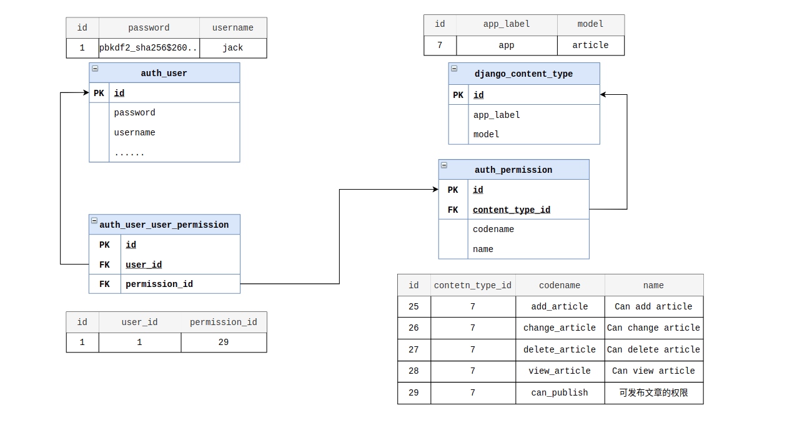

# 1. 安装用户认证

> https://docs.djangoproject.com/zh-hans/3.2/topics/auth/

Django 有内置的认证系统，用来处理用户、分组、权限以及基于 cookie 的会话系统，认证系统包括验证和授权两个部分。默认中创建完一个 Django 项目后，就已经集成了授权系统，授权系统相关的配置如下：

```python
INSTALLED_APPS = [
    ......
    'django.contrib.auth',
    'django.contrib.contenttypes',
    ......
]

MIDDLEWARE = [
    ......
    'django.contrib.sessions.middleware.SessionMiddleware',
    ......
    'django.contrib.auth.middleware.AuthenticationMiddleware',
    ......
]
```

# 2. User 对象

```python
# 创建用户
from django.contrib.auth.models import User
user = User.objects.create_user(username='jack', email='jack@example.com', password='111111')

# 创建超级用户
super_user = User.objects.create_superuser(username='admin', email='admin@example.com', password='admin')
# python manage.py createsuperuser --username=joe --email=joe@example.com

# 修改密码
user = User.objects.get(username='jack')
user.set_passsowrd('222222')
user.save()

# 验证用户
from django.contrib.auth import authenticate
user = authenticate(username='jack', password='222222')
if user is not None:
    # 验证通过，返回用户对象
    ......
else:
    # 验证失败，返回 None
    ......
```

# 3. 用户权限

在 `INSTALL_APPS` 中设置了 `django.contrib.auth` ，当运行 `python manage.py migrate` 时，会为所有安装过的模型创建四个默认权限：添加、修改、删除和查看。例如有一个名为 `app` 的应用程序中定义了一个 `Article` 模型，则自动添加四个权限：

```python
user.has_perm('app.add_article')    # 添加
user.has_perm('app.change_article') # 修改
user.has_perm('app.delete_article') # 删除
user.has_perm('app.view_article')   # 查看
```



## 创建权限

```python
# 通过定义模型添加权限
class Article(models.Model):
    ......
    author = models.ForeignKey(get_user_model(),on_delete=models.CASCADE)

    class Meta:
        permissions = (
            ('can_publish','可发布文章的权限'),
        )

# 通过代码添加权限
from django.contrib.auth.models import Permission, ContentType
from .models import Article

def add_permission(request):
    # 根据模型获取 ContentType 对象
    content_type = ContentType.objects.get_for_model(Article)

    # 获取 Proxy Model 的 content type
    # ContentType.objects.get_for_model(Article, for_concrete_model=False)

    # 传入 ContentType 对象创建模型权限
    permission = Permission.objects.create(name='可发布文章的权限', codename='can_publish', content_type=content_type)

    # 查询权限
    permissions = Permission.objects.filter(content_type=content_type)
    # ['add_article', 'change_article', 'delete_article', 'view_article', 'can_publish']

    return HttpResponse("add_permission")
```

## 检查用户权限

```python
from django.contrib.auth.models import User

def check_user_permission(request):
    user = User.objects.get(pk=2)

    # 判断是否拥有某个权限，权限参数是一个字符串，格式是 `app_name.codename`
    user.has_perm('app.can_publish')

    # 判断用户是否拥有多个权限
    user.has_perms(('app.add_article', 'app.can_publish'))

    return HttpResponse("check_user_permission")
```

## 给用户添加权限

```python
def add_user_permission(request):
    user = User.objects.get(pk=2)

    # 权限检查都会缓存当前的权限集
    user.has_perm('app.can_publish') # False

    content_type = ContentType.objects.get_for_model(Article)
    permission = Permission.objects.get(codename='can_publish', content_type=content_type)

    """
    permissions = Permission.objects.filter(content_type=content_type)
    user.user_permissions.add(permissions[0],permissions[1]) # 一个个添加权限
    user.user_permissions.set(permissions) # 直接给定一个权限的列表
    user.user_permissions.remove(permissions[0],permissions[1]) # 一个个删除权限
    user.user_permissions.clear() # 清除权限
    user.get_all_permissons()  # 获取所有的权限
    """

    # 检查缓存的权限集
    user.has_perm('app.can_publish') # False

    # 重新获取用户，刷新缓存权限
    user = User.objects.get(pk=1)

    # 重新获取用户权限并缓存
    user.has_perm('app.can_publish')  # True

    return HttpResponse("add_user_permission")
```

# 4. 用户登录、登出和认证

## is_authenticated

Django 使用 sessions 和中间件将身份验证系统挂接到请求对象中，每次请求中都会提供 `request.user` 属性。如果当前没有用户登录，这个属性将会被设置为 `AnonymousUser` ，否则就设置为 `User` 实例，使用 `is_authenticated` 可以区分两者

```python
def is_authenticated_view(request):
    if request.user.is_authenticated:
        # Do something for authenticated users.
        ...
    else:
        # Do something for anonymous users.
        ...
```

## login

在使用 `authenticate` 进行验证后，如果验证通过了。那么会返回一个 `user` 对象，拿到 `user` 对象后，可以使用 `django.contrib.auth.login()` 进行登录，其内部会自动设置 `session`

```python
from django.contrib.auth import authenticate, login

def login_view(request):
    if request.method == 'GET':
        return render(request, 'login.html')
    else:
        username = request.POST['username']
        password = request.POST['password']
        user = authenticate(request, username=username, password=password)
        if user and user.is_active:
            # 登录成功处理

            # 方式一，自己保存 session
            request.session['user_id'] = user.id
            # 方式二，使用 login
            login(request, user)

            # 还可以继续设置 session 过期时间
            request.session.set_expiry(0)
            ...
        else:
            # 登录失败处理
            ...
```

## logout

如果已经通过 `django.contrib.auth.login()` 登录的用户想退出登录，可以在视图中使用 `django.contrib.auth.logout()` 。需要传入 `HttpRequest` 对象，并且该函数不会返回值

```python
from django.contrib.auth import logout

def logout_view(request):
    # 方式一，自己删除 session
    request.session.flush()
    # 方式二，logout
    logout(request)
    ...
```

## login_required 装饰器

`login_required` 装饰器，会验证用户是否登录。例如当我们需要访问用户中心页面时，如果用户没有登录，会重定向到 `login_url` 或者 `settings.LOGIN_URL` 指定的页面，并传递用户中心页面绝对路径到查询字符串 `redirect_field_name` 指定的名称，默认为 `'next'` ，例如： `/accounts/login/?next=/users/3/ ` ，接着用户登陆完成会自动跳转回 `next` 指定路径页面，就是用户中心页面。

```python
from django.contrib.auth.decorators import login_required

@login_required(login_url='/accounts/login/',redirect_field_name='next')
def profile(request):
    ...
```

注意，如果没有指定参数 `login_url` ，则需要保证 `settings.LOGIN_URL` 有对应的视图。例如，使用默认方式 `LOGIN_URL='/accounts/login/'` ，在 URL 配置文件里添加下面这行：

```python
from django.contrib.auth import views as auth_views

path('accounts/login/', auth_views.LoginView.as_view()),
```

## LoginRequiredMixin

如果使用的是类视图，则可以使用 `LoginRequiredMixin` 实现和 `login_required` 相同的行为

```python
from django.views import View
from django.contrib.auth.mixins import LoginRequiredMixin

class ProfileView(View, LoginRequiredMixin):
    login_url = '/login/'
    redirect_field_name = 'next'
```

## permission_required 装饰器

使用 `django.contrib.auth.decorators.permission_required` 可以非常方便的检查用户是否拥有这个权限，如果用户未登录或登录了但是没有指定的权限，则跳转到 `login_url` 或者是配置文件中的 `LOGIN_URL` 指定的页面，默认是 `/accounts/login/` ，如果有 `raise_exception` 参数，那么装饰器将引发 `PermissionDenied` 错误，提示 `403 (HTTP Forbidden)` 而不是跳转到登录页面，否则进入到视图函数中。示例代码如下：

```python
from django.contrib.auth.decorators import permission_required

# @permission_required(app.can_publish, login_url='/login/', raise_exception=True)
@permission_required(['app.view_article', 'app.can_publish'], login_url='/login/', raise_exception=True)
def permission_required_view(request):
    pass
```

## PermissionRequiredMixin

同样如果是使用的是类视图，则可以使用 `PermissionRequiredMixin` 实现和 `permission_required` 相同的行为

```python
from django.contrib.auth.mixins import PermissionRequiredMixin

class PermissionRequiredView(View, PermissionRequiredMixin):
    permission_required = 'app.can_publish'
    # Or multiple of permissions:
    permission_required = ('app.view_article', 'app.can_publish')
    login_url = '/login/'
    redirect_field_name = 'next'
    raise_exception = True
```

# 5. 内置验证视图

> https://docs.djangoproject.com/zh-hans/3.2/topics/auth/default/#all-authentication-views

Django 通过[内置表单](https://docs.djangoproject.com/zh-hans/3.2/topics/auth/default/#module-django.contrib.auth.forms)，提供了许多可以用来处理登录、注销和密码管理的视图。如果想要在项目中使用，最简单的方法就是在 `URLconf` 中包含 `django.contrib.auth.urls` 提供的 `URLconf` 。举例：

```python
urlpatterns = [
    path('accounts/', include('django.contrib.auth.urls')),
]

# accounts/login/ [name='login']
# accounts/logout/ [name='logout']
# accounts/password_change/ [name='password_change']
# accounts/password_change/done/ [name='password_change_done']
# accounts/password_reset/ [name='password_reset']
# accounts/password_reset/done/ [name='password_reset_done']
# accounts/reset/<uidb64>/<token>/ [name='password_reset_confirm']
# accounts/reset/done/ [name='password_reset_complete']

# 引用特定的视图
from django.contrib.auth import views as auth_views

urlpatterns = [
    path('change-password/', auth_views.PasswordChangeView.as_view()),
    path('change-password/', auth_views.PasswordChangeView.as_view(template_name='change-password.html')),
]
```

# 6. 密码管理

> https://docs.djangoproject.com/zh-hans/3.2/topics/auth/passwords/

默认情况下，Django 使用带有 `SHA256` 哈希的 `PBKDF2` 算法，格式如下：

```
哈希算法 $ 算法迭代次数（工作因子）$ 随机 Salt $ 最终的密码哈希值
<algorithm>$<iterations>$<salt>$<hash>
```

如果想要修改存储密码的算法，可以通过配置 `PASSWORD_HASHERS` 列表，第一个条目用来存储密码，其他条目都是有效的哈希函数，可用来检测已存密码，下面是 `PASSWORD_HASHERS` 的默认值：

```python
PASSWORD_HASHERS = [
    'django.contrib.auth.hashers.PBKDF2PasswordHasher',
    'django.contrib.auth.hashers.PBKDF2SHA1PasswordHasher',
    'django.contrib.auth.hashers.Argon2PasswordHasher',
    'django.contrib.auth.hashers.BCryptSHA256PasswordHasher',
]
```

例如我们需要在 Django 中使用 `bcrypt` 作为默认存储算法：

1. 安装 [bcrypt library](https://pypi.org/project/bcrypt/) 库

```bash
$ pip install bcrypt
```

2. 修改 `PASSWORD_HASHERS` 配置，把 `BCryptSHA256PasswordHasher` 放在首位

```python
PASSWORD_HASHERS = [
    'django.contrib.auth.hashers.BCryptSHA256PasswordHasher',
    'django.contrib.auth.hashers.PBKDF2PasswordHasher',
    'django.contrib.auth.hashers.PBKDF2SHA1PasswordHasher',
    'django.contrib.auth.hashers.Argon2PasswordHasher',
]
```

## 密码验证器

密码验证由 `AUTH_PASSWORD_VALIDATORS` 控制。默认的设置是一个空列表，这意味着默认是不验证的。在使用默认的 `startproject` 创建的新项目中，默认启用了验证器集合。

默认情况下，验证器在重置或修改密码的表单中使用，也可以在 `createsuperuser` 和 `changepassword` 命令中使用。验证器不能应用在模型层，比如 `User.objects.create_user()` 和 `create_superuser()`

```python
AUTH_PASSWORD_VALIDATORS = [
    {
        # 验证密码是否与用户的某些属性有很大的区别
        # 默认使用：'username', 'first_name', 'last_name', 'email'
        'NAME': 'django.contrib.auth.password_validation.UserAttributeSimilarityValidator',
    },
    {
        # 用来检查密码是否符合最小长度，默认的8个字符，通过 OPTIONS 修改为 9 个字符
        'NAME': 'django.contrib.auth.password_validation.MinimumLengthValidator',
        'OPTIONS': {
            'min_length': 9,
        }
    },
    {
        # 检查密码是否在常用密码列表中。默认情况下，它会与列表中的 2000 个常用密码作比较
        #  Royce Williams 创建的 2000 个常用密码的列表 https://gist.github.com/roycewilliams/281ce539915a947a23db17137d91aeb7
        'NAME': 'django.contrib.auth.password_validation.CommonPasswordValidator',
    },
    {
        # 检查密码是否是完全是数字的
        'NAME': 'django.contrib.auth.password_validation.NumericPasswordValidator',
    },
]
```

## 自定义密码验证器

如果 Django 内置的验证器不满足你的需求，可以编写自定义的验证器，只需要实现两个方法，例如下面实现一个密码最大长度的验证器

```python
from django.core.exceptions import ValidationError
from django.utils.translation import gettext as _, ngettext

class MaximumLengthValidator:
    """
    Validate whether the password is of a maximum length.
    """

    def __init__(self, max_length=10):
        self.max_length = max_length

    def validate(self, password, user=None):
        """验证密码。如果密码有效，返回 None ，否则引发 ValidationError 错误"""
        if len(password) > self.max_length:
            raise ValidationError(
                ngettext(
                    "This password is too long. It must contain at largest %(max_length)d character.",
                    "This password is too long. It must contain at largest %(max_length)d characters.",
                    self.max_length
                ),
                code='password_too_long',
                params={'max_length': self.max_length},
            )

    def get_help_text(self):
        """提供一个帮助文本向用户解释密码要求"""
        return ngettext(
            "Your password must contain at largest %(max_length)d character.",
            "Your password must contain at largest %(max_length)d characters.",
            self.max_length
        ) % {'max_length': self.max_length}
```

# 7. 自定义

## 自定义认证后端

默认情况下，Django 维护了一个认证后端列表用于检查认证，当用户调用 `django.contrib.auth.authenticate()` 时，会依次对 `AUTHENTICATION_BACKENDS` 列表中的认证后端进行认证，如果第一个认证方法失败，Django 就尝试第二个，以此类推，会在第一个匹配成功时停止处理。默认配置如下：

```python
AUTHENTICATION_BACKENDS = ['django.contrib.auth.backends.ModelBackend']
```


一旦用户进行了身份认证，Django 就会在用户的会话中存储哪个后端对用户进行了身份验证，并在该会话期间，每当需要访问当前已身份认证的用户时，就会重新使用同一个后端。这意味着认证源是以每个会话为基础进行缓存的，所以如果你改变了 `AUTHENTICATION_BACKENDS` ，需要强制用户使用不同的方法重新认证，则需要清除会话数据。一个简单的方法就是执行 `Session.objects.all().delete()` 。


编写一个认证后端，只需要定义一个类，实现了两个方法：

```python
import re

from django.contrib.auth.backends import ModelBackend
from django.contrib.auth.models import User

class UsernameMobileAuthBackend(ModelBackend):
    """
    自定义的认证方法后端
    """

    def get_user(self, user_id):
        """user_id 可以是用户名、数据库 ID 或其他什么，但必须是用户对象的主键，然后返回一个用户对象或 None"""
        try:
            # 判断是否为手机号
            if re.match(r'^1[3-9]\d{9}$', user_id):
                user = User.objects.get(mobile=user_id)
            else:
                # 根据 username
                user = User.objects.get(username=user_id)
        except User.DoesNotExist:
            return None
        else:
            return user

    def authenticate(self, request, username=None, password=None, **kwargs):
        # 根据 username 查询用户对象，username:用户名或手机
        user = self.get_user(username)
        if user is not None and user.check_password(password):
            # 验证成功，返回对象
            return user
```

然后在 `settings.AUTHENTICATION_BACKENDS` 中配置：

```python
AUTHENTICATION_BACKENDS = [
    'app.authenticate.UsernameMobileAuthBackend',
]
```

## 自定义 User 模型

* **使用代理模型，只改变用户行为，改变数据库中存储的内容**

```python
from django.contrib.auth.models import User

class Person(User):
    """代理模型，无法定义字段映射到数据库，一般用来对继承的模型进行功能的扩展"""

    class Meta:
        proxy = True

    @classmethod
    def get_black_list(cls):
        """获取黑名单"""
        return cls.objects.filter(is_active=False)
```

* **继承自 AbstractUser 实现自定义用户模型**

```python
from django.contrib.auth.models import AbstractUser
from django.contrib.auth.base_user import BaseUserManager

class UserManager(BaseUserManager):
    use_in_migrations = True

    def _create_user(self, telephone, password, **extra_fields):
        if not telephone:
            raise ValueError("请填入手机号码！")
        user = self.model(telephone=telephone, **extra_fields)
        user.set_password(password)
        user.save(using=self._db)
        return user

    def create_user(self, telephone, password, **extra_fields):
        extra_fields.setdefault('is_staff', False)
        extra_fields.setdefault('is_superuser', False)
        return self._create_user(telephone, password, **extra_fields)

    def create_superuser(self, telephone, password, **extra_fields):
        extra_fields.setdefault('is_staff', True)
        extra_fields.setdefault('is_superuser', True)

        if extra_fields.get('is_staff') is not True:
            raise ValueError('Superuser must have is_staff=True.')
        if extra_fields.get('is_superuser') is not True:
            raise ValueError('Superuser must have is_superuser=True.')
        return self._create_user(telephone, password, **extra_fields)

class User(AbstractUser):
    telephone = models.CharField(max_length=11, unique=True)

    # 指定 telephone 作为 USERNAME_FIELD，以后使用 authenticate
    # 函数验证的时候，就可以根据 telephone 来验证
    # 而不是原来的 username
    USERNAME_FIELD = 'telephone'
    REQUIRED_FIELDS = []

    # 重新定义 Manager 对象，在创建 user 的时候使用 telephone 和
    # password，而不是使用 username 和 password 
    objects = UserManager()
```

最后需要在配置文件中的 `AUTH_USER_MODEL` 指向自定义用户模型：

```python
AUTH_USER_MODEL = 'app.User' # <应用名>.<模型名> 不需要中间的 models
```

* **继承更低级的 AbstractBaseUser 实现自定义用户模型**

```python
from django.contrib.auth.base_user import AbstractBaseUser
from django.contrib.auth.models import PermissionsMixin

class User(AbstractBaseUser, PermissionsMixin):
    email = models.EmailField(unique=True)
    username = models.CharField(max_length=150)
    telephone = models.CharField(max_length=11, unique=True)
    is_active = models.BooleanField(default=True)

    USERNAME_FIELD = 'telephone'
    REQUIRED_FIELDS = []

    objects = UserManager()

    def get_full_name(self):
        return self.username

    def get_short_name(self):
        return self.username
```

## 自定义权限

> https://docs.djangoproject.com/zh-hans/3.2/topics/auth/customizing/#custom-users-and-permissions

Django 提供了 `PermissionsMixin` ，这是一个抽象模型，用户模型通过继承自它实现自定义的权限。通过继承 `AbstractBaseUser` 和 `AbstractUser` 的自定义用户模型，已经继承过 `PermissionsMixin` ，我们可以直接重写方法自定义权限。

```python
class User(AbstractUser):
    ......

    def has_perm(self, perm, obj=None):
        """
        如果用户具有指定的权限，则返回 True ，
            其中 perm 的格式为 "<app label>.<permission codename>
        """
        pass

    def has_perms(self, perm_list, obj=None):
        """如果用户具有指定权限列表里的每个权限，则返回 True"""
        pass

    ......
```
