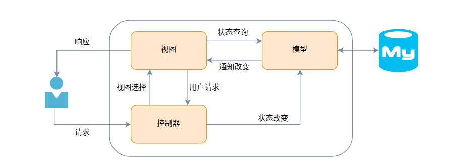
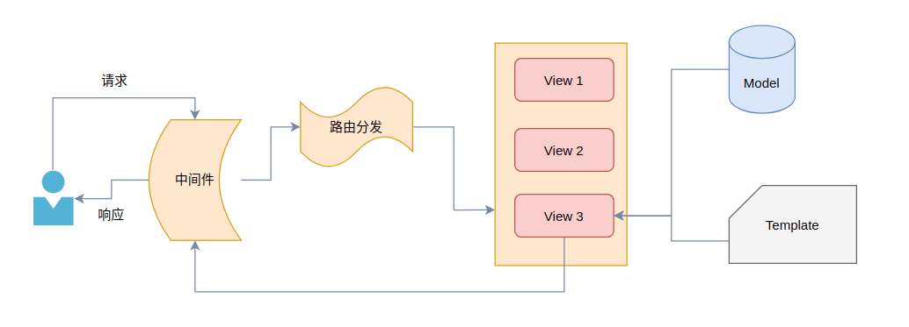
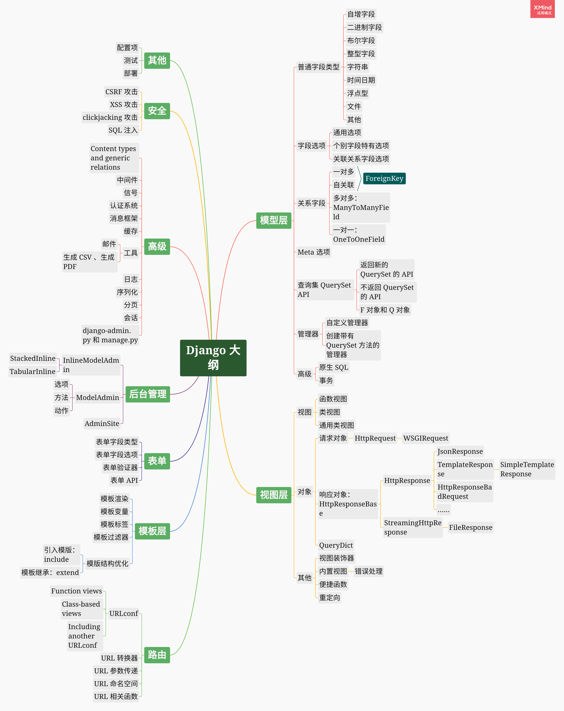

# 1. Django MTV

Django 框架的基础是 MTV 模式，它将开发任务分为三大部分： Model、Template、View。在了解 MTV 之前先来谈谈 MVC 开发模式：

* Model：负责业务对象与数据库的关系映射（一般基于 ORM 框架）
* View：负责页面展示，也就是与用户直接交互的网页部分 。
* Controller：接收并处理用户的请求，通常需要调用 Model 和 View 来完成用户请求



MTV 与 MVC 模式非常相似，也将开发工作分为三层 。

* M：Model，与 MVC 中的 Model 功能相同，负责和数据库交互，进行数据处理。
* V：View，与 MVC 中的 Controller 功能相同，接收请求，接收请求，处理业务逻辑，与 Model 和 Template 交互，返回结果
* T：Template，与 MVC 中的 View 功能相同，负责封装构造要返回的html



响应顺序：

1. Django 中间件接受到一个用户请求
2. Django 通过 URLconf 查找对应的视图，然后进行 URL 路由分发
3. 视图接受请求，查询对应的模型，调用模板生成 HTML 文档
4. 试图返回处理后的 HTML 文档
5. Web 服务器将响应内容发送给客户端
# 2. Django 安装

> https://www.djangoproject.com/download/

Django 是 BSD 许可的开放源代码。建议使用最新版本的 Python3。支持 Python 2.7 的最新版本是 Django 1.11 LTS


# 3. 创建 Django 项目

## django-admin 原生搭建

1. 创建一个新的虚拟环境，并安装 Django

```bash
$ mkvirtualenv -p python3 django_env
$ workon django_env
$ pip install django # 最新版本
$ pip install django==3.2.7 # 指定版本
```

2. 打开终端，使用`django-admin startproject <project_name>`命令创建一个项目

```bash
$ django-admin startproject mysite
```

3. 进入项目目录，创建一个应用

```bash
$ cd mysite
$ python manage.py startapp polls
```

4. 项目目录说明

```bash
tree -F
.
└── mysite/
    ├── manage.py*            # 一个命令行工具，通过该文件可以管理 Django 项目，同时也是一个 django-admin 工具的封装器，一般形式 python manage.py xxxx 
    ├── mysite/
    │   ├── asgi.py           # 兼容 ASGI 的 Web 服务器的入口点
    │   ├── __init__.py       # 一个空文件，指明当前文件夹是一个 Python 包
    │   ├── settings.py       # Django 项目的配置文件，定义与项目相关的配置项
    │   ├── urls.py           # Django 项目的根路由定义文件
    │   └── wsgi.py           # 兼容 WSGI 的 Web 服务器的入口点
    └── polls/
        ├── admin.py          # 用于编写与该应用相关 Django Admin 站点管理配置
        ├── apps.py           # 用于编写与该应用相关的配置
        ├── __init__.py
        ├── migrations/       # 用于存放与该应用相关的模型迁移文件
        │   └── __init__.py
        ├── models.py         # 用于编写与该应用相关的模型类
        ├── tests.py          # 用于编写与该应用相关的开发测试用例，编写单元测试
        ├── urls.py           # 用于编写与该应用相关的视图路由
        └── views.py          # 用于编写与该应用相关的 Web 应用视图
```

5. 运行开发服务器

在开发阶段，为了能够快速预览到开发的效果，django 提供了一个纯 python 编写的轻量级 web 服务器，仅在开发阶段使用。运行服务器命令如下：

```bash
$ python manage.py runserver 9000
$ python manage.py runserver 0.0.0.0:8000
```

默认情况下就可以在浏览器中通过 `http://127.0.0.1:8000/` 来访问网站了，如果想要修改 IP 地址或端口号，那么在运行的时候可以指定 IP 或 端口号。

# 4. Django 学习资料
* [官方网站](https://www.djangoproject.com/)
* [Github 源码](https://github.com/django/django)
# 5. Django 大纲

