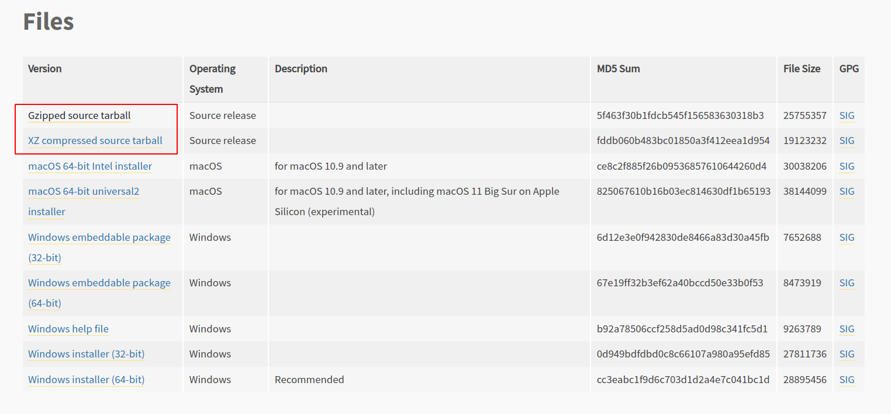

# 1. Python 源码安装

以 Python 3.9.7 为例，直接访问官方网站 https://www.python.org/downloads/release/python-397/ 下载源码压缩包



接下在终端中进行以下操作：

```bash
# 1. 下载源码包
$ wget https://www.python.org/ftp/python/3.9.7/Python-3.9.7.tgz

# 2. 解压
$ tar -zxf Python-3.9.7.tgz

# 3. 安装依赖包，防止源码编译失败
$ sudo apt-get -y install libncurses5-dev libbz2-dev \
libffi-dev libgdbm-dev liblzma-dev libsqlite3-dev libssl-dev \
libreadline6-dev gcc make zlibc zlib1g-dev

# 4. 编译
# 默认情况下，make install 将所有文件安装到 /usr/local/bin、/usr/local/lib 中。
# 可以使用 --prefix 指定除 /usr/local 以外的安装前缀，例如 --prefix=$HOME
$ ./configure --prefix=$HOME

# 5. 安装
# 通过指定 --prefix 安装会自动创建 bin  include  lib  share 目录
$ sudo make install

# 6. 卸载，查找对应目录下的相关文件依次删除
$ find /usr/local -name *3.9*
$ sudo rm -rf /usr/local/bin/python3.9
$ sudo rm -rf /usr/local/bin/python3.9-config
$ sudo rm -rf /usr/local/bin/pydoc3.9
$ sudo rm -rf /usr/local/bin/2to3-3.9
$ sudo rm -rf /usr/local/bin/idle3.9
$ sudo rm -rf /usr/local/bin/pip3.9

$ sudo rm -rf /usr/local/lib/python3.9/
$ sudo rm -rf /usr/local/lib/libpython3.9.a
$ sudo rm -rf /usr/local/lib/pkgconfig/python-3.9-embed.pc
$ sudo rm -rf /usr/local/lib/pkgconfig/python-3.9.pc

$ sudo rm -rf /usr/local/share/man/man1/python3.9.1
$ sudo rm -rf /usr/local/include/python3.9/
```

# 2. 包管理工具 pip

[pip](https://pip.pypa.io/en/stable/) 是 Python 的包管理器，用于安装和更新软件包。默认情况下 pip 将从 [Python Package Index](https://pypi.org/) 获取包，它是 Python 软件存储库，任何人都可以在其上传包。

* 安装 pip

```bash
# 1. 使用 Python 自带一个 ensurepip 模块
$ python -m ensurepip --upgrade

# 2. 从 https://bootstrap.pypa.io/get-pip.py 下载脚本
$ python get-pip.py

# 3. 使用 Linux 包管理器
$ sudo apt update
$ sudo apt install python3-pip
```

* pip 常用命令

pip 是一个命令行程序。安装 pip 时，系统会添加一个 pip 命令可以直接运行，也可以使用指定 Python 解释器执行 pip

```bash
# ===== 查看 pip 版本【两种方式运行 pip】 
$ pip --version
$ python3 -m pip --version

# ===== 安装软件包
$ python3 -m pip install requests               # 最新版本
$ python3 -m pip install requests==2.18.4       # 特定版本
$ python3 -m pip install requests>=2.0.0,<3.0.0 # 最低版本
$ python3 -m pip install --pre requests         # 预发布版本
$ python3 -m pip install git+https://github.com/pypa/sampleproject.git@main # 从 Github 安装
$ python3 -m pip install requests-2.18.4.tar.gz # 本地分发包
$ python3 -m pip install requests django flask  # 空格分开，安装多个

# ===== 升级软件包
$ python3 -m pip install --upgrade requests # 升级但不升级依赖
$ python3 -m pip install --upgrade requests --upgrade-strategy=eager # # 升级同时升级依赖

# ===== 卸载软件包
$ python3 -m pip uninstall requests

# ===== 查看当前环境安装的所有软件包
$ python -m pip list            # 列出已安装的软件包
$ python -m pip list --outdated # 列出过时的软件包，并显示可用的最新版本
$ python -m pip show requests   # 显示软件包的详细信息

# ===== 搜索软件包
$ python -m pip search "requests"

# ===== 导出软件包列表
$ python3 -m pip freeze > requirements.txt   # 导出 requirements.txt 文件中
$ python3 -m pip install -r requirements.txt # 安装 requirements.txt 文件中的所有软件包

# ===== 指定软件源
$ python3 -m pip install requests -i https://pypi.doubanio.com/simple
$ python3 -m pip install requests -i https://pypi.tuna.tsinghua.edu.cn/simple
```

* 配置文件
  + `global`：系统级别的配置文件（`/etc/pip.conf`）
  + `user`：每个用户的配置文件（`$HOME/.config/pip/pip.conf`、`$HOME/.pip/pip.conf`）
  + `site`：每个虚拟环境的配置文件（`$VIRTUAL_ENV/pip.conf`）

```conf
[global]
timeout = 60
index-url = https://pypi.doubanio.com/simple
no-cache-dir = false

[freeze]
timeout = 10

[install]
ignore-installed = true
no-dependencies = yes
```

# 3. 虚拟环境

## 3.1 virtualenv + virtualenvwrapper

* [virtualenv](https://virtualenv.pypa.io/en/latest/) 是一个创建 Python 虚拟环境的工具。
* [virtualenvwrapper](https://virtualenvwrapper.readthedocs.io/en/latest/) 是对 virtualenv 的扩展，用于更加方便的管理虚拟环境

```shell
# 1. 安装 virtualenvwrapper 和 virtualenv
$ python3 -m pip install virtualenv
$ python3 -m pip install virtualenvwrapper

# 2. 更改配置 vim ~/.bashrc
export WORKON_HOME=$HOME/.virtualenvs
export VIRTUALENVWRAPPER_PYTHON=/usr/bin/python3
source /usr/local/bin/virtualenvwrapper.sh
# 或者 source $HOME/.local/bin/virtualenvwrapper.sh

# 3. 激活配置
$ source .bashrc
```

* 常用命令

```shell
# ===== 创建虚拟环境
$ mkvirtualenv env_name
$ mkvirtualenv -p python3.6 env_name
$ mkvirtualenv -p python2.7 env_name

# ===== 进入或切换虚拟环境
$ workon env_name

# ===== 退出虚拟环境
$ deactivate

# ===== 删除虚拟环境
$ rmvirtualenv env_name

# ===== 列出所有虚拟环境
$ lsvirtualenv -b # 简要信息
$ lsvirtualenv -l # 详细信息

# ===== 复制现有的虚拟环境
$ cpvirtualenv src_env_name target_env_name

# ===== 进入到虚拟环境所在的目录
(venv)$ cdvirtualenv

# ===== 删除虚拟环境中已安装的所有第三方包
$ (venv)$ wipeenv
```

## 3.2 Pipenv

[Pipenv](https://pipenv.pypa.io/en/latest/) 的作者是著名的 Python 开发者 Kenneth Reitz，他同时也是 requests 库的作者。在众多的虚拟环境管理工具中，Pipenv 的亮点在于：

* 同时包含 pip 包管理和虚拟环境工具两者的功能，使用更加的方便
* 使用 Pipfile 文件取代手动处理 requirements.txt 的方式，使用 Pipfile.lock 文件管理包的依赖关系，这两个文件都无需手动处理，会根据 Pipenv 的相关命令自动进行变更
* 在包管理过程中使用哈希校验，保证软件包的完整性

```python
$ pip install --user pipenv
```

* 常用命令

```bash
pipenv --python 3.8
pipenv install django # 安装
pipenv install # 创建虚拟环境并安装 Pipfile 所指定的所有包
pipenv graph # 查看依赖关系
pipenv install requests --skip-lock # 跳过生成 lock
pipenv shell # 进入虚拟环境
pipenv install --dev pytest --skip-lock # 安装包到开发环境，可以在 Pipfile 查看
pipenv --where # 查看项目所在路径
pipenv --venv # 查看虚拟环境所在路径
pipenv --py # 查看虚拟环境 Python 解释器的路径
pipenv update # 更新所有包
pipenv check # 检查包的安全漏洞
pipenv --rm # 删除虚拟环境
pipenv run python manage.py runserver # 在虚拟环境中运行命令
```

## 3.3 venv

venv 是 Python3 自带的创建虚拟环境的工具

```bash
# 1. 安装，第二个参数是创建虚拟环境的位置
$ sudo apt install python3.9-venv
$ python3 -m venv env

# 2. 激活虚拟环境
$ source env/bin/activate

# 3. 检查 Python 解释器的位置来确认处于虚拟环境中
$ which python

# 4. 离开虚拟环境
$ deactivate

# 5. 删除虚拟环境只需要删除目录即可
$ rm -rf env
```

# 4. 集成开发环境 IDE

## 4.1 PyCharm

> https://www.jetbrains.com/pycharm/

| 插件名称          | 作用                                         |
| ----------------- | -------------------------------------------- |
| BashSupport       | 对 bash 语法的支持，比如语法高亮、文档查看等 |
| Rainbow Brackets  | 对代码中多对括号进行区分                     |
| Key Promoter X    | 快捷键提示                                   |
| Material Theme UI | 更多酷炫的主题                               |
| CSV Plugin        | 支持 CSV 等类型文件编辑                      |

## 4.2 VS Code

> https://code.visualstudio.com/
