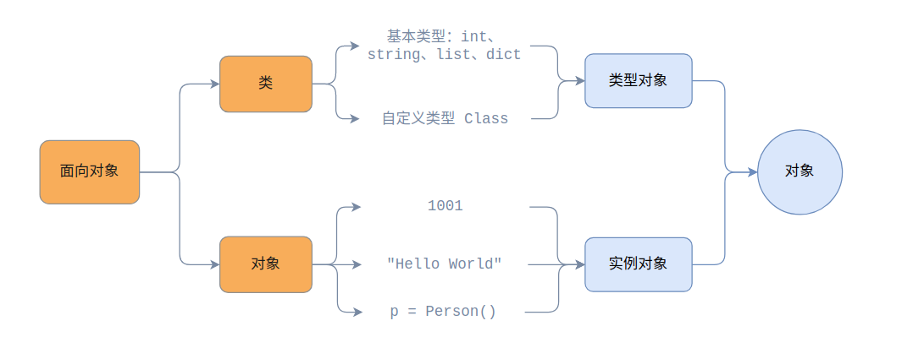
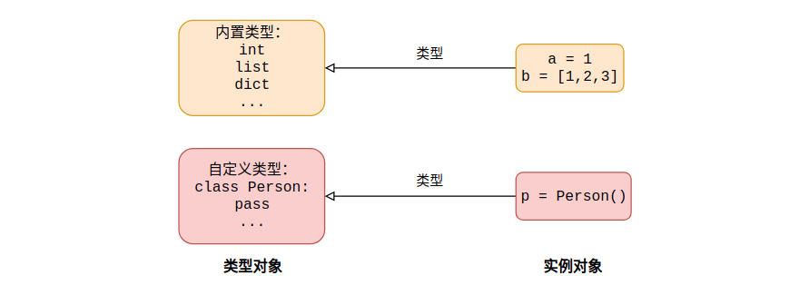
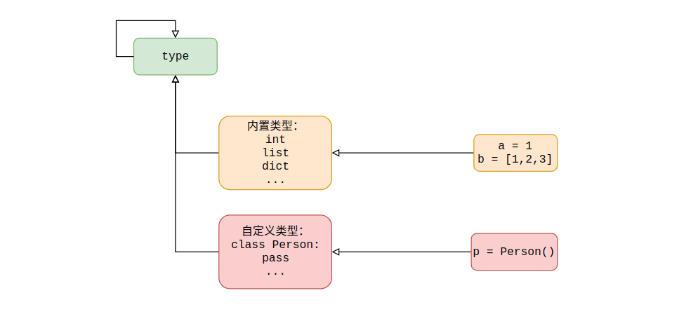
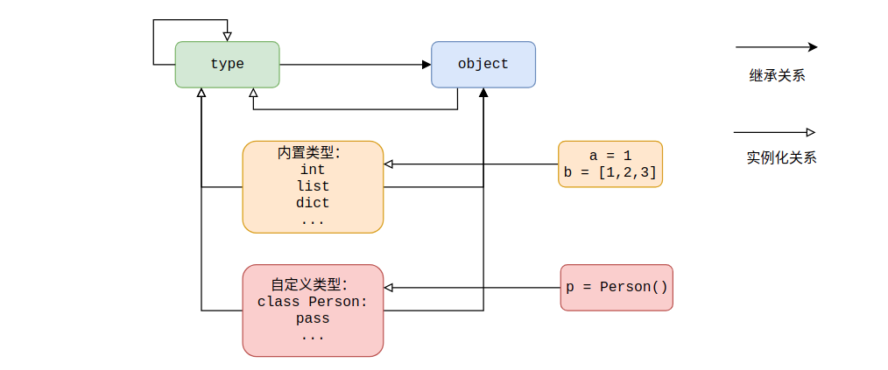

# 1. 对象的定义

Python 中的一切都是对象，每个对象具备以下三个特性：

* **任何对象都具有标识值**

标识值就是对象在内存中的地址，是一个整数且在对象的生命周期中是唯一的，通过内置函数 `id(object)` 可以查看

```python
>>> id('jack')
140560456842544
>>> id(str)
9484384
>>> class Person:
...     pass
... 
>>> p = Person()
>>> id(Person)
41107264
>>> id(p)
140560456880720
```

* **任何对象都具有类型**

对象的类型决定该对象所支持的操作，即决定对象所拥有的方法以及属性。通过内置函数 `type(object)` 来查看对象的类型

```python
>>> type('jack')
<class 'str'>
>>> type(str)
<class 'type'>
>>> type(Person)
<class 'type'>
>>> type(p)
<class '__main__.Person'>
```

* **任何对象都具有值**

对象的值即对象表示的数据

# 2. 对象体系

在 Python 一切皆对象的理念中，对象大致分为两种：

* **实例对象**

通过 Python 内置类型实例化的对象 `hello` 、 `1` 、 `[1, 2, 3]` 等以及通过自定义类实例化的对象统称为实例对象，它们具有以下共同点：

1. 不能拥有子类
2. 不能被实例化

* **类型对象**

Python 中的内置类型 `int` 、 `str` 、 `list` 、 `dict` 、 `type` 、 `object` 等以及自定义类型（就是自定义的类）统称为类型对象，它们具有以下共同点：

1. 它们的类型是 type
2. 它们可以被实例化，类型对象通过实例化创建的对象，这些对象的类型便是该类型对象
3. 它们可以被继承，即可以通过继承关系拥有子类

上面提到的实例对象和类型对象，正好对应面向对象理论中的“对象”和“类”这两个基本概念，如下图所示。



下面通过 Python 语法层面进行解释，例如 a 是一个整数对象 1（实例对象），其类型是 int 类型（类型对象）：

```python
>>> a = 1
>>> type(a)
<class 'int'>
>>> isinstance(a, int)
True
```

同理，对于字符串 `"hello"` 其类型是 str 类型（类型对象），对于列表 `[1, 2]` 其类型是 list 类型（类型对象），对于字典 `{"a":1}` 其类型是 dict 类型（类型对象）。

接着再来看看我们自定义的类型 Person ，其实例化对象的类型是啥？毋庸置疑，通过 Person 类实例化的对象，其类型就是 Person。

```python
>>> class Person:
...     pass
...
>>> p = Person()
>>> type(p)
<class '__main__.Person'>
>>> isinstance(p,Person)
True
```

综上所描述的关系，如下图所示。



前面说完了实例对象的类型，那么类型对象的类型又是什么呢？

```python
>>> type(int)
<class 'type'>
>>> type(Person)
<class 'type'>
>>> isinstance(int,type)
True
>>> isinstance(Person,type)
True
```

通过上面的代码可以看到，所有的类型对象的类型还是一种类型称为 `type` ，即：类型的类型。既然 type 也是类型，那么 type 也必然是类型对象，那 type 的类型又是啥？

```python
>>> type(type)
<class 'type'>
>>> isinstance(type,type)
True
```

由此可见，所有类型对象的类型都是 type 类型，包括 type 自身，这种类型也称为**元类**（metaclass），用来描述类型的类型。



除此之外，Python 中还有一个特殊类型 `object` ，通过下面的代码发现它的类型仍然是 type。

```python
>>> issubclass(str,object)
True
>>> issubclass(type,object)
True
```

另外在 Python3 中所有的类都是新式类，换句话说所有其他类型均继承于 object，即 object 是所有类型的基类，重点是 type 的基类也是 object。

```python
>>> issubclass(int, object)
True
>>> issubclass(Person,object)
True
>>> issubclass(type,object)
True
>>> type.__bases__
(<class 'object'>,)
```

但是 object 自身便不能有基类了。为什么呢？对于存在继承关系的类，成员属性和成员方法查找需要回溯继承链，不断查找基类。因此，继承链必须有一个终点，不然就死循环了。

```python
>>> object.__bases__
()
```

目前为止，无论是内建类型、自定义类型、 `type` 、 `object` 以及通过这些类型创建的实例共同构成了 Python 中的对象系统。其具体关系图如下所示。



# 3. Python 对象知识扩展

## 3.1 isinstance 和 issubclass

内置函数 `isinstance(object, classinfo)` ，通过返回 True 还是 False 判断 object 是 classinfo 的实例或者是 classinfo 的直接、间接、虚拟子类的实例。若 classinfo 是多个类组成的元组，当 object 为其中任意一个类的实例则返回 True。

内置函数 `issubclass(class, classinfo)` ，通过返回 True 还是 False 判断 class 为 classinfo 的直接、间接、虚拟子类。若 classinfo 是多个类组成的元组，class 为其中任意一个的子类，则返回 True。

## 3.2 == 和 is 的区别

`==` 运算符会递归的比较 == 左右两侧的对象值是否相等，也就是说如果存在嵌套对象的话，Python 会对嵌套对象的数据结构进行遍历，由左至右逐个逐层的比较相应的元素的值，直至得出比较结果。

```python
>>> a = [1, ['a', 3, [{1:2}]]]
>>> b = [1, ['a', 3, [{1:2}]]]
>>> a == b
True
```

不过需要注意 == 运算符本质是执行对象的 `__eq__()` 特殊方法，也就说重载该方法能够改变 == 的运算规则。例如下面自定义类实例化的对象与任何对象进行 == 比较始终返回 True

```python
class OverloadEqual(object):
    def __eq__(self, other):
        return True

o = OverloadEqual()
print(o == 10)  # True
print(o == 'hello')  # True
```

`is` 表达式会比较两个对象是否为同一个对象，也就是进行标识值 `id()` 的比较

```python
>>> a = [1, ['a', 3, [{1:2}]]]
>>> b = [1, ['a', 3, [{1:2}]]]
>>> a is b
False
```

## 3.3 None 对象

None 是单例对象，也就意味着该对象只存在一个，所以判断一个对象对象是否 None 的最佳实践是使用 is 表达式，这是因为 is 只比较对象标识值，而 == 则需要完成更多工作同时还要注意对象的 `__eq__()` 方法被重载

```python
>>> a = None
>>> b = None
>>> id(a)
9484816
>>> id(b)
9484816
>>> a is None
True
```

## 3.4 `type(object)` 和 `instance.__class__`

* 内置函数 `type(object)` 接受一个参数，返回 object 的类型
* `instance.__class__` 返回 instance 实例所属的类。

在新式类中，通常两者的返回结果相同。在经典类中， `type(object)` 返回始终为 `instance` ，而 `instance.__class__` 则会返回 instance 的类对象。其中 `instance.__class__` 结果能够通过重载 `__class__` 的方式进行修改， `type(object)` 返回结果通过动态修改对象的 `__class__` 的方式也能进行修改

```python
>>> class A:
...     pass
... 
>>> class B:
...     pass
... 
>>> a = A()
>>> type(a)
<class '__main__.A'>
>>> a.__class__ = B   # 动态修改 __class__ 从而影响 type(a)
>>> type(a)
<class '__main__.B'>
>>> class C:
...     __class__ = A # 重载 __class__ 属性
... 
>>> c = C()
>>> type(c)
<class '__main__.C'>
>>> c.__class__       # 重载后的属性发生变化
<class '__main__.A'>
```
