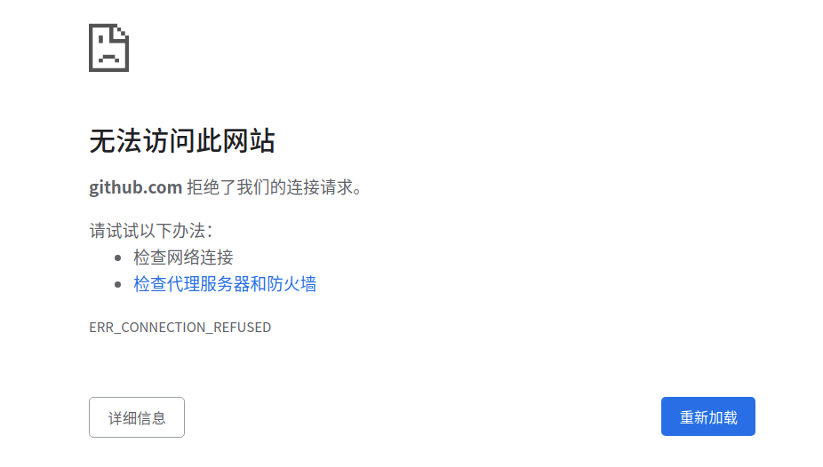

+++
title = "解决 Ubuntu20.04 拒接访问 github.com"
description = ""
tags = [

    "Github",

]
date = "2021-08-18"
categories = [

    "问题",

]
menu = "main"
+++

# 1. 问题

不知道什么原因，在我想要从 Github 克隆一个项目的时候，突然要求我输入密码：

```bash
$ git clone ........
$ git@github's password:
Permission denied, please try again.
$ git@github's password:
Permission denied, please try again.
....
```

但是无论我如何输入密码总是提示 `Permission denied, please try again.` 。与此同时在我想要打开 github.com 主页的时候，浏览器出现下面的情况，导致我只有科学上网才能访问。



# 2. 解决办法
1. 卸载 openssh-server 重新安装的【可选，八成没关系】

```bash
$ sudo apt-get remove openssh-server openssh-client --purge && sudo apt-get autoremove && sudo apt-get autoclean && sudo apt-get update
$ sudo apt-get install openssh-server openssh-client
```

2. 访问下面两个网址，把得到的 IP 记录下来，留着后续添加到 host 文件中【解决无法访问 github.com 的问题】

* https://github.com.ipaddress.com/
* https://fastly.net.ipaddress.com/github.global.ssl.fastly.net

```bash
$ vim /etc/hosts

# 把下面两行添加造 /etc/hosts 最后面
140.82.114.4 github.com
199.232.69.194 github.global.ssl.fastly.net

$ sudo apt install nscd
$ sudo /etc/init.d/nscd restart
```

3. 重新生成 ssh 的公私钥，然后把新产生的公钥添加到个人的 [Github SSH Keys](https://github.com/settings/keys)【解决 github ssh 访问的问题】

```bash
$ ssh-keygen -t rsa -C "xxxx@xx.com"
```

之后当我再次进行项目 clone 时一切就好了，整个过程基本就是无法访问 github.com 导致验证一直失败，所以在无法访问 github.com 网站的情况下，优先尝试步骤二。
